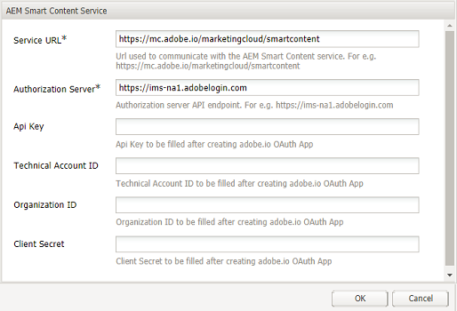
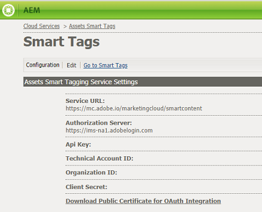
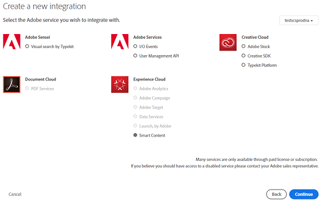
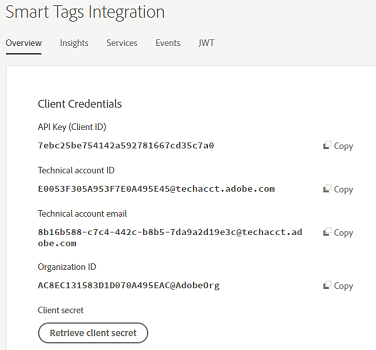

# Configure Asset tagging using the Smart Content Service{#configure-asset-tagging-using-the-smart-content-service}

Learn how to configure smart tagging and enhanced smart tagging in AEM, using the Smart Content Service.

You can integrate Adobe Experience Manager (AEM) with the Smart Content Service using Adobe I/O. Use this configuration to access the Smart Content Service from within AEM.

The article details out the following key tasks that are required to configure the Smart Content Service. At the back end, the AEM server authenticates your service credentials with the Adobe IO gateway before forwarding your request to the Smart Content Service.

* Create a Smart Content Service configuration in AEM to generate a public key. Obtain public certificate for OAuth integration.
* Create an integration in Adobe I/O and upload the generated public key.
* Configure your AEM instance using the API key and other credentials from Adobe I/O.  
* Optionally, enable auto-tagging on asset upload.

## Prerequisites {#prerequisites}

Before you can use the Smart Content Service, ensure the following to create an integration on Adobe I/O:

* An Adobe ID account that has administrator privileges for the organization.
* The Smart Content Service service is enabled for your organization.

To enable Enhanced Smart Tags, in addition to the above, also install [AEM 6.4 latest service pack](https://helpx.adobe.com/experience-manager/aem-releases-updates.html#main-pars_step_with_card_1987226281).

## Obtain public certificate {#obtain-public-certificate}

A public certificate allows you to authenticate your profile on Adobe I/O.

1. From the AEM user interface, tap the AEM logo, and go to **[!UICONTROL Tools > Cloud Services]**> **[!UICONTROL Legacy Cloud Services]**.  

1. In the Cloud Services page, tap/click **[!UICONTROL Configure Now]** under **[!UICONTROL Assets Smart Tags]**.
1. In the **[!UICONTROL Create Configuration]** dialog, specify a title and name for the Smart Tags configuration. Tap/click **[!UICONTROL Create]**.
1. In the **[!UICONTROL AEM Smart Content Service]** dialog, use the following values:

   **[!UICONTROL Service URL]**: *https://mc.adobe.io/marketingcloud/smartcontent*

   **[!UICONTROL Authorization Server]**: *https://ims-na1.adobelogin.com*

   Leave the other fields blank for now (to be provided later). Tap/click **[!UICONTROL OK]**.

   

1. Tap/click **[!UICONTROL Download Public Certificate for OAuth Integration]**, and download the public certificate file `AEM-SmartTags.crt`.

   

## Create Adobe I/O integration {#create-adobe-i-o-integration}

To use Smart Content Service APIs, create an integration in Adobe I/O to generate API Key, Technical Account Id, Organization Id, and Client Secret.

1. Access** ** [https://console.adobe.io](https://console.adobe.io/).
1. From the **[!UICONTROL Integrations]** page, select your organization.
1. Tap/click **[!UICONTROL New Integration]**.
1. On the **[!UICONTROL Create a new integration]** page, select **[!UICONTROL Access an API]**. Tap/click **[!UICONTROL Continue]**.
1. Under **[!UICONTROL Experience Cloud]**, select **[!UICONTROL Smart Content]**. Tap/click **[!UICONTROL Continue]**.

   

1. On the next page, select **[!UICONTROL New integration]**. Tap/click **[!UICONTROL Continue]**.
1. On the **[!UICONTROL Integration Details]** page, specify a name for the integration gateway and add a description.
1. In the **[!UICONTROL Public keys certificates]**, upload `AEM-SmartTags.crt` file that you downloaded above.
1. Tap/click **[!UICONTROL Create Integration]**.
1. To view the integration information, tap/click **[!UICONTROL Continue to integration details]**.

   

## Configure Smart Content Service {#configure-smart-content-service}

To configure the integration, use the values of Technical Account ID, Organization Id, Client Secret, Authorization Server, and API key fields from the Adobe I/O integration. Creating a Smart Tags cloud configuration allows authentication of API requests from the AEM instance.

1. From the AEM user interface, tap/click the AEM logo. Navigate to **[!UICONTROL Tools > Cloud Service > Legacy Cloud Services]** to open the Cloud Services console.
1. Under the **[!UICONTROL Assets Smart Tags]**, open the configuration created above. On the service settings page, click **[!UICONTROL Edit]**.
1. In the **[!UICONTROL AEM Smart Content Service]** dialog, use the pre-populated values for the **[!UICONTROL Service URL]** and **[!UICONTROL Authorization Server]** fields.
1. For the fields API Key, Technical Account Id, Organization Id, and Client Secret, use the values generated above.

## Validate the configuration {#validate-the-configuration}

After you've completed the configuration, you can use a JMX MBean to validate the configuration. To validate, follow these steps.

1. Access your AEM server at https://&lt;*servername*&gt;:&lt;*port&gt;*.  

1. Go to **[!UICONTROL Tools > Operations > Web Console]** to open the OSGi console. Click **[!UICONTROL Main > JMX]**.
1. Click **[!UICONTROL com.day.cq.dam.similaritysearch.internal.impl]**. It opens **[!UICONTROL SimilaritySearch Miscellaneous Tasks.]** 
1. Click **[!UICONTROL validateConfigs()]**. In the **[!UICONTROL Validate Configurations]** dialog, click **[!UICONTROL Invoke]**.

   The validation result is displayed in the same dialog.

## Enable smart tagging in the Update Asset workflow (Optional) {#enable-smart-tagging-in-the-update-asset-workflow-optional}

1. From the AEM user interface, tap/click the AEM logo, and go to **[!UICONTROL Tools > Workflow > Models]**.
1. On **[!UICONTROL Workflow Models]** page, select the **[!UICONTROL DAM Update Asset]** workflow model.
1. Tap/click **[!UICONTROL Edit]** from the toolbar.
1. Expand the Side Panel to display the steps. Drag **[!UICONTROL Smart Tag Asset]** step that is available in the DAM Workflow section and place it after the **[!UICONTROL Process Thumbnails]** step.

   

1. Open the step in edit mode. Under **Advanced Settings**, ensure that the **Handler Advance** option is selected.

   

1. In the **Arguments** tab, select **Ignore Errors** if you want the workflow to complete even if the automatic tagging step fails.

   

   To tag assets when they are uploaded irrespective of whether smart tagging is enabled on folders, select **Ignore Smart Tag Flag**.

   

1. Tap/click **OK** to close the process step, and then save the workflow.

>[!MORE_LIKE_THIS]
>
>* [Understanding Smart Tags in AEM Assets](https://helpx.adobe.com/experience-manager/kt/assets/using/smart-tags-feature-video-understand.html)
>* [Using Smart Tags with AEM Assets](https://helpx.adobe.com/experience-manager/kt/assets/using/smart-tags-feature-video-use.html)
>* [Using Enhanced Smart Tags with AEM Assets](https://helpx.adobe.com/experience-manager/kt/assets/using/enhanced-smart-tags-feature-video-use.html)
>* [Setup Enhanced Smart Tags in AEM Assets](https://helpx.adobe.com/experience-manager/kt/assets/using/enhanced-smart-tags-technical-video-setup.html)
