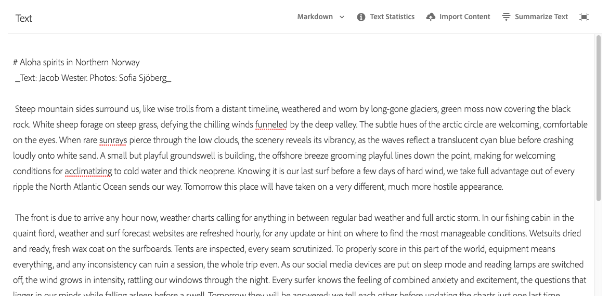

# Markdown{#markdown}

>[!CAUTION]
>
>Some Content Fragment functionality requires the application of [AEM 6.4 Service Pack 2 (6.4.2.0) or later](../../release-notes/sp-release-notes.md).

When you are [authoring](../../assets/using/content-fragments-variations.md#authoring-your-content), the content fragment editor uses *markdown* syntax to allow you to easily write content:

You can define:

* [Heading Notation](../../assets/using/content-fragments-markdown.md#heading-notation)
* [Paragraphs and Line Breaks](../../assets/using/content-fragments-markdown.md#paragraphs-and-line-breaks)
* [Links](../../assets/using/content-fragments-markdown.md#links)
* [Images](../../assets/using/content-fragments-markdown.md#images)
* [Block Quotes](../../assets/using/content-fragments-markdown.md#block-quotes)
* [Lists](../../assets/using/content-fragments-markdown.md#lists)
* [Emphasis](../../assets/using/content-fragments-markdown.md#emphasis)
* [Code Blocks](../../assets/using/content-fragments-markdown.md#code-blocks)
* [Backslash escapes](../../assets/using/content-fragments-markdown.md#backslash-escapes)

## Heading Notation {#heading-notation}

To create a header by placing a hash tag (#) in front of the heading. One hash tag (#) is used for an H1, two hash tags (##) for a H2 etc. You can use up to 6 hash tags. For example:

`#This is an H1`

`##This is an H2`

`###### This is a H6`

Optionally, you can create a H1 by underlining the text in equal signs and create a H2 by underlining the text in minus signs. For example:

`This is an H1`  
`==========`

`This is an H2`  
`--------------`

## Paragraphs and Line Breaks {#paragraphs-and-line-breaks}

A paragraph is simply one or more consecutive lines of text, separated by one or more blank lines. A blank line is a line containing nothing but spaces or tabs. Normal paragraphs should not be indented with spaces or tabs.

A line break is created by ending a line with two or more spaces then a return.

## Links {#links}

You can create inline and reference links.

In both styles, the link text is delimited by square brackets [].

These are examples of inline links:

`This is [an example](https://example.com/ "Title") inline link.`

`This is [an example of an email link](emailto:myaddress@mydomain.info)`

` [This link](https://example.net/) has no title attribute.`

A reference link has the following syntax:

` Hey you should [checkout][0] this [cool thing][wiki] that I [made][].`
  
`[0]: https://www.google.ca`  
`[wiki]: https://www.wikipedia.org`  
`[made]: https://www.stackoverflow.com`  

## Images {#images}

The syntax for images is similar to the links. You can create inline and referenced images.

For example, an inline image has the following syntax:

``  
  
``

The syntax includes:

- An exclamation mark: !;
- followed by a set of square brackets, containing the alt attribute text for the image;
- followed by a set of parentheses, containing the URL or path to the image, and an optional title attribute enclosed in double or single quotes.

A Reference-style image has the following syntax:

`![Alt text][id]`

Where “i*d”* is the name of a defined image reference. Image references are defined using syntax identical to link references:

`[id]: url/to/image "Optional title attribute"`

## Block Quotes {#block-quotes}

You can quote text by adding the &gt; symbol before the text. For example:

`>This is block quotes`  
`>asdhfjlkasdhlf`  
`>asdfahsdlfasdfj`

You can have nested block quotes. For example:

`> This is the first level of quoting.`  
`>`  
&nbsp;&nbsp;&nbsp;&nbsp;`>> This is nested blockquote.`  
`>`  
`> Back to the first level.`

## Lists {#lists}

You can create both ordered and unordered lists.

To create an unordered list, use the &#42; symbol before the items in the list. For example:

`* item in list`  
`* item in list`  
`* item in list`

To create an ordered list, add the numbers, followed by a period, before each item in the list. For example:

`1. First item in list.`  
`2. Second item in list.`  
`3. Third item in list.`

## Emphasis {#emphasis}

You can add italic or bold styling to your text.

To can add italics as follows:

`*single asterisks*`

`_single underscores_`

`Keyboard shortcut: Ctrl-I (Cmd-I)`

You can bold text as follows:

`**double asterisks**`

`__double underscores__`

`Keyboard shortcut: Ctrl-B (Cmd-B)`

To indicate a span of code, wrap it with backtick quotes (`). Unlike a pre-formatted code block, a code span indicates code within a normal paragraph.

For example:

``Use the `printf()` function.``

## Code Blocks {#code-blocks}

Code blocks are typically used to illustrate source code. You can create code blocks by indenting the code using a tab or a minimum of 4 spaces. For example:

`This is a normal paragraph.`

&nbsp;&nbsp;&nbsp;&nbsp;`This is a code block.`

## Backslash escapes {#backslash-escapes}

You can use backslash escapes to generate literal characters which have special meaning in formatting syntax. For example, if you wanted to surround a word with literal asterisks (instead of an HTML &lt;em&gt; tag), you can use backslashes before the asterisks, like this:

`\*literal asterisks\*`

Backslash escapes are available for the following characters:

`\ backslash`

` backtick

`* asterisk`

`_ underscore`

`{} curly braces`

`[] square brackets`

`() parentheses`

`# hash mark`

`+ plus sign`

`- minus sign (hyphen)`

`. dot`
