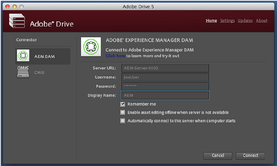
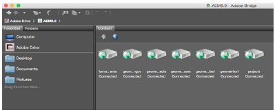
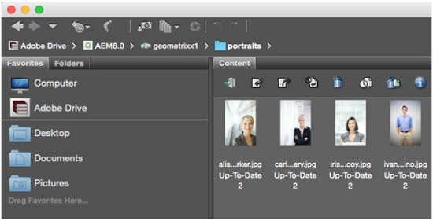
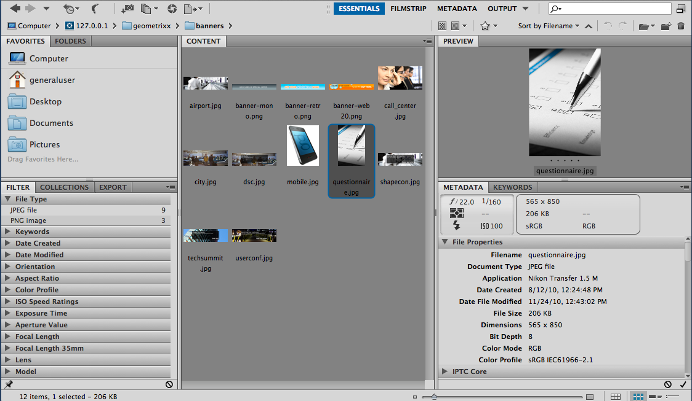
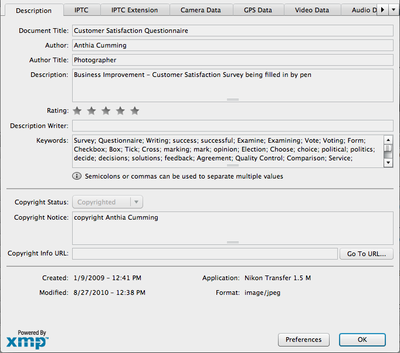
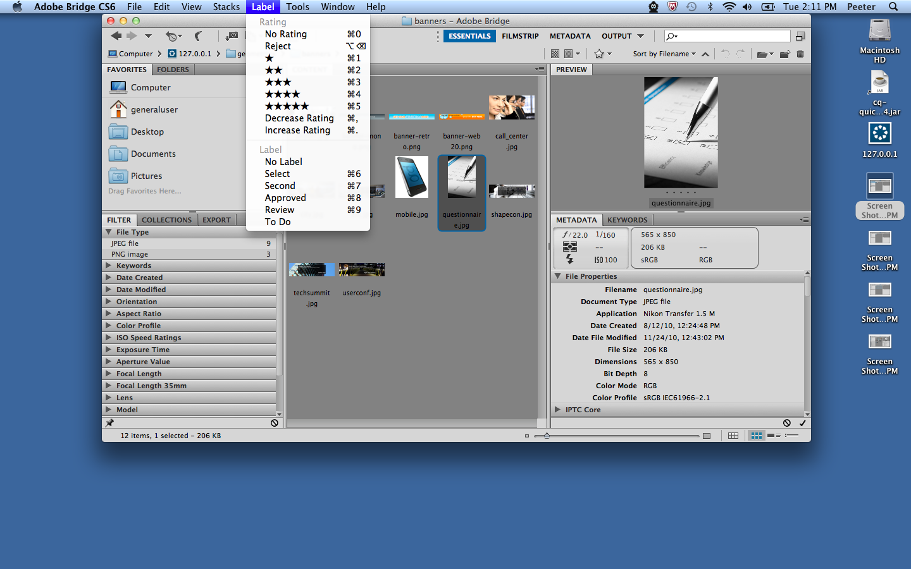

# Connecting Assets to Desktop Applications with Adobe Drive{#connecting-assets-to-desktop-applications-with-adobe-drive}

**Adobe Drive CC** connects your Adobe desktop applications, including CC 2015, CC 2014, CC, and CS6) to the Adobe Experience Manager (AEM) service.

Once connected, you can access AEM assets through Windows Explorer or Mac OS Finder, as well as directly through the UI of the integrated CS applications (Photoshop, Illustrator, Bridge, etc.).

You can also use Adobe Experience Manager Desktop App to map the AEM Assets repository to a network directory on your system so assets within AEM are available at your local system. For details, see [Adobe Experience Manager Desktop App](/assets/using/aem-desktop-app.md).

## Supported Features {#supported-features}

Adobe Drive CC (5.0.3) supports the following AEM-related features:

* Connecting to and disconnecting from an AEM server.
* Browsing documents and folders.
* Creating and deleting documents and folders.
* Moving and copying documents and folders.
* Checking documents in and out.
* Managing document versions.
* Searching documents.
* Thumbnails and preview icons in Adobe Bridge.
* Thumbnails in the Show Versions dialog.
* Viewing, editing, and searching XMP metadata in Adobe Bridge

## Before you begin {#before-you-begin}

Before connecting, you will need:

* [Adobe Drive CC (or later)](http://www.adobe.com/products/adobedrive.html) installed on your local machine.   

* The URL for the AEM server to which you wish to connect, as well as a valid username and password.

This document uses the localhost server on the default port (4502) in examples; this will only work if you have the default server installation on your local machine. To connect to a remote machine, you must replace `localhost URL` with the appropriate remote server URL and the username and password with valid credentials.

## Connecting to the Server {#connecting-to-the-server}

To connect to an AEM server:

1. Start the Adobe Drive application.

    * In Windows Explorer, right-click a folder, a file, or your desktop, and choose **Adobe Drive 5 &gt; Connect To** from the context menu. 
    * In Mac OS, CTRL-click a folder or file in Finder or your desktop, and choose **More &gt; Adobe Drive 5 &gt; Connect To** from the context menu.

   

1. Click **Add Drive**.
1. Click **AEM DAM** to indicate that you want to connect using the AEM Assets Services Connector.
1. Enter your connection details. For example, for a default local installation:

   **Server URL**: http://localhost:4502

   **Username**: admin

   **Password**: admin

1. Click **Connect**.
1. Check that the server has been mounted in the file browser:

    * In Windows Explorer, it should be under **My Computer**.
    * In Mac OS Finder, it should be under **Devices**.

   

## Troubleshooting {#troubleshooting}

If connection fails, open a web browser and test whether the server is available using the server URL. For example, if you enter `http://localhost:4502` and authenticate with your credentials, you should see the AEM login screen, and be able to navigate to AEM Assets and open digital assets.

* If you receive no response or an empty response, your server might not be available or your credentials might be incorrect.
* If you do not have AEM access, check that you have the Digital Asset Management capability installed. The connector does not work with an AEM server that does not have this capability.

## Disconnecting {#disconnecting}

* In Windows Explorer: Right-click the AEM Assets drive and choose **Disconnect** from the context menu.
* In Mac OS Finder: CTRL-click the AEM Assets drive and choose **Eject** from the context menu.
* In Adobe Drive 5.0.3: Select the server to be disconnected from **Recent Connections** and click **Disconnect**.

* In Adobe Bridge (see below): Select **Adobe Drive** in the Favorites panel. Right-click (CTRL-click in Mac OS) the AEM Assets drive and choose **Disconnect** from the context menu.

## Connecting AEM Assets to Adobe Bridge {#connecting-aem-assets-to-adobe-bridge}

Adobe Bridge is part of Adobe's Creative Suite software. It let's you edit and manage asset metadata and connect asset stores (like AEM Assets) directly to your desktop CS applications like Photoshop, InDesign and Illustrator.

To connect AEM Assets to Adobe Bridge, you must first mount it as a drive on your local system using Adobe Drive, as described above.

Next, start Adobe Bridge, select **Adobe Drive** on the left-hand panel and double click on the drive you want to connect to in the center panel:

You can now navigate into the mounted drive to reveal all your AEM assets:

 

## Browsing and manipulating documents and folders {#browsing-and-manipulating-documents-and-folders}

Once you are connected, Adobe Drive 5.0.3 presents documents and folders from your AEM Assets server in a network drive on your computer. You can view the server’s files in Windows Explorer or Mac OS Finder and access these files in Open, Save As, and other file management dialog boxes, just as you would local files. Of course, at the same time, the assets still reside on the AEM server and so you can also use the web-based UI of the AEM Assets server to view and manipulate your assets.

## Creating and deleting documents and folders {#creating-and-deleting-documents-and-folders}

Adobe Photoshop Creative Suite CC 2014, CC, and CS6, Adobe Illustrator Creative Suite CC 2014, CC, and CS6, Adobe InDesign Creative Suite CC 2014, CC, and CS6, and Adobe InCopy Creative Suite CC 2014, CC, and CS6 allow you to check in documents directly to the AEM Assets server. In other applications you must save your document to the AEM drive and use Windows Explorer, Mac OS Finder or Adobe Bridge to manually check in the file.

You can create new folders using Windows Explorer, Mac OS Finder or Adobe Bridge Creative Suite CC 2014, CC, and CS6, or using the Open, Save As, and other file management dialog boxes in an application.

You cannot create documents or folders at the root of the drive; you must save any new content under a folder in the root that already exists on the server. If you need to create new folders at the root location, you must use the UI provided by your AEM Assets server.

For example, to create a new document in the AEM Assets server from Photoshop:

1. Create a new document in Photoshop.
1. Choose File &gt; Check In.
1. In the Save As dialog, navigate to the folder on the AEM drive where you want to save the document.  
1. Enter a check-in comment when prompted, and click OK.

Photoshop, Illustrator, InDesign, and InCopy display the file status in a status bar when you view or edit documents. Once the document is saved to the server, the file status changes to Up-to-Date.

## Moving and copying documents and folders {#moving-and-copying-documents-and-folders}

To move or copy documents or folders on the AEM Assets server:

In Adobe Bridge:

* Invoke the context menu (right-click in Windows or CTRL-click in Mac OS) for the document or folder.
* Choose **Move To** or **Copy To** from the context menu, then choose the destination folder.

    * Documents moved or copied in this way are automatically checked in.

In Windows Explorer or Mac OS Finder:

* Drag a document or folder to move it to a different location.
* CTRL-drag (in Windows) or OPTION-drag (in Mac OS) to copy to a new location.

    * If you move a document from the desktop to an AEM drive this way, or copy any document to a new location, you must check it in explicitly.
    * You cannot move or copy documents or folders to the root of an AEM drive.

## Renaming documents and folders {#renaming-documents-and-folders}

In Adobe Bridge, Mac OS Finder or Windows Explorer, invoke the context menu (right-click in Windows or CTRL-click in Mac OS) for the document or folder, and choose **Rename**.

You cannot rename documents or folders in the root of an AEM drive.

## Deleting documents and folders {#deleting-documents-and-folders}

In Adobe Bridge, Mac OS Finder, or Windows Explorer, invoke the context menu (right-click in Windows or CTRL-click in Mac OS) for the document or folder, and choose **Delete**.

You cannot delete documents or folders in the root of an AEM drive.

Deletion from an AEM server is permanent; deleted files cannot be restored. The **Tools &gt; Adobe Drive &gt; Project Trash** option in Adobe Bridge, **Recycle Bin** in Windows, and **Trash** in Mac OS are not supported.

## Working with XMP metadata {#working-with-xmp-metadata}

When you are connected to an AEM server, you can use Adobe Bridge to view, edit, and search XMP metadata in managed assets.

You can view metadata directly through the Adobe Bridge **Metadata** and **Keywords** panels menus and panels:

Alternatively you right-click the asset and choose **File Info**. The resulting dialog provides access to all XMP metadata properties:

In addition, the Adobe Bridge **Label** menu gives you access to the view and edit rating and label information:

Alternatively you right-click the asset and choose **File Info**. The resulting dialog provides access to all XMP metadata properties:

In addition, the Adobe Bridge **Label** menu gives you access to the view and edit rating and label information:

 

## Searching documents and folders {#searching-documents-and-folders}

To search for a document or a folder on an AEM server from Adobe Bridge:

1. Select Adobe Drive from the **Favorites** panel and open the folder in the AEM drive you want to search.
1. Choose **Edit &gt; Find**.
1. Choose search criteria by selecting options and limiters from the **Criteria** menus.
1. Enter search text in the box on the right. To add search criteria, click the plus sign (**+**). To remove search criteria, click the minus sign (**-**).

1. Choose an option from the **Match** menu to specify whether any or all criteria must be met.
1. Click **Find**.
1. The "**Search includes all versions of a file**" and "**Search includes deleted files**" options in the **Find** dialog are ignored.

>[!NOTE]
>
>You can search assets based on any metadata information except "**File size**", "**Check in comment**", or "**Lock owner**" (although these are listed in the search criteria).

 

## Check-out and version management {#check-out-and-version-management}

Adobe Photoshop, Adobe Illustrator, and Adobe InDesign or InCopy automatically check out a managed document when the first edit is made.

* Check the document in using the **File &gt; Check In** menu.
* To cancel checkout, close the document and click **Don't Save** when prompted for whether changes should be saved.

In other applications, you must check out assets manually, modify and save the document and then check them back in manually.

In Mac OS Finder or Windows Explorer, invoke the context menu (right-click in Windows or CTRL-click in Mac OS) and choose the desired action from the **Adobe Drive 5.0.3** menu (**Check Out**, **Check In**, or **Cancel Check Out**).

## Managing document versions {#managing-document-versions}

All documents created or modified via the AEM Services Connector are versioned. Versions track changes to a document. Each version is a snapshot of the document at a particular point in time. When you check a document in, you create a new version of the document on the AEM server.

In Adobe Photoshop, Adobe Illustrator, and Adobe InDesign or InCopy, use the **Show Versions** popup menu on the status bar to display the versions of a document in the **Versions** dialog.

In Mac OS Finder or Windows Explorer, invoke the context menu (right-click in Windows or CTRL-click in Mac OS) for the document or folder, and choose **Adobe Drive 5 &gt; Show Versions**. You can use this dialog to delete, promote and open selected versions.

You can also use the UI for the AEM server to display versions of a document. If you check out an unversioned document, checking in the edited document creates version 1 of that document. If you cancel the checkout, the document remains unversioned.
