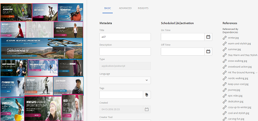
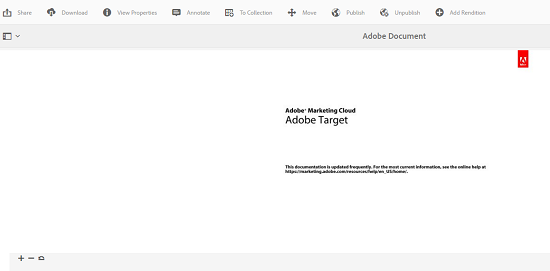
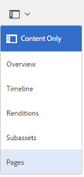
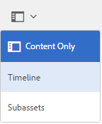

# Managing Compound Assets{#managing-compound-assets}

Adobe Experience Manager (AEM) Assets can identify if an uploaded file contains references to assets that already exist in the repository. This feature is available for supported file formats only. If the uploaded asset contains any references to AEM assets, a bidirectional link is created between the uploaded and referenced assets.

Besides eliminating redundancy, referencing AEM assets in Adobe Creative Cloud applications enhances collaboration and increases the efficiency and productivity of users.

AEM Assets supports **bidirectional referencing**.** **You can find referenced assets in the asset detail page of the uploaded file. In addition, you can view the referencing files for AEM assets in the asset details page of the referenced asset.

References are resolved on the basis of path, document ID, and instance ID of the referenced assets.

## Add AEM Assets as references in Adobe Illustrator {#refai}

You can reference existing AEM assets from within an Adobe Illustrator file.

1. Using [AEM Desktop App](https://helpx.adobe.com/experience-manager/desktop-app/aem-desktop-app.html), mount AEM Assets repository as a drive on your local machine. Within the mounted drive, navigate to the location of the asset that you want to reference.
1. Drag the asset from the mounted drive to the Illustrator file.
1. Save the Illustrator file to the mounted drive, or [upload](../../assets/using/managing-assets-touch-ui.md#uploading-assets) to the AEM repository.
1. After the worflow completes, go to the asset details page for the asset. The references to existing AEM assets are listed under **Dependencies** in the **References** column.

   

1. The referenced assets that appear under **Dependencies** can also be referenced by files other than the current one. To view a list of referencing files for an asset, click the asset in the under **Dependencies**.

   

1. Click the **View Properties** icon from the toolbar. In the properties page, the list of files that reference the current asset appear under the **References** column in the **Basic** tab.

   

## Add AEM assets as references in Adobe InDesign {#add-aem-assets-as-references-in-adobe-indesign}

To reference AEM assets from within an InDesign file, either drag AEM assets to the InDesign file or export the InDesign file as a ZIP file.

Referenced assets already exist in AEM Assets. You can extract subassets by [configuring InDesign server](../../assets/using/indesign.md). Embedded assets in an InDesign file are extracted as subassets.

>[!NOTE]
>
>If the InDesign server is proxied, InDesign files have their preview embedded within their XMP metadata. In this case, thumbnail extraction is not explicitly required. However, if the InDesign server is not proxied, thumbnails must be explicitly extracted for InDesign files.

### Create references By Dragging AEM assets {#create-references-by-dragging-aem-assets}

This procedure is similar to [Adding AEM assets as references in Adobe Illustrator](#refai). 

### Create references to AEM assets by exporting a ZIP file {#create-references-to-aem-assets-by-exporting-a-zip-file}

1. Perform the steps in [Creating Workflow Models](../../sites/developing/using/workflows-models.md) to create a new workflow.
1. Use the Package feature of Adobe InDesign to export the document.   
   Adobe InDesign can export a document and the linked assets as a package. In this case, the exported folder contains a Links folder that contains sub-assets in the InDesign file.
1. Create a ZIP file and upload it to the AEM repository.
1. Start the Unarchiver workflow.
1. When the workflow completes, the references in the Links folder are automatically referenced as subassets. To view a list of referred assets, navigate to the asset details page of the InDesign asset and close the [Rail](../../sites/authoring/using/basic-handling.md#therail).

## Add AEM assets as references in Adobe Photoshop {#refps}

1. Using a WebDav client, mount AEM Assets as a drive.
1. To create references to AEM assets in a Photoshop file, navigate to the corresponding assets in the mounted drive using the Place linked functionality in Photoshop.

   

1. Save in Photoshop file to the mounted drive or or [upload](../../assets/using/managing-assets-touch-ui.md#uploading-assets) to the AEM repository.
1. After the worflow completes, the references to existing AEM assets are listed in the asset details page.

   To view the referenced assets, close the [Rail](../../sites/authoring/using/basic-handling.md#therail) in the asset details page.

1. The referenced assets also contain the list of assets they are referenced from. To view a list of referenced assets, navigate to the asset details page and close the [Rail](../../sites/authoring/using/basic-handling.md#therail).

>[!NOTE]
>
>The assets within compound assets can also be referenced based on their Document ID and Instance ID. This functionality is available with Adobe Illustrator CC and Adobe Photoshop CC versions only. For others, referencing is done on the basis of relative path of linked assets in the main compound asset as done in earlier versions of AEM.

## View pages of a multi-page file {#view-pages-of-a-multi-page-file}

The Page Viewer feature of AEM Assets lets you view individual pages of multi-page files, including PDF, INDD, PPT, PPTX, and Ai files. For InDesign, you can extract pages using InDesign server. If the previews of pages are saved during InDesign file creation , then InDesign Server is not required for page extraction.

You can browse through individual pages of a file from the asset page. You can use options from the toolbar to annotate individual pages of the file. You can also use the **Page Overview** option to view all the pages simultaneously.

1. Navigate to the folder in AEM Assets that contains the multi-page file.
1. Click the asset to view its asset page.

   

1. Click the Global Nav icon, and then choose **Pages** from the menu.

   

1. Click the left or right arrows below the image to navigate to individual pages of the file.

   

1. To annotate a page, click the **Annotate** icon from the toolbar and add a comment.

   

1. To download the file, click the **Download** icon.

   

1. To view all pages of the file simultaneously, near the upper-right corner of the page, tap the **Page Overview** icon.

   

1. To view the activity stream for the file, including annotations and downloads, click the Global Navigation icon and then choose **Timeline** from the menu.

   

1. To view and edit the metadata properties of the page, click the **View Properties** icon from the toolbar.

   

