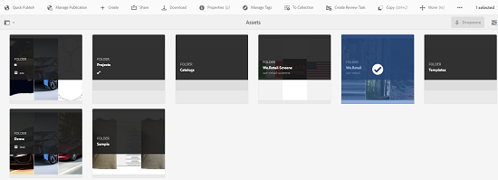
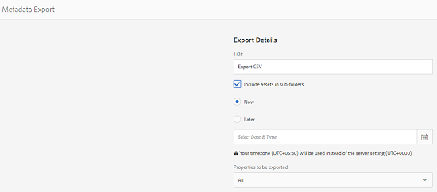
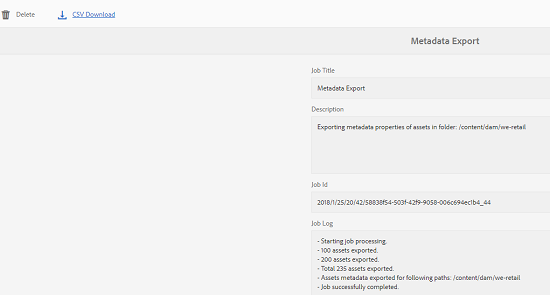

# Bulk Metadata Import and Export{#bulk-metadata-import-and-export}

This article describes how to import and export metadata in bulk.

AEM 6.4 Assets lets you import asset metadata in bulk using a CSV file for newly uploaded assets. In addition, you can also update the metadata for assets in bulk for existing assets by importing a CSV file. You can also ingest asset metadata in bulk from third-party system in CSV format.

## Import metadata {#import-metadata}

In other words, you can use a single CSV file to simultaneously update the metadata for multiple assets simultaneously. The operation is asynchronous. and, therefore, does not impede your system performance.

>[!NOTE]
>
>To be able to import metadata on custom namespaces, first register them.

1. Navigate to the Assets UI, and tap/click **Create** from the toolbar.
1. From the menu, select **Metadata**.
1. In the **Metadata Import** page, tap/click the **Select File** button to select the CSV file with metadata values to be imported.
1. Specify the following configuration parameters:

   <table> 
    <tbody>
    <tr>
    <td style="font-weight: normal" valign="top" width="295">
Batch Size
 </td> 
    <td style="font-weight: normal" valign="top" width="295">
Number of assets in a batch for which metadata is to be imported. Default value is 50. Maximum value is 100.
 </td> 
    </tr>
    <tr>
    <td valign="top" width="295">
Field Separator
 </td> 
    <td valign="top" width="295">
Default value is Comma. You can specify any other character.
 </td> 
    </tr>
    <tr>
    <td valign="top" width="295">
Multi value Delimiter
 </td> 
    <td valign="top" width="295">
Separator for metadata values. Default value is |.
 </td> 
    </tr>
    <tr>
    <td valign="top" width="295">
Launch Workflows
 </td> 
    <td valign="top" width="295">
False by default. When set to <em>true</em> and default Launcher settings are in effect for the DAM Metadata WriteBack Workflow (that writes metadata to the binary XMP data). Enabling launch workflows slows the system down. 
 </td> 
    </tr>
    <tr>
    <td valign="top" width="295">
Asset Path Column Name
 </td> 
    <td valign="top" width="295">
Defines the column name for the CSV file with assets.
 </td> 
    </tr>
    </tbody>
   </table>

1. Tap/click **Import** from the toolbar. After the metadata is imported a notification is sent to your Notification inbox. Navigate to asset property page and verify whether the metadata values are correctly imported for assets.

## Export Metadata {#export-metadata}

AEM 6.4 Assets lets you export metada for multiple assets in CSV format and reimport the metadata in a third-party system. You can also share asset metadata within project team.

The metadata is exported asynchronously and, therefore, does not impact the performance of your system. When you export metadata, AEM traverses through properties of the asset node *jcr:content/metadata* and its child nodes and exports metadata properties in a CSV file.

1. Select the asset folder for which you want to export metadata. 

   

1. From the toolbar, select** Export metadata**.

   

1. In the Metadata Export field, specify a name for the CSV file. To export metadata for assets in subfolders, select **Include assets in sub-folders**.

   

1. Select whether you want to export now or at a later date.
1. In the **Properties to be exported** field, specify whether you want to export all or specific properties.  

1. From the toolbar, tap/click **Export**. A message confirms that the metadata is exported. Close the message.
1. Open the inbox nofification for the export job. To download the CSV file with the metadata, tap/click the **CSV Download** icon from the toolbar.

   

