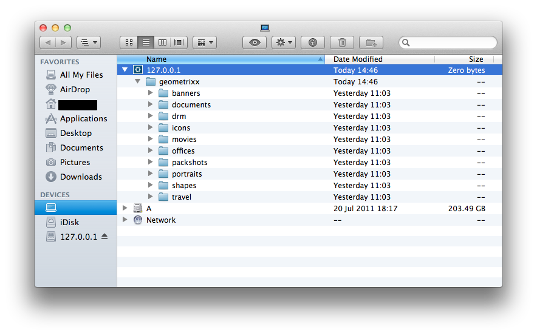

# Related Assets{#related-assets}

Adobe Experience Manager (AEM) Assets lets you manually relate assets based on the needs of your organization using the Related Assets feature. For example, you can relate a license file with an asset or an image/video on a similar topic. You can relate assets that share certain common attributes. You can also use the feature to create source/derived relationships between assets. For example, if you have a PDF file that is generated from an INDD file, you can relate the PDF file to its source INDD file.

This way, you have the flexibility to share a low resolution file (for example PDF/JPG) to vendors/agencies and make available the high resolution file (for example INDD) only on request.

## Relating assets {#relating-assets}

1. From the Assets interface, open the properties page for an asset you want to relate. 

   

   Alternatively, select the asset from the list view.

   

   You can also select the asset from a collection.

   

1. To relate another asset with the asset you selected, click/tap the **Relate** icon from the toolbar.

   

1. Do one of the following:

    * To relate the source file for the asset, select **Source** from the list.
    * To relate a derived file, select **Derived** from the list.
    * To create a two-way relationship between the assets, select **Others** from the list.

   

1. From the **Select Asset** screen, navigate to the location of the asset you want to relate, and select it.

   

1. Click/tap the **Confirm** icon.
1. Click/tap **OK** to close the dialog. Depending on your choice of relationship in step 3, the related asset is listed under under an appropriate category in the **Related** section. For example, if the asset you related is the source file for the current asset, it is listed under **Source**.

   

1. To unrelate an asset, click/tap the **Unrelate** icon from the toolbar.

   

1. Select the asset(s) you want to unrelate from the **Remove Relations** dialog, and the click/tap **Unrelate**. 

   

1. Click/Tap **OK** to close the dialog. The assets for which you removed relations are deleted from the list of related assets under the **Related** section.

## Translating Related Assets {#translating-related-assets}

Creating source/derived relationships between assets using the Related Assets feature is also helpful in translation workflows. When you run a translation workflow on a derived asset, AEM Assets automatically fetches any asset that the source file references and includes it for translation. This way, the asset referenced by the source asset is translated along with the source and derived assets. For example, consider a scenario where your English language copy includes a derived asset and its source file as shown.

If the source file is related to another asset, AEM Assets fetches the refenced asset and includes it for translation.

1. Translate the assets in the source folder to a target language by following the steps in [Create a new translation project](../../assets/using/translation-projects.md#create-a-new-translation-project). For example, in this case, translate your assets to French.
1. From the Projects page, open the translation folder.

   

1. Click/Tap the project tile to open the details page.

   

1. Click/tap the ellipses below the Translation Job card to view the translation status. 

   

1. Select the asset and then click/tap **Reveal in Assets** from the toolbar to view the translation status for the asset.

   

1. To verify whether the assets related to the source have been translated, click/tap the source asset.

   

1. Select the asset that is related to the source, and then click/tap **Reveal in Assets**. The translated related asset is displayed.

   

