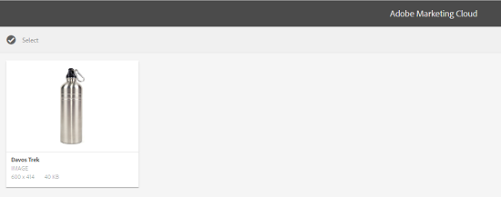

# Working with Selectors{#working-with-selectors}

When working with an interactive image, interactive video, or carousel banner, you select assets and you select sites and products for hotspots and image maps to link to. When working with image sets, spin sets, and multimedia sets, you also select assets with the Asset Selector.

This topic covers how to use the Product, Site, and Asset selectors, including the ability to browse, filter, sort within the selectors.

You access the selectors while creating carousel sets, adding hotspots and image maps, creating interactive videos and images.

For example, in this carousel banner, you use the Product selector if you are linking a hotspot or image map to a Quickview page, you use the Site selector if you are linking a hotspot or image map to a Hyperlink, and you use the Asset selector when creating a new slide.

When you select (rather than manually enter) where hotspots or image maps go to, you are using the selector. The Site selector only works if you are an AEM sites customer. The product selector also requires AEM Commerce.

### Selecting Products {#selecting-products}

Use the product selector to choose a product when you want a hotspot or image map to provide a quick view to a specific product in your product catalog.

1. Navigate to the carousel set, interactive image, or interactive video, and tap or click the **Actions** tab (only available if you have defined a hotspot or image map).

   The Product selector is in the **Action Type** area.

   

1. Tap or click the **Product Selector** icon (magnifying glass) and navigate to a product in the catalog.

   

   You can also filter by keyword or tag by tapping or clicking **Filter** and entering keywords and/or selecting tags.

   

   You can change where AEM browses for product data by tapping or clicking **Browse** and navigating to another folder.

   

   Tap or click **Sort** by to change whether AEM sorts by newest to oldest or oldest to newest.

   

   Tap or click **View as **to change how you view products - either list view or card view.

   

1. After the product is selected, the field populates with the product thumbnail and name.

   

1. When in Preview mode, you can tap or click the hotspot or image map, and see what the quick view looks like.

   

### Selecting Sites {#selecting-sites}

Use the site selector to choose a webpage when you want a hotspot or image map to link to a webpage that is managed within AEM sites.

1. Navigate to the carousel set, interactive image, or interactive video, and tap or click the **Actions** tab (only available if you have defined a hotspot or image map).

   The Site selector is in the **Action Type** area.

   

1. Tap or click the **Site Selector** icon (folder with magnifying glass) and navigate to a page in your AEM sites that you want to link the hotspot or image map to.

   

1. After the site is selected, the field populates with the path.

   

1. When in Preview mode if you tap or click the hotspot or image map, you navigate to the AEM site page you specified.

### Selecting Assets {#selecting-assets}

Use this selector to choose images to be used in a carousel banner, an interactive video, image sets, mixed media sets, and spin sets. In interactive video, the asset selector is available when you tap or click **Select Assets** in the Content tab. In carousel sets, the asset selector is available when you create a new slide. In image sets, mixed media sets, and spin sets, the asset selector is available when you create a new image set, mixed media set, or spin set, respectively.

See also [Asset Picker](../../assets/using/asset-selector.md) for more information.

1. Navigate to the carousel set and create a new slide. Or navigate to the interactive video, go the Content tab and select assets. Or create a mixed media set, image set, or spin set.
1. Tap or click the **Asset Selector** icon (folder with magnifying glass) and navigate to an asset.

   

   You can also filter by keyword or tag by tapping or clicking **Filter** and entering keywords and/or adding criteria.

   

   You can change where AEM browses for assets by navigating to another folder in the **Path** field.

   Tap or click **Collection** to only search for assets within collections.

   

   Tap or click **View as **to change how you view products - either list, column, or card view.

   

1. Tap or click the check mark to select the asset. The asset is displayed.

   

