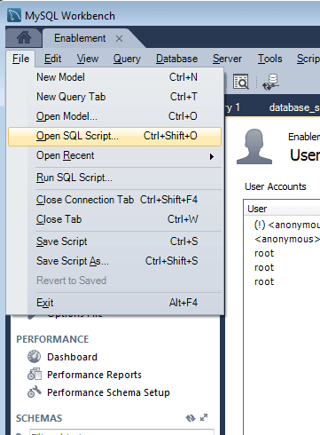

# MySQL Configuration for DSRP {#mysql-configuration-for-dsrp}

MySQL is a relational database that can be used to store user generated content (UGC).

These instructions describe how to connect to the MySQL server and establish the UGC database.

## Requirements {#requirements}

* [latest Communities feature pack](deploy-communities.md#latestfeaturepack)
* [JDBC driver for MySQL](deploy-communities.md#jdbc-driver-for-mysql)
* A relational database:

    * [MySQL server](https://dev.mysql.com/downloads/mysql/) Community Server version 5.6 or later

        * May run on same host as AEM or run remotely

    * [MySQL workbench](https://dev.mysql.com/downloads/tools/workbench/)

## Installing MySQL {#installing-mysql}

[MySQL](https://dev.mysql.com/downloads/mysql/) should be downloaded and installed following the instructions for the target OS.

### Lower case table names {#lower-case-table-names}

As SQL is case insensitive, for case sensitive operating systems, it is necessary to include a setting to lower case all table names.

For example, to specify all lower case table names on a Linux OS:

* Edit file `/etc/my.cnf`
* In the `[mysqld]` section, add the following line: 

  `lower_case_table_names = 1`

### UTF8 character set {#utf-character-set}

To provide better multilingual support, it is necessary to use the UTF8 character set.

Change MySQL to have UTF8 as its character set:

* mysql&gt; SET NAMES 'utf8';

Change the MySQL database to default to UTF8:

* Edit file `/etc/my.cnf`
* In the `[client]` section, add the following line:  

  `default-character-set=utf8`

* In the `[mysqld]` section, add the following line:  

  `character-set-server=utf8`

## Installing MySQL Workbench {#installing-mysql-workbench}

MySQL Workbench provides an UI for executing SQL scripts which install the schema and initial data.

MySQL Workbench should be downloaded and installed following the instructions for the target OS.

## Communities Connection {#communities-connection}

When the MySQL Workbench is first launched, unless already in use for other purposes, it will not yet show any connections:

 

### New Connection Settings {#new-connection-settings}

1. Select the `+` icon to the right of `MySQL Connections`.
1. In the dialog `Setup New Connection`, enter values appropriate for your platform  

   For demonstration purposes, with the author AEM instance and MySQL on the same server:

    * Connection Name: `Communities`
    * Connection Method: `Standard (TCP/IP)`
    * Hostname: `127.0.0.1`
    * Username: `root`
    * Password: `*no password by default*`
    * Default Schema: `*leave blank*`

1. Select `Test Connection` to verify the connection to the running MySQL service

**Notes**:

* The default port is `3306`
* The Connection Name chosen is entered as the datasource name in [JDBC OSGi configuration](#configurejdbcconnections)

#### New Communities Connection {#new-communities-connection}

 

## Database Setup {#database-setup}

Open the Communities connection in order to install the database.

 

### Obtain the SQL Script {#obtain-the-sql-script}

The SQL script is obtained from the AEM repository:

1. Browse to CRXDE Lite

    * For example, [http://localhost:4502/crx/de](http://localhost:4502/crx/de)

1. Select the /libs/social/config/datastore/dsrp/schema folder
1. Download `init-schema.sql`

One method for downloading the schema is to

* Select the `jcr:content`node for the sql file
* Notice the value for the `jcr:data`property is a view link

* Select the view link to save the data to a local file

### Create the DSRP Database {#create-the-dsrp-database}

Follow the steps below to install the database. The default name of the database is `communities`.

If the database name is changed in the script, be sure to also change it in the [JDBC config](#configurejdbcconnections).

#### Step 1: open SQL file {#step-open-sql-file}

In the MySQL Workbench

* From the File pulldown menu
* Select the downloaded `init_schema.sql`

 

#### Step 2: execute SQL Script {#step-execute-sql-script}

In the Workbench window for the file opened in Step 1, select the `lightening (flash) icon` to execute the script.

In the following image, the `init_schema.sql` file is ready to be executed:

 

#### Refresh {#refresh}

Once the script is executed, it is necessary to refresh the `SCHEMAS`section of the `Navigator` in order to see the new database. Use the refresh icon to the right of 'SCHEMAS':

 

## Configure JDBC Connection {#configure-jdbc-connection}

The OSGi configuration for **Day Commons JDBC Connections Pool** configures the MySQL JDBC Driver.

All publish and author AEM instances should point to the same MySQL server.

When MySQL runs on a server different from AEM, the server hostname must be specified in place of 'localhost' in the JDBC connector.

* On each author and publish AEM instance
* Signed in with administrator privileges
* Access the [web console](../../help/sites-deploying/configuring-osgi.md)

    * For example, [http://localhost:4502/system/console/configMgr](http://localhost:4502/system/console/configMgr)

* Locate the `Day Commons JDBC Connections Pool`
* Select the `+` icon to create a new connection configuration

* Enter the following values:

    * **JDBC driver class**: `com.mysql.jdbc.Driver`
    * **JDBC connection URI**: `jdbc:mysql://localhost:3306/communities?characterEncoding=UTF-8`  

      Specify server in place of localhost if MySQL server is not the same as 'this' AEM server  

      *communities* is the default database (schema) name
  
    * **Username**: `root`

      Or enter the configured Username for the MySQL server, if not 'root'
    
    * **Password**:   

      Clear this field if no password set for MySQL, 
    
      else enter the configured password for the MySQL Username
    * **Datasource name**: name entered for the [MySQL connection](#new-connection-settings), for example, 'communities'

* Select **[!UICONTROL Save]**

