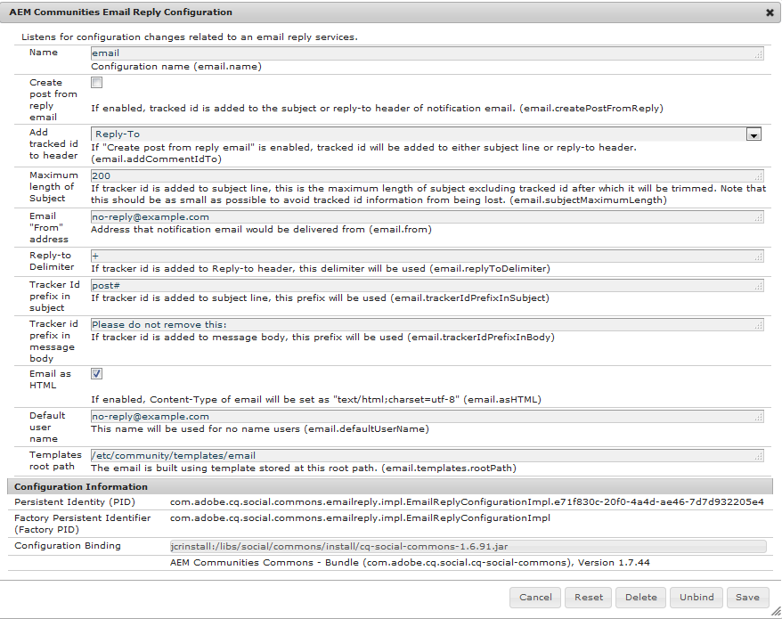

# Configuring Email{#configuring-email}

AEM Communities uses email for

* [Communities Notifications](/help/communities/notifications.md)
* [Communities Subscriptions](/help/communities/subscriptions.md)

By default, the email feature is not functional as it requires specification of an SMTP server and SMTP user.

>[!CAUTION]
>
>Email for notifications and subscriptions must be configured only on the [primary publisher](/help/communities/deploy-communities.md#primary-publisher).

## Default Mail Service Configuration {#default-mail-service-configuration}

The default mail service is required for both notifications and subscriptions.

* on the primary publisher
* signed in with administrator privileges
* access the [Web Console](/help/sites-deploying/configuring-osgi.md)

    * for example, [http://localhost:4503/system/console/configMgr](http://localhost:4503/system/console/configMgr)

* locate the `Day CQ Mail Service`
* select the edit icon

This is based on the documentation for [Configuring Email Notification](/help/sites-administering/notification.md), but with a difference in that the field `"From" address` is *not* required and should be left empty.

For example (filled in with values for illustrative purposes only):

* **SMTP server host name:** *(required)* The SMTP server to use.

* **SMTP server port** *(required)* The SMTP server port must be 25 or higher.

* **SMTP user:** *(required)* The SMTP user.

* **SMTP password:** *(required)* The SMTP user's password.

* **"From" address:** Leave empty
* **SMTP use SSL:** If checked, will send secure email. Ensure the port is set to 465 or as required for SMTP server.
* **Debug email:** If checked, enables logging of SMTP server interactions.

## AEM Communities Email Configuration {#aem-communities-email-configuration}

Once the [default mail service](#default-mail-service-configuration) is configured, the two existing instances of the `AEM Communities Email Reply Configuration` OSGi config, included in the release, become functional.

Only the instance for subscriptions needs to be further configured when allowing reply by email.

1. ` [email](#configuration-for-notifications)` instance  
   for notifications, which does not support reply email, and should not be altered

1. ` [subscriptions-email](#configuration-for-subscriptions)` instance  
   requires configuration to fully enable creating post from reply email

To reach the Communities email configuration instances:

* on the primary publisher
* signed in with administrator privileges
* access the [Web Console](/help/sites-deploying/configuring-osgi.md)

    * for example, [http://localhost:4503/system/console/configMgr](http://localhost:4503/system/console/configMgr)

* locate `AEM Communities Email Reply Configuration`

 

### Configuration for Notifications {#configuration-for-notifications}

The instance of `AEM Communities Email Reply Configuration` OSGi config with the Name email is for the the notifications feature. This feature does not include email reply.

This configuration should not be altered.

* locate the `AEM Communities Email Reply Configuration`
* select the edit icon
* verify the **Name** is `email`

* verify **Create post from reply email** is `unchecked`

 

### Configuration for Subscriptions {#configuration-for-subscriptions}

For Communities subscriptions, it is possible to enable or disable the ability for a member to post content by replying to an email.

* locate the `AEM Communities Email Reply Configuration`
* select the edit icon
* verify the **Name** is `subscriptions-email`

* **Name **: *(required)* `subscriptions-email`. Do Not Edit.

* **Create post from reply email**: If checked, recipient of subscription email may post content by sending a reply. Default is checked.
* **Add tracked id to header**: Default is `Reply-To`.

* **Maximum length of Subject**: If tracker id is added to subject line, this is the maximum length of subject, excluding tracked id, after which it will be trimmed. Note that this should be as small as possible to avoid tracked id information from being lost. Default is 200.
* **Email "From" address**: *(required)* Address that notification email would be delivered from. Likely the same **SMTP user** specified for the [default mail service](#configuredefaultmailservice). Default is `no-reply@example.com`.

* **Reply-to-Delimiter**: If tracker id is added to Reply-to header, this delimiter will be used. Default is `+` (plus sign).

* **Tracker Id prefix in subject**: If tracker id is added to subject line, this prefix will be used. Default is `post#`.

* **Tracker id prefix in message body**: If tracker id is added to message body, this prefix will be used. Default is `Please do not remove this:`.

* **Email as HTML**: If checked, Content-Type of email will be set as `"text/html;charset=utf-8"`. Default is checked.

* **Default user name**: This name will be used for no name users. Default is `no-reply@example.com`.

* **Templates root path**: The email is built using template stored at this root path. Default is `/etc/community/templates/subscriptions-email`.

## Configure Polling Importer {#configure-polling-importer}

In order for the email to be brought into the repository, it is necessary to configure a polling importer and configure its properties in the repository manually.

### Add New Polling Importer {#add-new-polling-importer}

* on the primary publisher
* signed in with administrator privileges
* browse to the polling importer console
    for example, [http://localhost:4503/etc/importers/polling.html](http://localhost:4503/etc/importers/polling.html)
* select **Add**

* **Type **: *(required)* Pull down to select `POP3 (over SSL).`

* **URL **: *(required)* The outbound mail server. For example, `pop.gmail.com:995/INBOX?username=community-emailgmail.com&password=****`

* **Import to Path&ast;**: *(required)* Set to `/content/usergenerated/mailFolder/postEmails`  
  by browsing to the `postEmails`folder and select **OK**

* **Update Interval in Seconds**: *(optional) *The mail server configured for the default mail service may have requirements regarding the update interval value. For example, Gmail may require an interval of `300`.

* **Login **: *(optional)* 

* **Password**: *(optional)*

* Select **OK**

### Adjust Protocol for New Polling Importer {#adjust-protocol-for-new-polling-importer}

Once the new polling configuration is saved, it is necessary to further modify properties of the subscription email importer in order to change the protocol from `POP3` to `emailreply`

Using [CRXDE Lite](/help/sites-developing/developing-with-crxde-lite.md):

* on the primary publisher
* signed in with administrator privileges
* browse to [https://&lt;server&gt;:&lt;port&gt;/crx/de/index.jsp#/etc/importers/polling](http://localhost:4503/crx/de/index.jsp#/etc/importers/polling)
* select the newly created configuration
* modify the following properties

    * **feedType **: replace `pop3s` with **`emailreply`**
    
    * **source**: replace source's protocol `pop3s://` with **`emailreply://`**

The red triangles indicate the modified properties. Be sure to save the changes:

* select **Save All**

