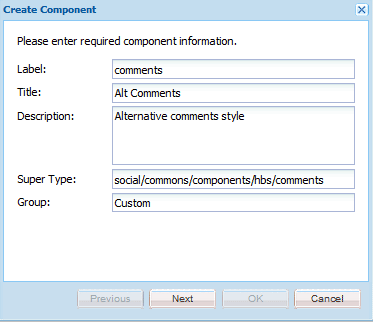

# Create the Components{#create-the-components}

|   |** [Add Comment to Sample Page ⇒](../../communities/using/extend-sample-page.md)** |
|---|---|

The example of extending components uses the comment system, which is actually composed of two components

* comments - the encompassing comment system which is the component placed on a page
* comment - the component which captures an instance of a posted comment

Both components needs to be put in place, especially if customizing the appearance of a posted comment.  

>[!NOTE]
>
>Only one comment system per site page is allowed.
>
>Many Communities features already include a comment system whose resourceType can be modified to reference the extended comment system.

## Create the Comments Component {#create-the-comments-component}

These directions specify a **Group **value other than *.hidden* so the component may be made available from the component browser (sidekick).

The deletion of the auto-created JSP file is because the default HBS file will be used instead.

1. Browse to **CRXDE|Lite** ([http://localhost:4502/crx/de/index.jsp](http://localhost:4502/crx/de/index.jsp))

1. create a location for custom applications:

    * select the **/apps** node

        * **Create Folder** named **custom**

    * select the **/apps/custom** node

        * **Create Folder** named **components**

1. select the **/apps/custom/components** node

    * **Create &gt; Component...**

        * **Label**: *comments*
        
        * **Title**: *Alt Comments*
        
        * **Description**: *Alternative comments style*
        
        * **Super Type**: *social/commons/components/hbs/comments*
        
        * **Group**: *Custom*

    * Select **Next**
    * Select **Next**
    * Select **Next**
    * Select **OK**

1. Expand the node just created: **/apps/custom/components/comments**
1. Select **Save All**
1. Right-click **comments.jsp**
1. Select **Delete**
1. Select **Save All**

 

### Create the Child Comment Component {#create-the-child-comment-component}

These directions set **Group** to *.hidden* as only the parent component should be included within a page.

The deletion of the auto-created JSP file is because the default HBS file will be used instead.

1. Navigate to the **/apps/custom/components/comments** node
1. Right-click the node

    * Select **Create &gt; Component...**

        * **Label**: *comment*
        
        * **Title**: *Alt Comment*
        
        * **Description**: *Alternative comment style*
        
        * **Super Type**: *social/commons/components/hbs/comments/comment*
        
        * **Group**: *.hidden*

    * Select **Next**
    * Select **Next**
    * Select **Next**
    * Select **OK**

1. Expand the node just created: **/apps/custom/components/comments/comment**
1. Select **Save All**
1. Right-click **comment.jsp**
1. Select **Delete**
1. Select **Save All**

  

### Copy and Modify the Default HBS Scripts {#copy-and-modify-the-default-hbs-scripts}

Using [CRXDE Lite](../../sites/developing/using/developing-with-crxde-lite.md):

* copy **comments.hbs**

    * from [/libs/social/commons/components/hbs/comments](http://localhost:4502/crx/de/index.jsp#/libs/social/commons/components/hbs/comments)
    * to [/apps/custom/components/comments](http://localhost:4502/crx/de/index.jsp#/apps/custom/components/comments)

* edit **comments.hbs** to:

    * change the value of the `data-scf-component` attribute (~line 20):

        * from `social/commons/components/hbs/comments`
        * to `/apps/custom/components/comments`

    * modify to include the custom comment component (~line 75):

        * replace ` `{{include this resourceType='social/commons/components/hbs/comments/comment'}}``
        * with ` `{{include this resourceType='/apps/custom/components/comments/comment'}}``

* copy **comment.hbs**

    * from [/libs/social/commons/components/hbs/comments/comment](http://localhost:4502/crx/de/index.jsp#/libs/social/commons/components/hbs/comments/comment)
    * to [/apps/custom/components/comments/comment](http://localhost:4502/crx/de/index.jsp#/apps/custom/components/comments/comment)

* edit **comment.hbs** to:

    * change the value of the data-scf-component attribute (~ line 19)

        * from `social/commons/components/hbs/comments/comment`
        * to /apps/ `custom/components/comments/comment`

* select `/apps/custom` node
* select **Save All**

## Create a Client Library Folder {#create-a-client-library-folder}

To avoid having to explicitly include this client library, the categories value for the default comment system's clientlib could be used ( `cq.social.author.hbs.comments`), but then this clientlib would be included for all instances of the default component as well.

Using [CRXDE Lite](../../sites/developing/using/developing-with-crxde-lite.md):

* select `/apps/custom/components/comments` node
* select **Create Node**

    * **Name**: `clientlibs`
    
    * **Type **: `cq:ClientLibraryFolder`
    
    * add to **Properties **tab:

        * **Name** `categories` **Type** `String` **Value** `cq.social.author.hbs.comments` `Multi`
        
        * **Name** `dependencies` **Type** `String` **Value** `cq.social.scf` `Multi`

* select **Save All**
* with `/apps/custom/components/comments/clientlib`s node selected, create 3 files:

    * **Name**: `css.txt`
    
    * **Name**: `js.tx`t
    
    * **Name**: customcommentsystem.js

* enter 'customcommentsystem.js' as the content of `js.txt`
* select **Save All**

 

## Register the SCF Model & View {#register-the-scf-model-view}

When extending (overriding) an SCF component, the resourceType is different (overlaying makes use of the relative search mechanism that searches through `/apps` before `/libs` so that the resourceType remains the same). This is why it is necessary to write JavaScript (in the client library) to register the SCF JS model and view for the custom resourceType.

Enter the following text as the content of `customcommentsystem.js`:

### customcommentsystem.js {#customcommentsystem-js}

```xml
(function($CQ, _, Backbone, SCF) {
    "use strict";
 
    var CustomComment = SCF.Components["social/commons/components/hbs/comments/comment"].Model;
    var CustomCommentView = SCF.Components["social/commons/components/hbs/comments/comment"].View;

    var CustomCommentSystem = SCF.Components["social/commons/components/hbs/comments"].Model;
    var CustomCommentSystemView = SCF.Components["social/commons/components/hbs/comments"].View;
 
    SCF.registerComponent('/apps/custom/components/comments/comment', CustomComment, CustomCommentView);
    SCF.registerComponent('/apps/custom/components/comments', CustomCommentSystem, CustomCommentSystemView);

})($CQ, _, Backbone, SCF);
```

* select **Save All**

## Publish the App {#publish-the-app}

In order to experience the extended component in the publish environment, it is necessary to replicate the custom component.

One way to do so is

* from global navigation

    * select **Tools &gt; Deployment &gt; Replication**
    * select `Activate Tree`
    * set `Start Path`: to `/apps/custom`
    
    * uncheck `Only Modified`
    * select `Activate`button

|   |** [Add Comment to Sample Page ⇒](../../communities/using/extend-sample-page.md)** |
|---|---|

