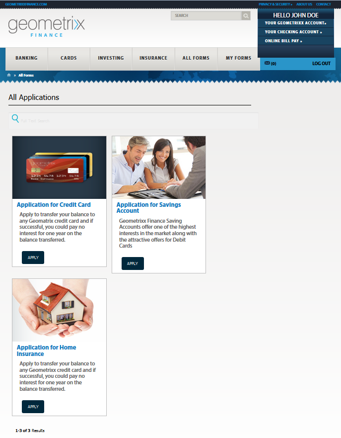
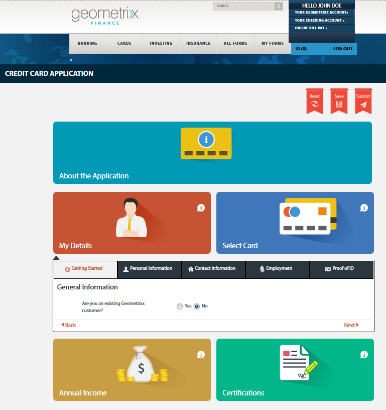

# Accessing and filling published forms{#accessing-and-filling-published-forms}

In a forms-centric portal deployment setup, forms development and portal development are two distinct activities. While form designers design and store forms in a repository, Web Developers create a web application to that list forms and handle submissions. Forms are then copied over to the web tier as there is no communication between the forms repository and the web application.

This often results in issues with managing the setup and production delays. For example, if a newer version of a form is available in the repository, the form designer, replaces the form on the web tier, modifies the web application, and redeploys the form on the public site. Redeploying the web application can cause some server downtime. Since the server downtime is a planned activity, the changes cannot be pushed to the public site immediately.

Forms Portal reduces management overheads and production delays. It equips Web Developers with components to create and customize a forms portal on websites authored using Adobe Experience Manager (AEM).

For more information about forms portal and its features, see [Introduction to publishing forms on a portal](../../forms/using/introduction-publishing-forms.md).

## Getting started with forms portal {#getting-started-with-forms-portal}

Navigate to the published forms portal page. For more information about creating a forms portal page, see [Creating a forms portal page](../../forms/using/creating-form-portal-page.md).

The Search and Lister component of roms portal displays the forms available on the Publish instance of the AEM server. This list includes all forms or the forms defined in the filter at the time of authoring the forms portal page. A forms portal page looks similar to as shown in the following image:

A sample forms portal page

### Search and Lister {#search-and-lister}

The Search and Lister component allow you to add the following functionality to your forms portal:

* List forms in panel, card, or grid view that are available out of the box. It also supports custom templatesList forms from specific folders in Forms Manager.
* Specify how forms are rendered - HTML5, PDF, or both.
* Specify how PDF and XFA-forms are rendered - HTML5, PDF, or both. Non-XFA forms as HTML5.  
* Enable searching of forms based on criteria, such as form properties, metadata, and tags.
* Submit form data to a servlet.
* Use custom style sheets (CSS) to customize the look and feel of the portal.  
* Create links to forms.

You can search for forms in the Forms Portal page by using the following options:

* Full Text Search
* Advanced Search

Full text search allows you to find and list forms based on the specified keywords.

An advanced search dialog

Advance Search allows you to search forms based on specified form properties. This provides a more specific results than full-text search. Advance search includes search based on tags, properties (such as Author, Description, and Title), modification date, and full text.

Lister displays forms based on the search parameters. Each form in the search result is displayed with an icon, which is hyperlinked to the associated form. You can click the icon to open and work with the associated form.

### Filling a form {#filling-a-form}

A sample adaptive form

The forms can be accessed from the link provided along with the form in the Search and Lister component of the page.

Each form contains help information that enables a user to fill the form.

#### Drafts and Submission {#drafts-and-submission}

A user has the option to save a draft of a form by clicking the Save button. This allows the user to work on a form over a period of time before submitting the form.

The data filled in the form (including attachments) is saved as a draft on the server. The draft of a form can be saved any number of times. The saved form appears in the Drafts tab of Draft & Submission component of the page.

On completion of form filling, the user submits the forms by clicking the Submit button on the form. The submitted forms appear in the Submissions tab of the Draft & Submission component of the Page.

>[!NOTE]
>
>Submitted forms appear in the Submitted Forms tab only if the submit action for the adaptive form is configured as Forms Portal Submit Action. For more information about submit actions, see [Configuring the Submit action](../../forms/using/configuring-submit-actions.md).

Drafts & submissions component

## Start a new form using submitted form data {#start-a-new-form-using-submitted-form-data}

There are certain forms that you need to fill and submit quite often. For example, the form for filing individual tax return is submitted every year. In such cases, while some bit of the information changes every time you fill the form, most of it like the personal and family details do not change. However, you are still required to fill the entire form again, from scratch.

AEM Forms can help optimize the form filling experience and significantly reduce the time to fill and submit a form again. End-users can start a new form using data from a submitted form. This functionality is built-in in the [Drafts and Submissions component](../../forms/using/draft-submission-component.md). When you add Drafts and Submission component to your forms portal page and publish it, end-users will find an option in Submitted Forms and Draft Forms tabs to start a new form using data from a submitted form. The following image highlights that option.

When you click the button to initiate a new form, it opens a new form with data from the corresponding submitted form. You can now review and update the information, as required, and submit the form.
