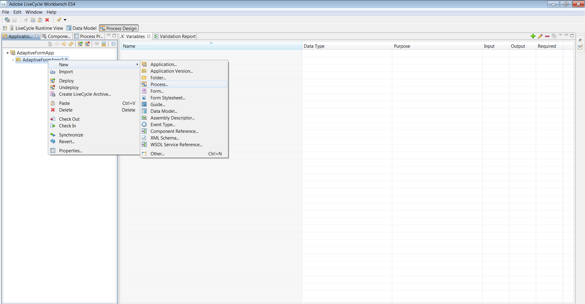

# Using an adaptive form in HTML Workspace{#using-an-adaptive-form-in-html-workspace}

AEM Forms on JEE provides the capability of using an adaptive form in HTML Workspace.

As one can select an XDP during Process design, the capability to browse from an existing adaptive form AEM repository has been added. The capability gives the Process designer the ability to configure an adaptive form in Starting Point as well as in Task.

## Process design experience {#process-design-experience}

Perform the following to enable adaptive forms to be used in process design:

* In Assign Task and Start Point, you can browse to an adaptive form asset in the CRX repository when assigning a form asset to a task.
* In the Assign Task/Start Point Workbench property sheet, you can hide top-level/global toolbar of an adaptive form.
* You can use new Action profiles for Render and Submit actions in adaptive forms.

### LiveCycle application export and import {#livecycle-application-export-and-import}

Because adaptive forms are in the AEM repository, the LiveCycle application export contains only the references for adaptive forms used. Therefore, the export and import of LiveCycle application is a two-step process. The LiveCycle application includes process definitions, and so on. A separate package containing adaptive forms is exported as a ZIP file from AEM. While importing, the LiveCycle application is imported through Workbench and adaptive forms are imported through AEM.

## User experience of adaptive form in HTML Workspace {#user-experience-of-adaptive-form-in-html-workspace}

HTML Workspace provides some adaptive form-specific controls in addition to controls that are available for mobile forms. A user can add attachments, save, sign, submit, and navigate the adaptive forms in HTML Workspace when the user opens a Task or Start Point. The following are the specifics:

1. To **attach **files use Task attachments, as was the case in Mobile Forms. Any File Attachment type button of adaptive form is hidden.  

1. To save** **an adaptive form, click **Save**, as was the case in Mobile Forms. Any Save type button of adaptive form is hidden.  

1. To submit** **an adaptive form, use the **Submit** button or route actions available, as was the case in Mobile Forms. Any Submit type button of adaptive form is hidden.  

1. **Adaptive Form Global toolbar visibility**: If process designer hides the global/top-level toolbar, the toolbar, and the buttons don't appear on adaptive forms.  

1. **Workspace navigation controls for Adaptive Forms**: Next/Previous buttons are available along with save, Submit, and Route Action buttons for an adaptive form in HTML Workspace. Click Next/Previous buttons to navigate panels of adaptive forms in HTML Workspace. The Next/Previous buttons provide deep navigation, similar to navigation controls in the Mobile view of adaptive forms.  

1. **eSign Services and Summary Component of Adaptive Form**: The Summary component is non-operational in HTML Workspace. In other words, if an adaptive form has a Summary component, it is not visible in workspace. Instead of Auto Submit in the Esign component, the workspace user clicks the Submit or a route action in HTML Workspace. After a document is signed, it is visible as a flat signed document. Click **Submit** or a route action to close/complete the task or Start Point.  
   The signed document is collected from the eSign services server, and the data xml file is forwarded to the next step in the process.

## Steps to use adaptive forms in process design {#steps-to-use-adaptive-forms-in-process-design}

1. Open Adobe Experience Manager Forms Workbench.  

1. Go to **File &gt; New &gt; Application** or use the existing application to create an application.

   

   Create new application

1. Create a process, or use an existing process in the application.

   

   Create new process

1. Create a Start Point or Assign Task and double-click it.
1. Under the **[!UICONTROL Presentation & Data]** section, select **[!UICONTROL use a CRX asset]** and click the ellipses before the asset.

   

   Use a CRX asset

1. Select the adaptive form created through Manage Assets UI, and click **[!UICONTROL OK]**.

   

   Select an adaptive form

   >[!NOTE]
   >
   >For details around creating an adaptive form, see [Creating an adaptive form](../../forms/using/creating-adaptive-form.md).
   >
   >
   >For details around creating a process, see [Creating and managing processes](http://help.adobe.com/en_US/AEMForms/6.1/WorkbenchHelp/WS92d06802c76abadb-1cc35bda128261a20dd-7ff7.2.html).

