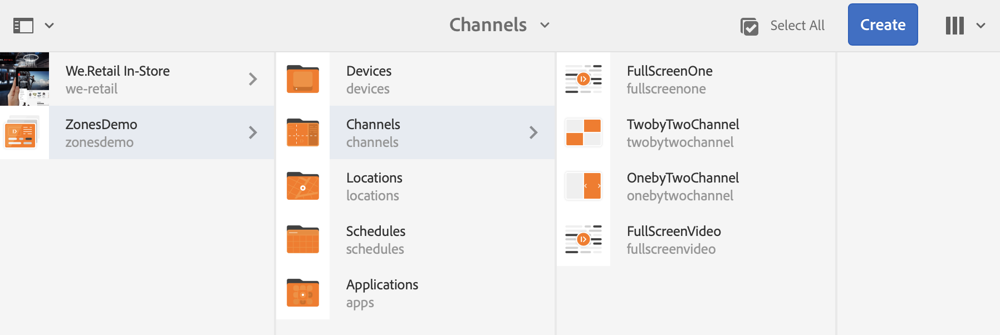
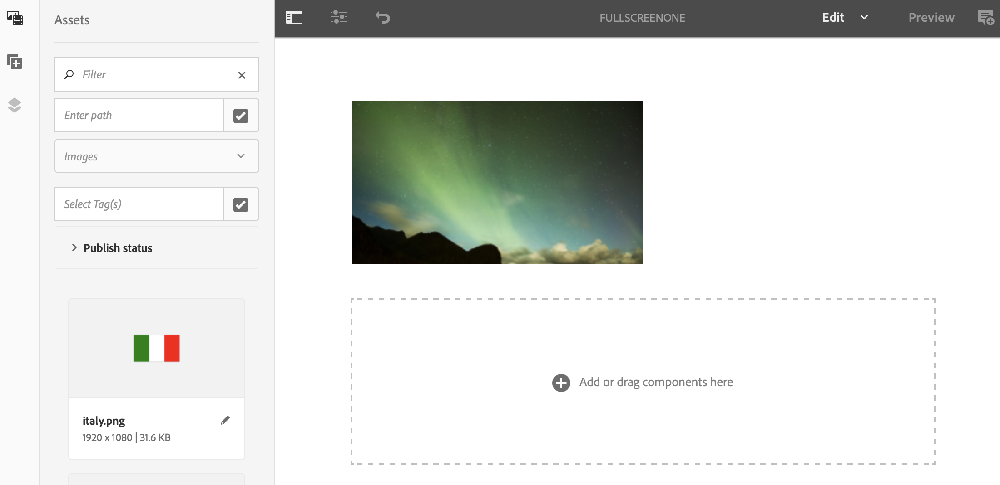
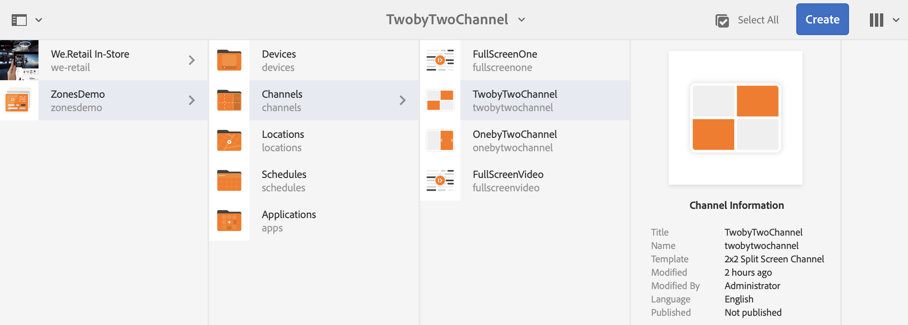
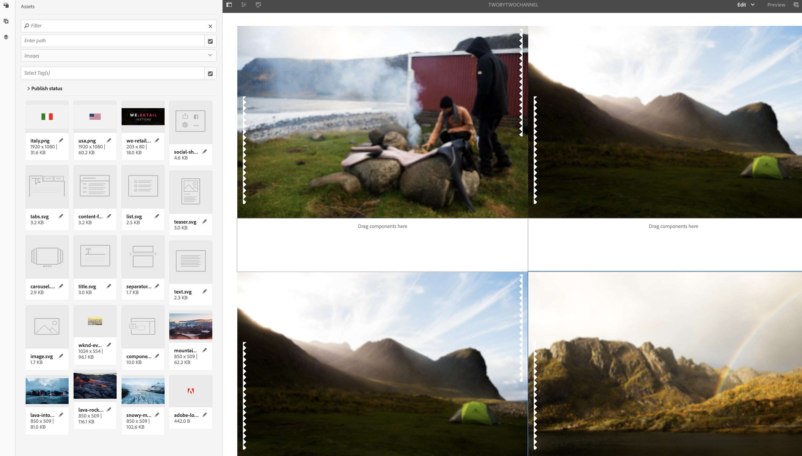
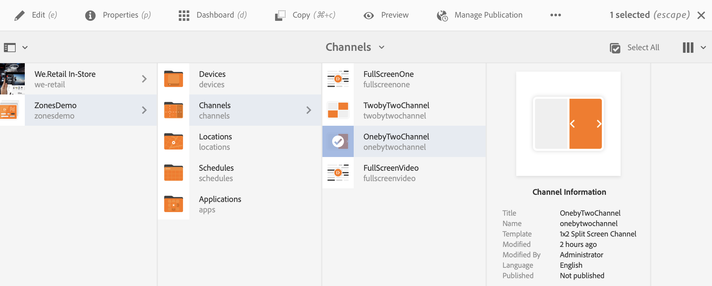
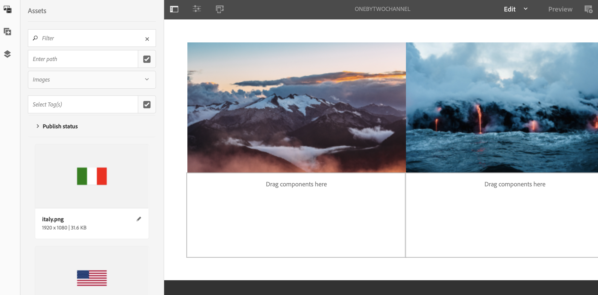
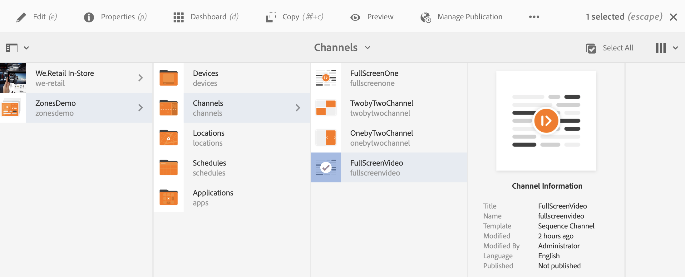
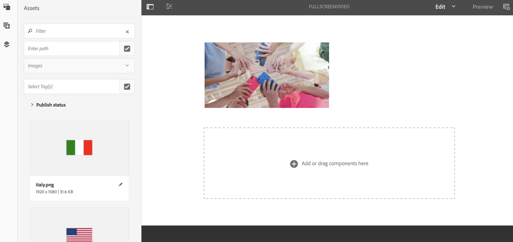
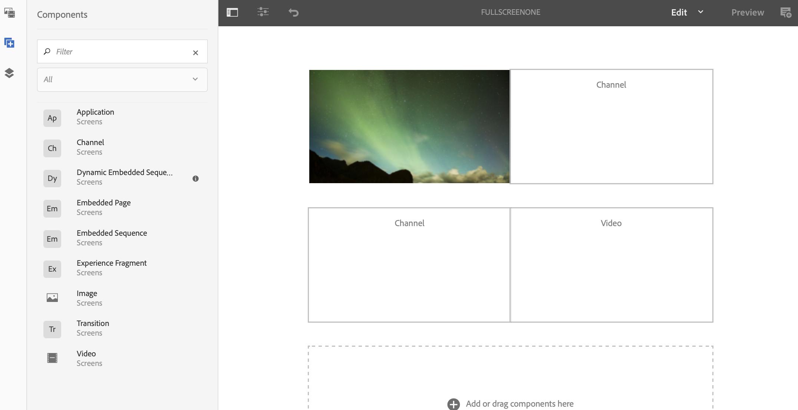
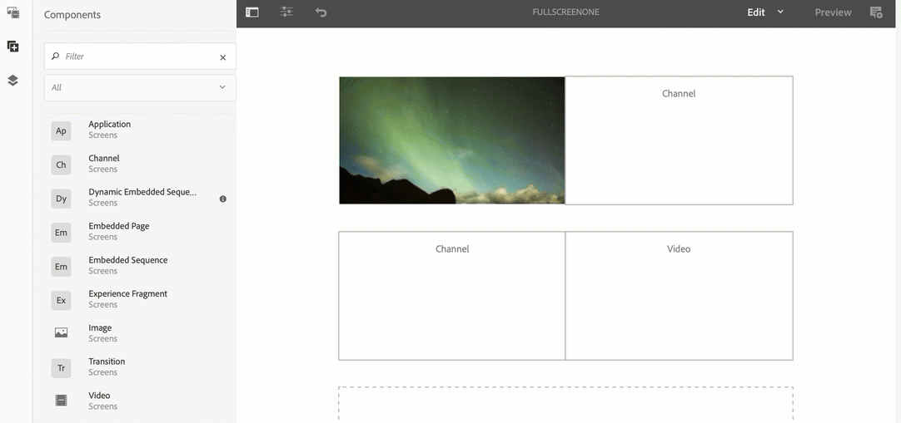

# Single Zone to Multizone Takeover {#single-zoneto-multizone}

## Use Case Description {#use-case-description}

This section describes a use case example that emphasizes on how to set up a multi zone layout channel that alternates with a single zone layout channel. Each channel has sequencing image/video assets.

### Preconditions {#preconditions}

Before you start this use case, make sure you understand how to:

* **[Create and Manage Channels](/help/screens/managing-channels.md)**
* **[Create and Manage Locations](/help/screens/managing-locations.md)**
* **[Create and Manage Schedules](/help/screens/managing-schedules.md)**
* **[Device Registration](/help/screens/device-registration.md)**

### Primary Actors {#primary-actors}

Content Authors

## Setting up the Project {#setting-up-the-project}

Follow the steps below to set up a project

1. Create an AEM Screens Project named as **ZonesDemo**, as shown below.

   >[!NOTE]
   >
   >To learn more about creating and managing projects in AEM Screens, refer to Creating a Project.

   

1. **Creating a Sequence Channel with one image**

    1. Select the **Channels** folder and click **Create** from the action bar to open the wizard to create a channel.
    1. Select **Sequence Channel** from the wizard and create the channel titled as **FullScreenOne**.

       
    1. Select the channel and click **Edit** from the action bar to open the editor and drag and drop an image to that channel, as shown below.
        

1. **Creating a 2X2 Channel with four images**

    1. Select the **Channels** folder and click **Create** from the action bar to open the wizard to create a channel.

    1. Select **2X2 Split Screen Channel** template from the wizard and create the channel titled as **TwobyTwoChannel**.

       
    1. Select the channel and click **Edit** from the action bar to open the editor and drag and drop four images (four different zones) to that channel, as shown below.
        

1. **Creating a 1X2 Split Screen Channel with two images**

    1. Select the **Channels** folder and click **Create** from the action bar to open the wizard to create a channel.

    1. Select **1X2 Split Screen Channel** template from the wizard and create the channel titled as **OnebyTwoChannel**.

       
    1. Select the channel and click **Edit** from the action bar to open the editor and drag and drop two images (two different zones) to that channel, as shown below.
        

1. **Creating a Channel with one full screen video**

    1. Select the **Channels** folder and click **Create** from the action bar to open the wizard to create a channel.

    1. Select **Sequence Channel** template from the wizard and create the channel titled as **FullScreensVideo**.

       
    1. Select the channel and click **Edit** from the action bar to open the editor and drag and drop the video component to that channel and then add the desired video, as shown below.
        

## Setting up the Takeover Channel to Transition from SingleZone to MultiZone {#takeover-channel-setup}

1. **Editing the SingleZone Channel for MultiZone Takeover**

    1. Select the channel (**FullScreenOne)** that you created in step 1.
    1. Click **Edit** from the action bar to open the editor. Drag and drop two channel components and one video component to the editor.

   

1. **Populating the Components added to FullScreenOne Channel**

     1. Select the first channel component from the editor of **FullScreenOne** and click **Configure** to point to the channel created in preceding steps. Similarly, add the channel path ()to the other channel component and the video to the video component as shown below.

   

1. **Setting up the time duration for the channels while transitioning**

   >[!NOTE]
   >
   >By default, the assets will transition after every 8 seconds, but if you want the assets to transition after a specific time duration, follow the step below.

   1. Select the second channel component from the editor of **FullScreenOne** and click **Settings** to configure the time duration for this channel. Similarly, set up the time duration for the channel two, as shown below.
   In this example, the time is set as 3 seconds.

   

## Previewing the Result {#previewing -result}

You can click on Preview from the editor and check how the assets will transition from single zone to multizone.

 
