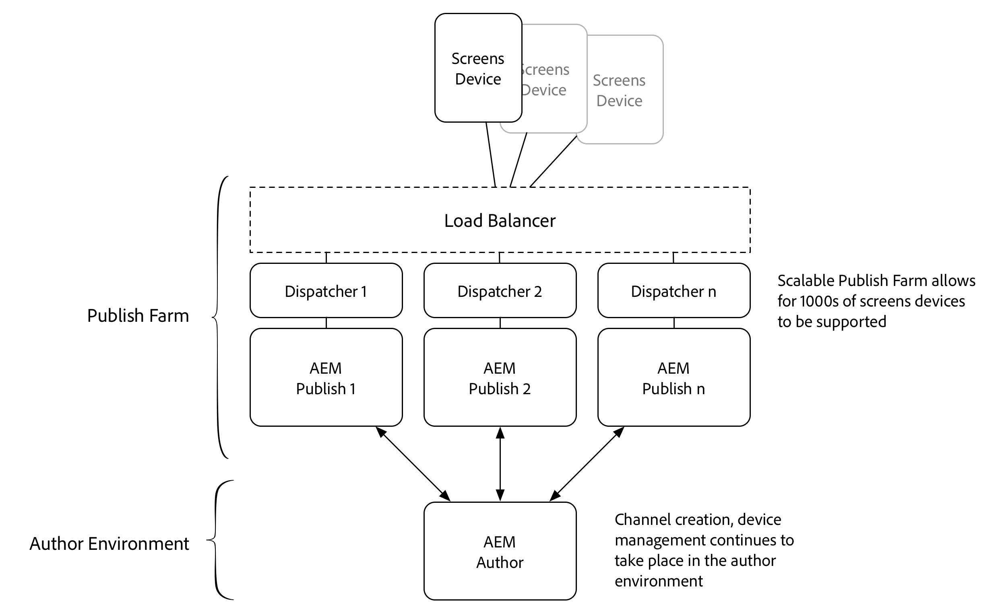
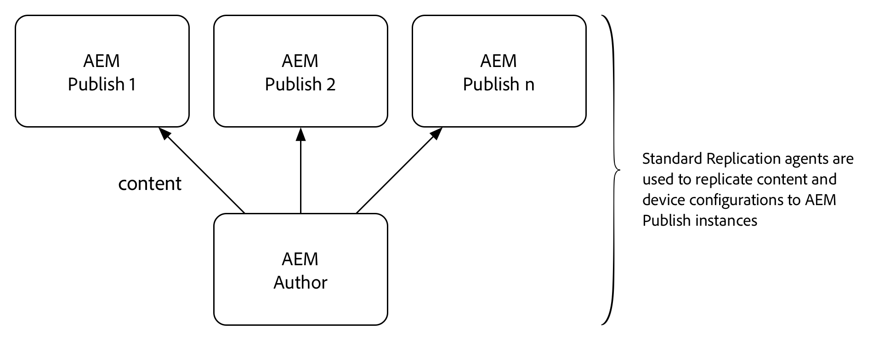
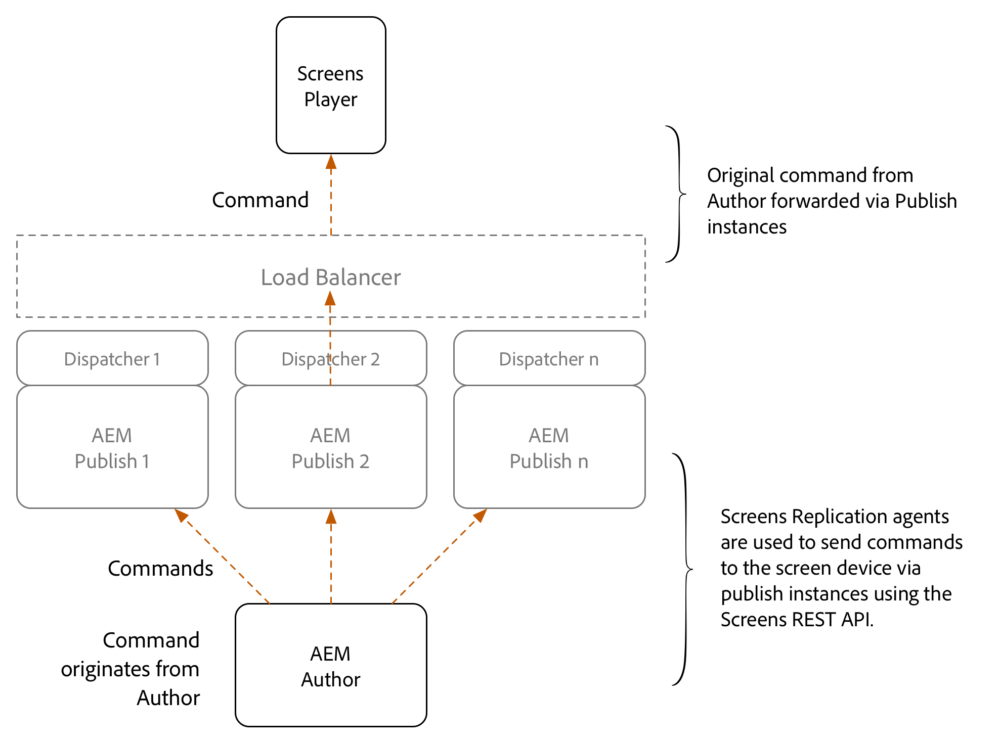
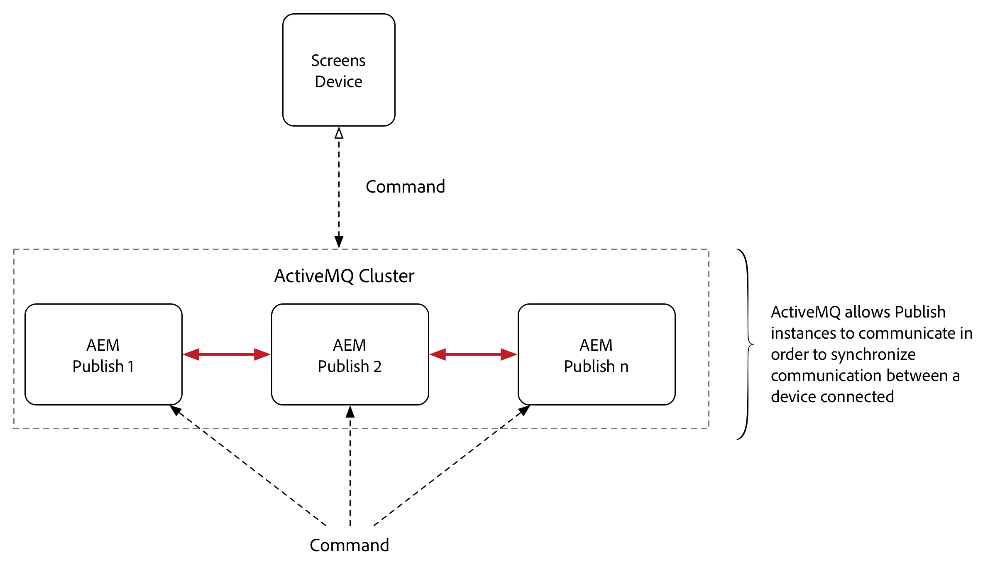
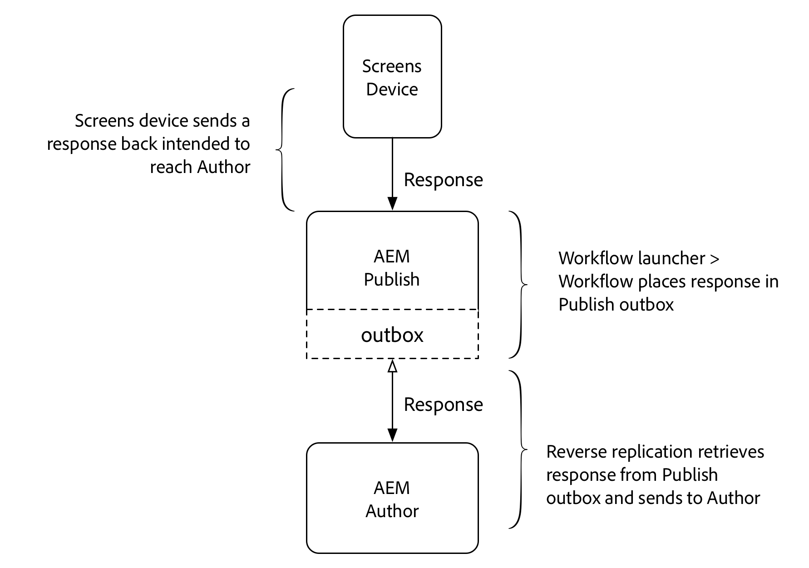
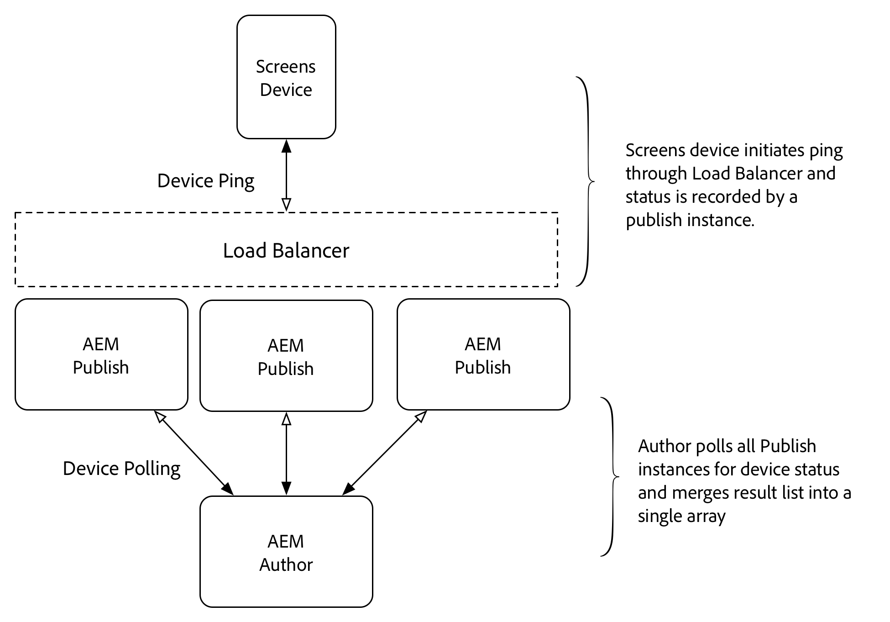

# Supporting Author and Publish in AEM Screens{#supporting-author-and-publish-in-aem-screens}

## An Overview {#an-overview}

This page highlights the following topics:

* **Introduction to Publish Servers**
* **Architectural Overview**
* **Setting Up Replication Agents on Author**
* **Setting Up Publish Topology**
* **Device Registration**
* **Managing Publication: Delivering Content Updates from Author to Publish to Device**

### Prerequisites {#prerequisites}

Before getting started with author and publish servers, you should have prior knowledge of:

* **AEM Topology**
* **Creating and Managing AEM Screens Project**
* **Device Registration Process**

>[!NOTE]
>
>This AEM Screens functionality is only available, if you have installed AEM 6.3 Screens Feature Pack 2. To get access to this Feature Pack, you must contact Adobe Support and request access. Once you have permissions you can download it from Package Share.

## Introduction {#introduction}

AEM Screens architecture resembles a traditional AEM Sites architecture. Content is authored on an AEM author instance and then forward-replicated to multiple publish instances. AEM Screens devices can now connect to an AEM publish farm via load balancer. Multiple AEM publish instances can be added to continue to scale the publish farm.

*For example*, an AEM Screens content author issues a command on the authoring system for a particular device that is configured to interact with a publish farm or an AEM Screens content author that obtains information about devices that are configured to interact with publish farms.

The following diagram illustrates the author and publish environments.

 

## Architectural Design {#architectural-design}

There are five architectural components, facilitating this solution:

* ***Replicating ***content*** ***from author to publish for display by devices

* ***Reverse ***replicating binary content from publish (received from devices) to author
* ***Sending ***commands from author to publish via specific REST APIs
* ***Messaging*** between publish instances to synchronize device information updates and commands
* ***Polling*** by the author of publish instances to obtain device information via specific REST APIs

### Replication (Forward) of Content and Configurations {#replication-forward-of-content-and-configurations}

Standard replication agents are used to replicate screens channel content, location configurations and device configurations. This allows authors to update the content of a channel and optionally go through some sort of approval workflow before publishing channel updates. A replication agent needs to be created for each publish instance in the publish farm.

The following diagram illustrates the replication process:

>[!NOTE]
>
>A replication agent needs to be created for each publish instance in the publish farm.

### Screens Replication Agents and Commands {#screens-replication-agents-and-commands}

Custom Screens specific replication agents are created to send commands from the Author instance to the AEM Screens device. The AEM Publish instances serve as an intermediary to forward these commands to the device.

This allows authors to continue to manage the device such  as,  send device updates and take  screenshot s from the  author  environment. The AEM Screens replication agents have a custom transport configuration, like standard replication agents.

 

### Messaging between Publish Instances {#messaging-between-publish-instances}

In many cases a command is only meant to be sent to a device a single time. However in a load-balanced publish architecture it is unknown which publish instance the device is connecting to.

Therefore, the author instance sends the message to all Publish instances. However only a single message should then be relayed to the device. To ensure correct messaging some communication must take place between publish instances. This is achieved using *Apache ActiveMQ Artemis. *Each publish instance is placed in a loosely coupled Toplogy using Oak-based Sling discovery service and ActiveMQ is configured so that each publish instance can communicate and create a single message queue. The Screens device polls the publish farm via the load balancer and picks up the command from the top of the queue.

 

### Reverse Replication {#reverse-replication}

In many cases, following a command, some sort of response is expected from the Screens device to be forwarded to the Author instance. In order to achieve this AEM ***Reverse replication*** is used.

* Create a reverse replication agent for each publish instance, akin to the standard replication agents and the screens replication agents.
* A workflow launcher configuration listens for nodes modified on the publish intance and in turn triggers a workflow to place the Device's response in the Publish instance's outbox.
* A reverse replication in this context is only used for binary data ( such as, log files and screenshots) provided by the devices. Non-binary data is retrieved by polling.
* Reverse replication polled from the AEM author instance retrieves the response and saves it to the author instance.

 

### Polling of Publish Instances {#polling-of-publish-instances}

The author instance needs to be able to poll the devices to get a heartbeat and know the health status of a connected device.

Devices ping the load balancer and get routed to a publish instance. The status of the device is then exposed by the publish instance through a Publish API served @ **api/screens-dcc/devices/stati** for all active devices and **api/screens-dcc/devices/&lt;device_id&gt;/status.json** for a single device.

The author instance polls all publish instances and merges the device status responses into a single status. The scheduled job that polls on author is *com.adobe.cq.screens.impl.jobs.DistributedDevicesStatiUpdateJob* and can be configured based on a cron expression.

 

## Registration {#registration}

Registration continues to originate on the AEM author instance. AEM Screens Device is pointed to the author instance and registration is completed.

Once a device has been registered on the author environment the device configuration and channel/schedule assignments are replicated to the AEM publish instances. The AEM Screens Device configuration is then updated to point to the Load Balancer in front the AEM publish farm. This is intended to be a one-time setup, once the Screens Device is successfully connected to the publish environment it can continue to recieve commands originating from the author environment and there should be no need to ever connect the Screens device to the author environment directly.

 

## Setting Up Author and Publish instances {#setting-up-author-and-publish-instances}

The following section explains how to setup replication agents on author and publish topology.

You can set up a simple example, where you host an author and two publish instances:

* Author --&gt; localhost:4502 
* Publish 1 (pub1) --&gt; localhost:4503   
* Publish (pub2) --&gt; localhost:4505

### Setting up Replication Agents on Author {#setting-up-replication-agents-on-author}

#### Create Standard Replication Agents {#create-standard-replication-agents}

1. Create standard replication agent for pub1 (out-of-the-box default agent should already be configured).
1. Create standard replication agent for pub2. You can copy rep agent for pub1 and update the transport to be used for pub2 by changing the port in the transport configuration.

#### Create Screens Replication Agents {#create-screens-replication-agents}

1. Create AEM Screens replication agent for pub1. Out-of-the-box, there is a one named Screens Replication Agent that points to port 4503. This needs to be enabled.
1. Create AEM Screens replication agent for pub2. Copy the Screens replication agent for pub1 and change the port to point to 4505 for pub2.

**Create Screens Reverse Replication Agents**

1. Create standard reverse replication agent for pub1.
1. Create standard reverse replication agent for pub2. You can copy reverse rep agent for pub1 and update the transport to be used for pub2 by changing the port in the transport configuration.

### Setting up Publish Topology {#setting-up-publish-topology}

#### Step 1: Configure Apache Sling Oak-Based Discovery {#step-configure-apache-sling-oak-based-discovery}

Set up Apache Sling Oak-Based Discovery for all Publish instances in the topology   
  
For each publish instance:

1. Navigate to http://&lt;host&gt;:&lt;port&gt;/system/console/configMgr
1. Select **Apache Sling Oak-Based Discovery Service** Configuration.
1. Update Topology connector URLs: add URLs of all partaking publish instances that is, [http://localhost:4502/libs/sling/topology/connector](http://localhost:4502/libs/sling/topology/connector)
1. Topology connector Whitelist: adapt to IPs or subnets covering partaking publish instances
1. Enable **Auto-Stop Local-Loops**


The configuration should be identical for each publish instance and the auto-stop Local-loop prevents an infinite loop.

#### Step 2: Verify Publish Topology {#step-verify-publish-topology}

For any of the Publish instances navigate to http://&lt;host&gt;:&lt;port&gt;/system/console/topology. You should see each publish instance represented in the topology.

#### Step 3: Setup ActiveMQ Artemis Cluster {#step-setup-activemq-artemis-cluster}

This step allows you to create encrypted password for ActiveMQ Artemis cluster.  
The cluster user and password of all publish instances in the topology needs to be identical. The password of the ActiveMQ Artemis configuration needs to be encrypted. Since each instance has its own encryption key it is necessary to use Crypto Support to create an encrypted password string. Then encrypted password will be used in the OSGi config for ActiveMQ.

On each Publish Instance:

1. In the OSGi Console navigate to **MAIN** --&gt; **Crypto Support** (*http://&lt;host&gt;:&lt;port&gt;/system/console/crypto*).

1. Type in the desired plain text password (same for all instances) in **Plain Text**
1. Click **Protect**.
1. Copy the value **Protected Text **to notepad or text editor. This value will be used in the OSGi config for ActiveMQ.

Since each publish instance by default has unique crypto keys you need to perform this step on each pub instance and save the unique key for the next configuration.

*For example*,

Pub1 - {1ec346330f1c26b5c48255084c3b7272a5e85260322edd59119828d1fa0a610e}   
Pub2 - {8d3d113c834cc4f52c2daee0da3cb0a21122a31f0138bfe4b70c9ead79415f41}

#### Step 4: Activate ActiveMQ Artemis Cluster {#step-activate-activemq-artemis-cluster}

On each publish instance:

1. Navigate to the OSGi Config manager *http://&lt;host&gt;:&lt;port&gt;/system/console/configMgr*
1. Select **Apache ActiveMQ Artemis JMS Provider** Configuration
1. Update the following:

* ***Cluster Password***: (use encrypted value from previous step per respective instance)
* ***Topics***: {name: 'commands', address: 'com.adobe.cq.screens.commands', maxConsumers: 50}

#### Verify ActiveMQ Artemis Cluster {#verify-activemq-artemis-cluster}

Follow the steps below on each Publish instance:

1. Navigate to the OSGi Console -&gt; Main &gt; ActiveMQ Artemis ([http://localhost:4505/system/console/mq](http://localhost:4505/system/console/mq)).
1. Verify and check to view the ports of other instances under Cluster Information &gt; Topology &gt; nodes=2, members=2. 
1. Send a Test Message (top of the screen under Broker Information)
1. Enter the following changes in fields:

    1. **Destination**: /com.adobe.cq.screens/devTestTopic
    1. **Text**: Hello World
    1. View the error.log of each instance to see that the message was sent and received across the cluste

>[!NOTE]
>
>Navigating to OSGI console, may take a few seconds after saving the configuration in the preceeding step. You can also check the error.log for more details.

As an example, the following image displays on successful configuration of ActiveMQ Artemis Server.

If you do not see the following configuration from */system/console/mq*, then navigate to */system/console/mq* and click **Restart** to restart the broker.

 

#### Remove referrer header requirement {#remove-referrer-header-requirement}

Follow the steps on each Publish instance:

1. Navigate to the **OSGi Console **&gt; **Configuration Manager**

1. Select **Apache Sling Referrer Filter**
1. Update config and **check Allow Empty**

### Configuring Author and Publish Instance {#configuring-author-and-publish-instance}

Once you have set up the publish toplogy, you need to configure the author and publish instances, to view the practical results of implementation:

>[!NOTE]
>
>**Prerequisites**
>
>To get started with this example, create a new AEM Screens project followed by creating a location, display, and channel in your project. Add content to your channel and assign the channel to a display.

#### Step 1: Starting an AEM Screens Player (device) {#step-starting-an-aem-screens-player-device}

1. Launch a separate browser window.
1. Go to Screens player using the [web browser](http://localhost:4502/content/mobileapps/cq-screens-player/firmware.html) or launch the AEM Screens app. When you open the device you will notice the device's state as unregistered.

>[!NOTE]
>
>You can open an AEM Screens player using the AEM Screens app you downloaded or using the web browser.

#### Step 2: Registering a Device on Author {#step-registering-a-device-on-author}

1. Go to [http://localhost:4502/screens.html/content/screens/we-retail](http://localhost:4502/screens.html/content/screens/we-retail) or select your project and navigate to Devices &gt; Device Manager. 
1. Select **Register Device**.
1. Click **Device Registration** to view the device.
1. Select the device you want to register and click **Register Device**.
1. Verfiy the registration code and click **Validate**.
1. Enter a title for your device and click **Register**.

#### Step 3: Assigning the Device to Display {#step-assigning-the-device-to-display}

1. Click **Assign Display** from the dialog box from the preceeding step.
1. Select the display path for your channel from the **Locations** folder.
1. Click **Assign**.
1. Click **Finish** to complete the process, and now the device is assigned.

Check your player and you will see the content that you added in your channel.

#### Step 4: Publishing Device Configuration to Publish Instances {#step-publishing-device-configuration-to-publish-instances}

**Verifying the Device**

Before, you perform the steps below, make sure to verify the Device ID. To verify, search for the device id in CRXDELite, with the path as */home/users/screens/{project}/devices*.

Follow the steps below to replicate the device user:

1. Navigate to the user admin page (e.g: [http://localhost:4502/useradmin](http://localhost:4502/useradmin)).
1. Search for the **screens-devices-master** group
1. Right click on the group, and click **Activate**

>[!CAUTION]
>
>Do not activate author-publish-screens-service as it is a system user, used by the Author Job.

#### Publishing Check list {#publishing-check-list}

The following points summarizes the Publishing Check list:

* *Screens Device User*: This is stored as an AEM user and be activated from Tools &gt; Security &gt; Users. The user will be prefixed with "screens" with a long serialized string.
* *Location* : Location that device is connected to.
* *Channel(s)*: one or more channels that are being displayed at the location
* *Schedule* - if using a schedule ensure this is published

Once you verify the checklist, you need to verify the following changes/behavior in your channel:

* After publishing the device config open the Screens player config and point it to the Publish instance.
* Update some channel content on Author and publish it and verify that the updated channel now displays on the AEM Screens player.
* Connect the Screens player to a different publish instance and verify behavior above.

#### Step 5: Pointing the Device to Publish Instance in the Admin Panel {#step-pointing-the-device-to-publish-instance-in-the-admin-panel}

1. View the admin UI from the Screens player, long press on the top left corner to open the Admin menu, on your touch enabled AEM Screens player, or by using a mouse. 
1. Click the **Configuration **option from the side panel.
1. Change author instance to publish instance in **Server**.

View the changes in your AEM Screens player.

Alternatively, you can also update/edit the server URL from the device management console using the following steps:

1. Navigate to your AEM Screens project and select the **Devices** folder.
1. Click **Device Manager** from the action bar.
1. Select the device and click **Edit server URL **from the action bar, as shown in the figure below and your changes will be propagated to the AEM Screens player.

 

## Managing Publication: Delivering Content Updates from Author to Publish to Device {#managing-publication-delivering-content-updates-from-author-to-publish-to-device}

Follow the steps below to deliver content updates from author to publish to device:

1. Navigate to your Screens project and select the channel.
1. Click **Manage Publication** from the action bar to publish the channel to publish instance.

   >[!NOTE]
   >
   >Wait for a few seconds/minutes so that the content reaches publish instance.

   

1. The **Manage Publication** wizard opens. You can select the **Action** and also schedule the publishing time for now or later. Click **Next**.

   

1. Click **Publish **from the** Manage **Publication wizard.** **

   

1. Once you have completed the manage publication workflow, you must trigger the update offline content in author, that will create the update offline on the author instance.

   Navigate to the channel dashboard and click **Update Offline Content**. This action forwards the same command to publish instance, so that the offline zips are created on the publish instance as well.

   

   >[!CAUTION]
   >
   >You must first publish and then trigger the update offline content, as summarized in the preceding steps.

