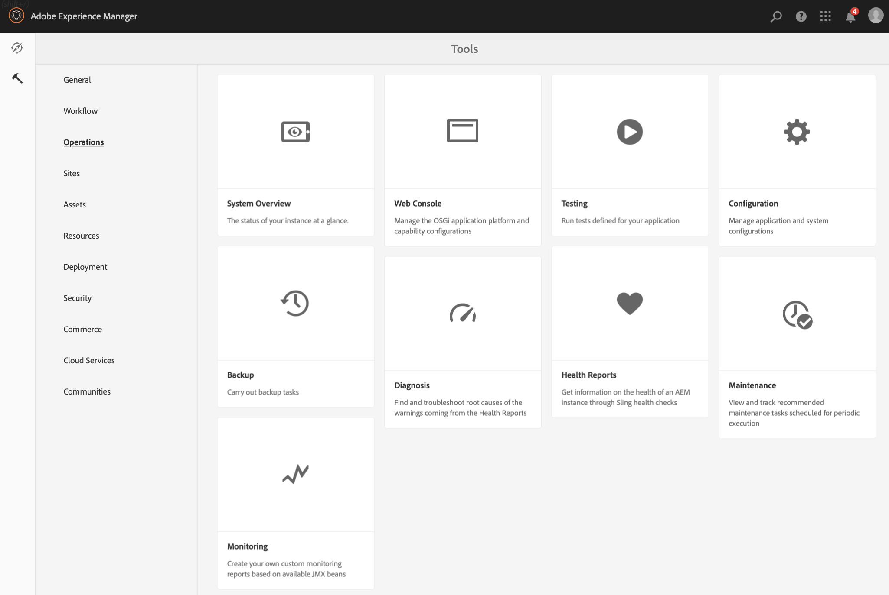
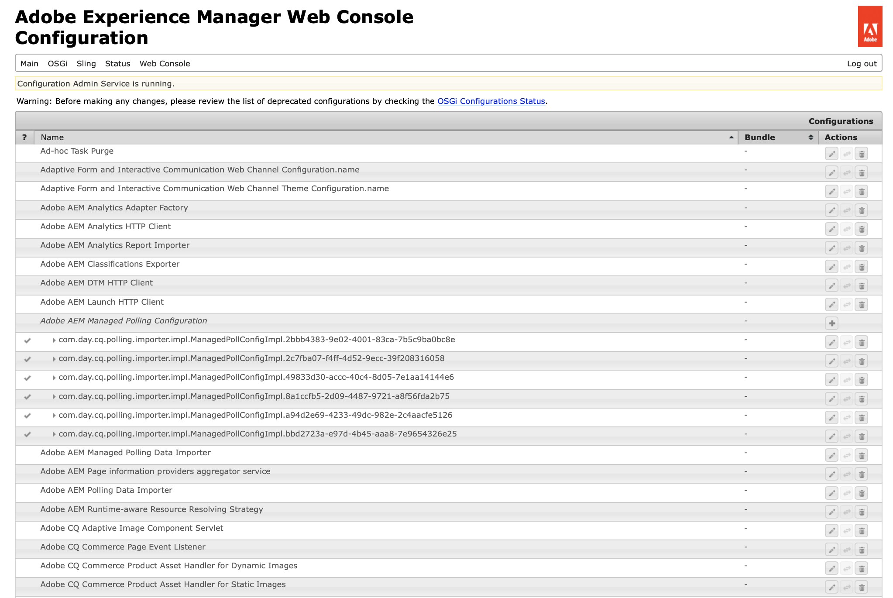

# Configuring and Deploying AEM Screens{#configuring-and-deploying-aem-screens}

This page shows how to install and configure the Screens players on your devices and covers the following topics:

* [Installing AEM Screens Player](../../screens/using/configuring-screens-introduction.md#installingaemscreensplayer)
* [Server Configuration](../../screens/using/configuring-screens-introduction.md#serverconfiguration)
* [Hardware Selection Guidelines for Player Device](#hardwareselectionguidelinesforplayerdevice)  

* [The Next Steps](../../screens/using/configuring-screens-introduction.md#thenextsteps)

## Installing AEM Screens Player {#installing-aem-screens-player}

The AEM Screens player is available for Android, Chrome OS, iOS, and Windows.

To download **AEM Screens Player**, visit the [**AEM 6.4 Player Downloads**](https://download.macromedia.com/screens/) page.

>[!NOTE]
>
>Once you download the latest Player (*.exe*), follow the steps on the player to complete the ad-hoc installation:
>
>1. Long-press on the top left corner to open the admin panel.
>1. Navigate to **Configuration** from the left action menu and enter the location address of the AEM instance in **Server** and click **Save**.
>
>1. Click on the **Registration** link from the left action menu and the steps below to complete the device registation process.
>

### Additional Resources {#additional-resources}

Refer to the following topics for an in-depth information:

* To download Android Player, visit **Google Play**. To learn about implementing Android Watchdog, please refer to ** [Implementing Android player](../../screens/using/implementing-android-player.md)**.

* To implement Chrome OS Player, please refer to [**Chrome Management Console**](/screens/using/implementing-chrome-os-player.html?cq_ck=1513900475345) for more information.
* To configure AEM Screens Windows player, please refer to [**Implementing Windows Player**](../../screens/using/implementing-windows-player.md).

## Server Configuration {#server-configuration}

>[!NOTE]
>
>**Important**:
>
>AEM Screens player does not make use of the Cross-Site Request Forgery (CSRF) token. Therefore, in order to configure and AEM server to be ready to use for AEM Screens, skip the referrer filter by allowing empty referrers.

### Prerequisites {#prerequisites}

The following key points below helps to configure and AEM server to be ready to use for AEM Screens:

#### Allow Empty Referrer Requests {#allow-empty-referrer-requests}

Follow the steps below to enable the Apache Sling Referrer Filter Allow Empty. This is required for optimal operation of the control protocol between AEM Screens Player and AEM Screens server.

1. Navigate to **Adobe Experience Manager Web Console Configuration **via AEM instance --&gt; hammer icon --&gt; **Operations** --&gt; **Web Console**.

   

1. **Adobe Experience Manager Web Console Configuration **opens. Search for sling referrer.

   For searching the sling referrer property, press **Command+F** for **Mac** and **Control+F** for **Windows**.

   

1. Check the **Allow Empty **option, as shown in the figure below.

   

1. Click **Save** to enable the Apache Sling Referrer Filter Allow Empty.

#### Enable Touch UI for AEM Screens {#enable-touch-ui-for-aem-screens}

AEM Screens requires TOUCH UI and will not work with CLASSIC UI of Adobe Experience Manager (AEM).

1. Navigate to *&lt;yourAuthorInstance&gt;/system/console/configMgr/com.day.cq.wcm.core.impl.AuthoringUIModeServiceImpl*
1. Ensure that the **Default authoring UI mode** is set to **TOUCH**, as shown in the figure below

Alternatively, you can also perform the same setting using*&lt;yourAuthorInstance&gt; *-&gt;* tools (hammer icon)* -&gt; **Operations** -&gt;** Web Console** and search for **WCM Authoring UI Mode Service**.

>[!NOTE]
>
>You can always enable Classic UI for specific users using user preferences.

#### AEM in NOSAMPLECONTENT runmode {#aem-in-nosamplecontent-runmode}

Running AEM in production uses the **NOSAMPLECONTENT** runmode. Remove the the *X-Frame-Options=SAMEORIGIN* header (in the additional response header section) from

[http://localhost:4502/system/console/configMgr/org.apache.sling.engine.impl.SlingMainServlet](http://localhost:4502/system/console/configMgr/org.apache.sling.engine.impl.SlingMainServlet).

This is required for the AEM Screens Player to play online channels.

#### Password Restrictions {#password-restrictions}

AEM Screens Player registration will fail, if the **password restrictions **are set.

Remove the following config to set it correctly,

[http://localhost:4502/system/console/configMgr/org.apache.jackrabbit.oak.spi.security.user.action.DefaultAuthorizableActionProvider](http://localhost:4502/system/console/configMgr/org.apache.jackrabbit.oak.spi.security.user.action.DefaultAuthorizableActionProvider).

#### Dispatcher Configuration {#dispatcher-configuration}

For **Dispatcher, **add client headers to .any file. Allow the following headers through:

* "X-Requested-With"
* "X-SET-HEARTBEAT"
* "X-REQUEST-COMMAND"

#### Java encoding {#java-encoding}

Set the ***Java encoding*** to Unicode. For example, *Dfile.encoding=Cp1252* will not work.

>[!NOTE]
>
>**Recommendation:**
>
>It is recommended to use HTTPS for AEM Screens Server in production use.

## Hardware Selection Guidelines for Player Device {#hardware-selection-guidelines-for-player-device}

The following section provides the hardware selection guidelines for a Screens Project:

* Always source ***Commercial*** or ***Industrial*** Grade components for both PC player and Display Panel or Projector.

* Always engage with vendors who serve the digital signage market.
* Always consider environmental factors such as ambient temperature and relative humidity.
* Always review power requirements and power conditioning.
* Carefully review performance needs and I/O ports required for application.

The following table summarizes the hardware configurations with typical use cases for an AEM Screens project:

<table border="1" cellpadding="1" cellspacing="0" width="100%"> 
 <tbody> 
  <tr> 
   <td>Player Configuration</td> 
   <td>Processor</td> 
   <td>Memory</td> 
   <td>Storage SSD</td> 
   <td>GPU</td> 
   <td>Display</td> 
   <td>I/O</td> 
   <td>Typical Use Cases</td> 
  </tr> 
  <tr> 
   <td>Basic</td> 
   <td>Dual Core, i3 or entry-level quad core Intel® Atom Processor</td> 
   <td>
4GB of memory
 
2MB of cache
 </td> 
   <td>
•ChromeOS 32 GB
 
•Windows 128GB
 </td> 
   <td>OnBoard</td> 
   <td>1920 x 1080</td> 
   <td>DVI,   Ethernet / Wireless,  2xUSB</td> 
   <td> 
    <ul> 
     <li>Standard Full Screen Looping   </li> 
     <li>Day Parting</li> 
    </ul> </td> 
  </tr> 
  <tr> 
   <td>Standard</td> 
   <td>Quad Core, Intel® Core i5 processor</td> 
   <td>
8GB of memory
 
4MB of cache
 </td> 
   <td>128 GBB</td> 
   <td>OnBoard</td> 
   <td>3840x2160 (4K)</td> 
   <td>DVI, HDMI  Ethernet / Wireless,  2xUSB</td> 
   <td> 
    <ul> 
     <li>Single Source Dynamic Content </li> 
     <li>Simple Interactive</li> 
     <li> 1-3 Zone layouts</li> 
    </ul> </td> 
  </tr> 
  <tr> 
   <td>Advanced</td> 
   <td>Quad Core with hyperthreading, Intel® Core i7 processor</td> 
   <td>
16GB of memory
 
8MB of cache
 </td> 
   <td>256 GB</td> 
   <td>Discreet GPU</td> 
   <td>3840x2160 (4K)</td> 
   <td>DVI, HDMI  Ethernet / Wireless,  4xUSB</td> 
   <td> 
    <ul> 
     <li>4 or more Content Zones, Concurrent Video Playback</li> 
     <li> Multi-Page Interactive</li> 
     <li>Multi-Source Data Triggers</li> 
    </ul> </td> 
  </tr> 
 </tbody> 
</table>

## The Next Steps {#the-next-steps}

Once you have installed and configured Screens player, follow the topics below to get started:

1. [Create and Manage Screens Project](../../screens/using/creating-a-screens-project.md)
1. [Create and Manage Channels](../../screens/using/managing-channels.md)
1. [Create and Manage Locations](../../screens/using/managing-locations.md)
1. [Create and Manage Displays](../../screens/using/managing-displays.md)
1. [Assign Channels](../../screens/using/channel-assignment.md)
1. [Manage Devices](https://chl-auth/content/help/en/experience-manager/6-4/sites/authoring/using/managing-devices.html)
1. [Registering a Device](../../screens/using/device-registration.md)
1. [Assign Devices](../../screens/using/managing-devices.md)
1. [Create and Manage Schedules](https://chl-author.corp./content/help/en/experience-manager/6-4/sites/authoring/using/managing-schedules.html)
1. [AEM Screens Player](https://chl-author.corp.ad/content/help/en/experience-manager/6-4/sites/authoring/using/working-with-screens-player.html)  
1. [Troubleshoot Device Control Center](../../screens/using/monitoring-screens.md)

