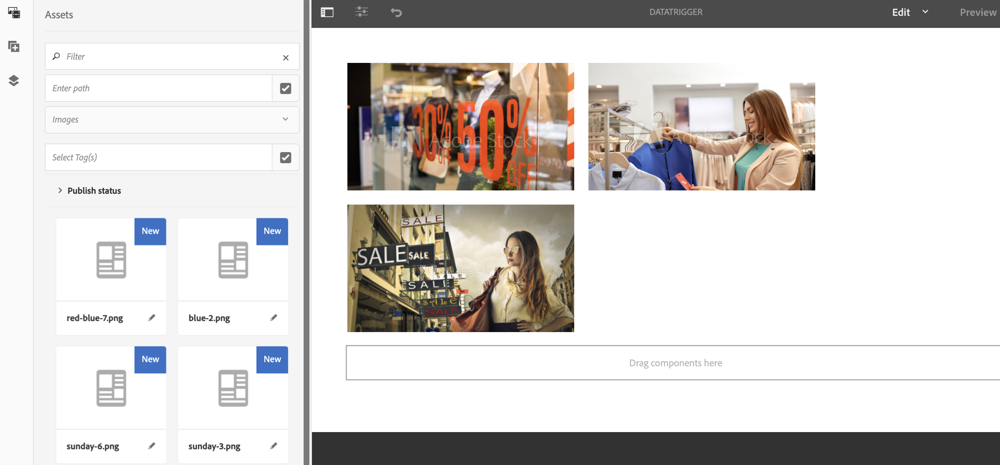
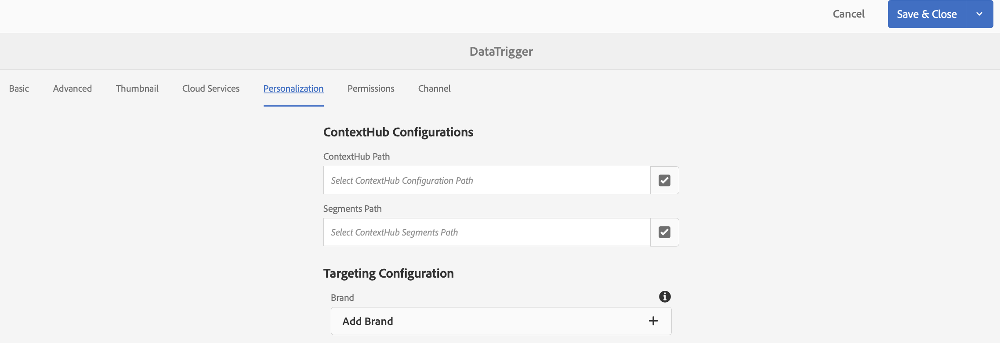
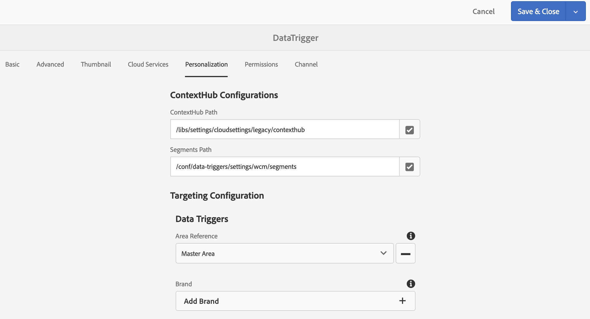
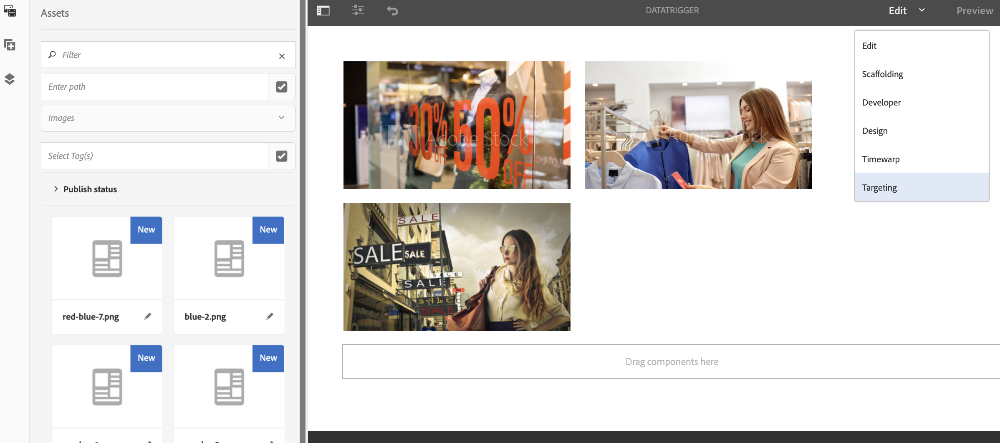
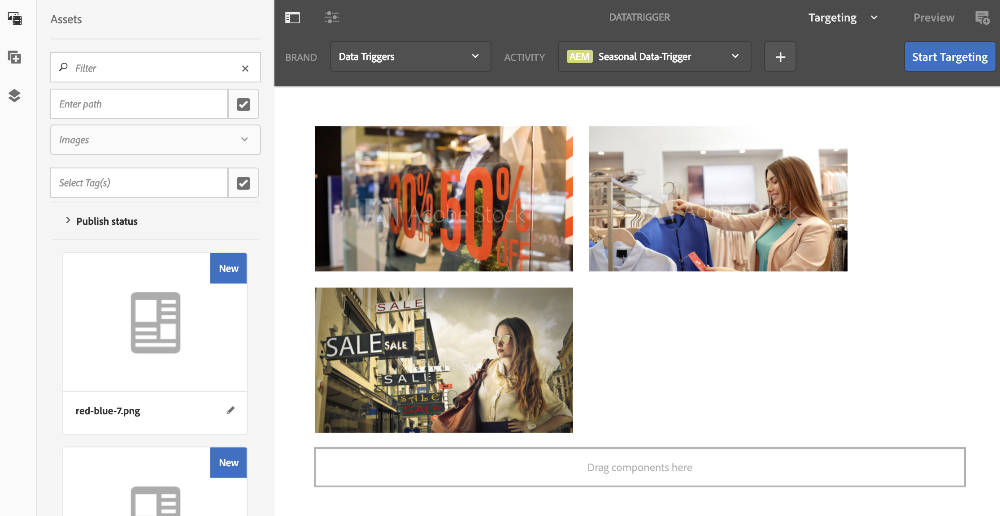
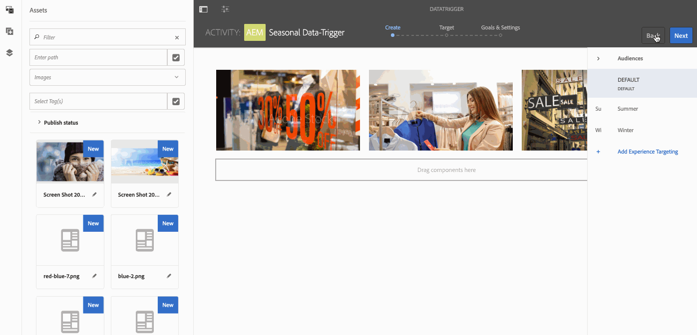
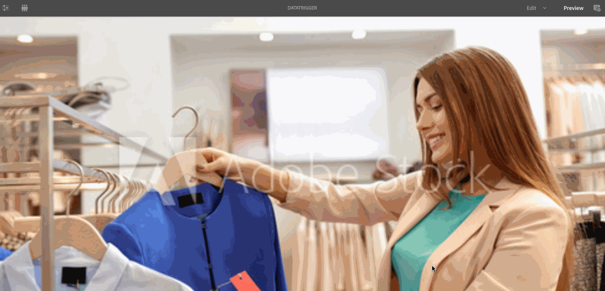
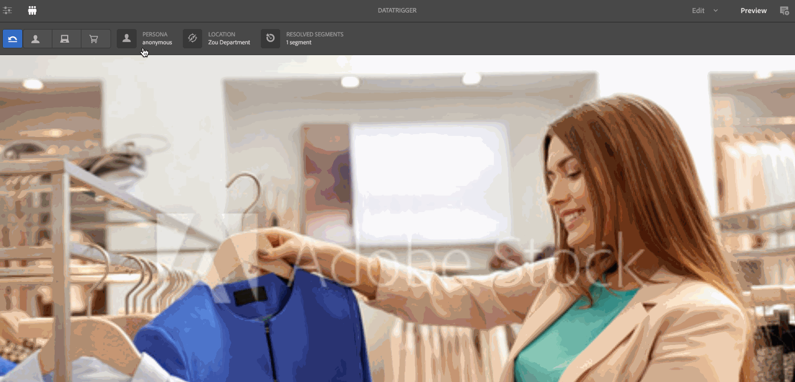

# Data Triggered Asset Change{#data-triggered-asset-change}

## Use Case Description {#use-case-description}

This use case example describes how to achieve personalized content based on weather of your location.

The following AEM Screens project leverages AEM personalization which includes the ContextHub, the Segmentation engine and the Content Targeting UI.

This use case delivers content which is personalized based on the current weather in each location, if the weather is:

* *sunny, it displays summer clothing  
  *
* *cold, it displays winter clothing*

>[!NOTE]
>
>For demonstration purposes, this use case captures your Geo-location to showcase the content update. You can manually update the Geo-location view the output in different scenarios.

### Preconditions {#preconditions}

Before you start this use case, make sure you understand:

* [Personalization](../../sites/administering/using/personalization.md)
* [Configuring ContextHub](../../sites/administering/using/contexthub-config.md)
* [Configuring Segmentation with ContextHub](../../sites/administering/using/segmentation.md)
* [Authoring Targeted Content Using Targeting Mode](../../sites/authoring/using/content-targeting-touch.md)

### Primary Actors {#primary-actors}

Content Authors

## Basic Flow: Setting up the Project {#basic-flow-setting-up-the-project}

Follow the steps below to set up a project showcasing data triggered asset change:

1. Create an AEM Screens Project named as **DataTriggerAsset**, as shown below.

   

1. **Creating a Sequence Channel**

    1. Select the **Channels** folder and click **Create** to open the wizard to create a channel.
    
    1. Select **Sequence Channel **from the wizard and create the channel titled as **DataTrigger**.

   

1. **Adding Content to Sequence Channel**

    1. Select the channel (**DataTrigger**).
    1. Click **Edit** from the action bar to open the editor. Drag and drop few assets to your channel.

   

   >[!NOTE]
   >
   >You must only add the default images to the editor. The images that you want to be replaced, must be added to the editor when you switch to targeting mode in step (6).

1. **Setting ContextHub and Targeting Configurations**

    1. Navigate to **DataTriggerAsset** --&gt; **Channels** --&gt; **DataTrigger** and click **Properties** from the action bar.   
    
    1. Click **Personalization** tab.

   

1. **Adding ContextHub and Targeting Configurations**

    1. For demo purposes, download the content package below.
    1. Once you have downloaded the package to your AEM instance, you need to set the ContextHub and Segments Path:

    * For **ContextHub**, set the path to: ***/libs/settings/cloudsettings/legacy/contexthub***
    
    * For **Segments Path**, set the path to: ***/conf/data-triggers/settings/wcm/segments***

   Data Triggers

   [Get File](assets/data-triggers-1_00.zip)

   >[!NOTE]
   >
   >To learn about configuring ContextHub and Segmentation, refer to:
   >
   >    
   >    
   >    * ** [Configuring ContextHub](../../sites/administering/using/contexthub-config.md)**
   >    * ** [Configuring Segmentation with ContextHub](../../sites/administering/using/segmentation.md)**
   >    
   >

   

   Click **Save & Close**.

1. **Switching to Targeting Mode**

    1. Navigate to **DataTriggerAsset** --&gt; **Channels** --&gt; **DataTrigger **and** **click** Edit** from the action bar.  
    
    1. Select **Targeting** from the menu bar under **Edit**.

   

1. **Adding the Targeted Content**

    1. Select **Data Triggers** in **BRAND** and **Seasonal Data-Trigger **in **ACTIVITY**.
    
    1. Click the **Start Targeting**

   

1. **Defining the Targeted Component**

    1. Select the component for which you want to have targeted content.
    1. Click the **Target** button to enable targeting for that component.
    1. Define the content for each variation by selecting the variation in the **Audiences** in the side rail and adjusting the content as needed.

   >[!NOTE]
   >
   >To hide the **Assets** panel in the editor, you will have to click the left arrow on the right hand side panel, as shown in the figure below.

   

## Viewing the Results {#viewing-the-results}

Once you have completed the preceding steps, follow along further to preview and view the results:

1. Click **Preview** from the editor.

   

1. To showcase, how the image will change, depending on the location and further the temperature of your area, you can manually click the ContextHub icon, as shown below.

   As soon as you update the location, the temperature of that area is captured and the image updates with the winter selection and replaces the summer selection image.

   

