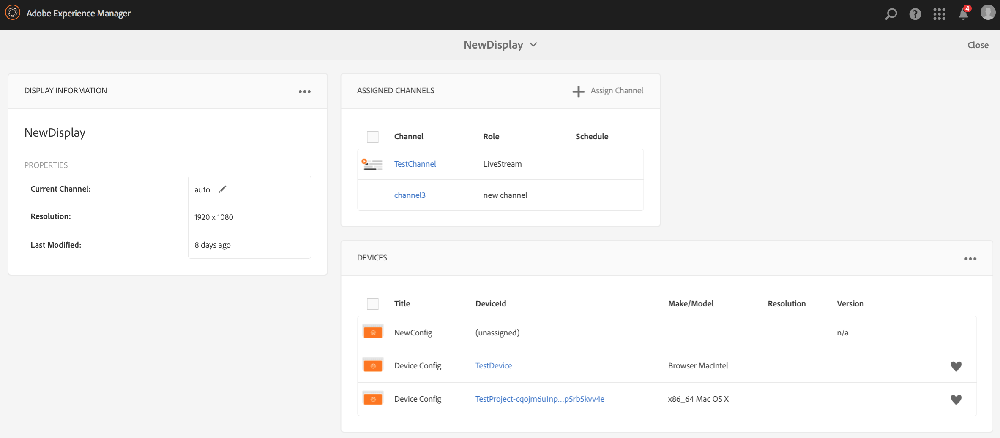
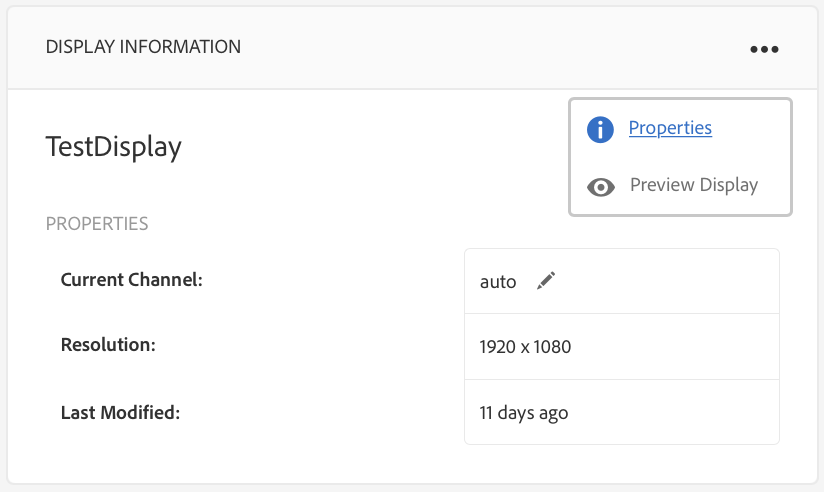
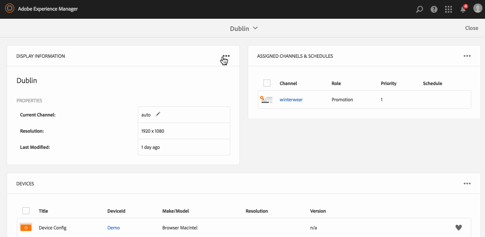
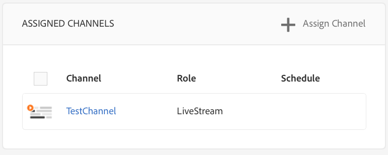

# Creating and Managing Displays{#creating-and-managing-displays}

A display is a virtual grouping of screens that are usually positioned next to each other. The display is usually permanent in respect to an installation. This will be the object content authors will work with and always reference to as logical display rather than their physical counter part(s).

Once you create a location, you have to create a new display for your location.

This page shows creating and managing displays for Screens.

**Pre-requisites**:

* [Configuring and Deploying Screens](../../sites/deploying/using/configuring-screens-introduction.md)
* [Create and Manage Screens Project](../../screens/using/creating-a-screens-project.md)
* [Create and Manage Channels](../../screens/using/managing-channels.md)
* [Create and Manage Locations](../../screens/using/managing-locations.md)

## Creating a New Display {#creating-a-new-display}

>[!NOTE]
>
>You need to create a location before creating a display. To see how to create a location, see [Create and Manage Locations](../../screens/using/managing-locations.md) for more information.

To create a new display in your location, follow the steps below:

1. Navigate to the appropriate location, for example (http://localhost:4502/screens.html/content/screens/TestProject).
1. Select your location folder and tap/click **Create** next to the plus icon in the action bar. A wizard will open.
1. Select **Display** from the **Create** wizard and click **Next**.

1. Enter **Name** and **Title** for your display location.

1. Under the **Display** tab, choose the details of the Layout. Choose the desired **Resolution** (example as, as **Full HD**). Furthermore, you can choose the number of devices horizontally and vertically.

1. Click **Create**.

The display (*StoreDisplay*) is created and added to the location (*SanJose*).

Once you have display in position, the next step will be to create a device config for that particular display. Follow the section below to create a new device config.

>[!NOTE]
>
>**The Next Step**:
>
>Once you create a display for your location, you need to assign a channel to your display to leverage the content.
>
>See [Assign Channels](../../screens/using/channel-assignment.md)**** section to learn how to assign a channel to the display.

## Creating a New Device Config {#creating-a-new-device-config}

A device config acts as a placeholder for an actual digital signage device that is not yet installed.

Follow the steps below to create a new device config:

1. Navigate to the appropriate display, for example, http://localhost:4502/screens.html/content/screens/TestProject/locations/newlocation
1. Select your display folder and tap/click **View Dashboard** in the action bar.
1. Tap/click the **+ Add Device Config** on the top right of the **Devices** panel.

1. Select the **Device Config** as the required template as and tap/click **Next**.

1. Enter the properties as required and tap/click **Create**.

The device config is created and added to the current display (in the following demonstration, the new device config is *DeviceConfig*).

Once a device config is set to your display in the location, the next step will be to assign a channel to your display.

>[!NOTE]
>
>Once a device config is set to your display in the location, the next step will be to assign a channel to your display. 
>
>As shown in the figure below, if the device config is displayed as unassigned in the **DEVICES** pannel, if no channel is assigned to that particular device config.
>
>You should have prior understanding of creating and managing channels. See [Create and Manage Channels](../../screens/using/managing-channels.md) for more details.

## Display Dashboard {#display-dashboard}

The display dashboard provides you with different panels for managing display devices and device configurations for your device.

>[!NOTE]
>
>You can select the dashboard lists and trigger bulk actions on items, instead of going through each item individually.
>
>For example, the following image shows how you can select multiple channels from the display dashboard.

### Display Information Panel {#display-information-panel}

The **DISPLAY INFORMATION** Panel provides the display properties.

Click on the (**...**) in the top right corner in the **DISPLAY INFORMATION **panel to view the properties and preview the display.

#### Viewing Properties {#viewing-properties}

Click **Properties** to view or change the properties of your display.

Additionally, you can adjust the event timer value for your interactive channel in **Idle timeout **property under **Display** tab. The default value is set to *300 seconds*.

Use **CRXDE Lite**, to access the [***idleTimeout***](http://localhost:4502/crx/de/index.jsp#/content/screens/we-retail/locations/demo/flagship/single/jcr%3Acontent/channels) property.

### Assigned Channels Panel {#assigned-channels-panel}

The **ASSIGNED CHANNELS** panel displays the assigned channels to this device.

### Devices Panel {#devices-panel}

The **DEVICES** Panel provides information on the device configs.

Click on the (**...**) in the top right corner in the **DEVICES **panel to add device configs and update devices.

Additionally, click on the device config to view properties, assign a device, or delete it completely.

#### The Next Steps {#the-next-steps}

Once you complete creating a display for your location, you need to assign a channel for your display.

See [Assign Channels](../../screens/using/channel-assignment.md) for more details.
