# Digital River{#digital-river}

## Product Import {#product-import}

>[!NOTE]
>
>This section must be performed by someone with write access to `/etc/commerce/products` and `/etc/tags`.

To import products to a specific folder:

1. In the AEM Home Page, click **Commerce**.

   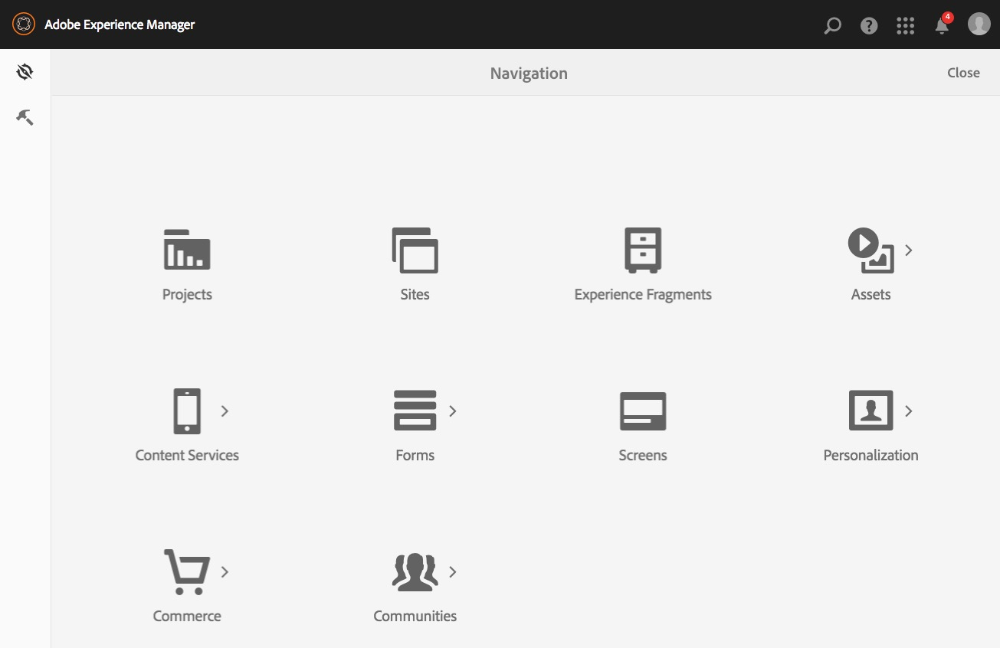

1. Click **Products**.

   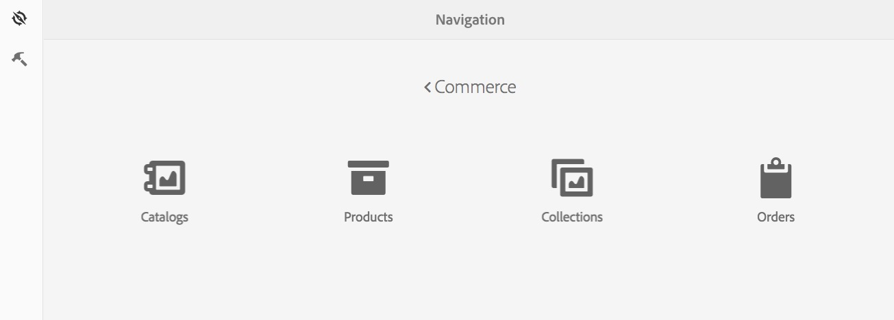

1. Click **Create** and select **Create Folder**.

   

1. Enter the required values and click **Create**.

   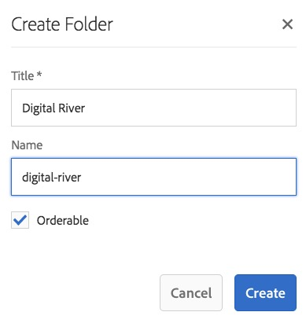

1. Enter the newly created folder by clicking it.

   

1. Click **Create** again and select **Import Products**.

   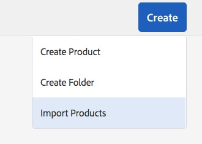

1. Fill in the following information:

    * **Server**: Use the API endpoint provided by your Account or Project Manager.
    * **API Key**: Use the API Key provided by your Account or Project Manager.
    * **Secret**: Use the Secret provided by your Account or Project Manager.
    * **Locale**: Enter in the Locale of the products you want to import. If left blank, it will default to `en_us`.
    * For the first import leave **Is this an incremental import?** blank. For subsequent imports you can check this.
    * Leave all **Collection** fields blank.

   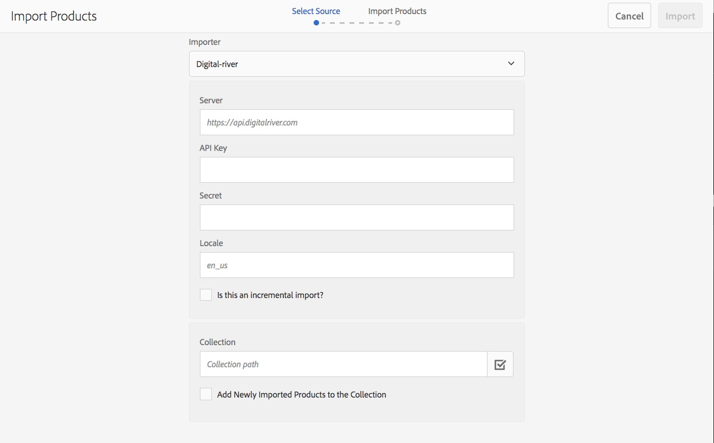

1. Click **Import**. A pop-up opens during the import stating that it is importing. You have to wait.
1. After the import is done, the screen will display information about what was done. You can then click **Done** and it will take you back to the folder, now populated with products.

## Catalog Blueprint Import {#catalog-blueprint-import}

>[!NOTE]
>
>This section must be performed by someone with write access to `/content/catalogs`.

To import a catalog blueprint:

1. In the AEM Home Page, click **Commerce**.

   

1. Click **Catalogs**.

   

1. Click **Create** and select **Create Folder**.

   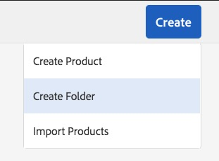

1. Enter the required values and click **Create**.

   

1. Enter the newly created folder by clicking it.
1. Click **Create** again and select **Import Blueprints**.

   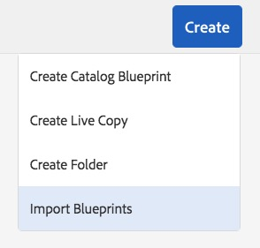

1. Fill in the following information:

    * **Server**: Use the API endpoint provided by your Account or Project Manager.
    * **API Key**: Use the API Key provided by your Account or Project Manager.
    * **Secret**: Use the Secret provided by your Account or Project Manager.
    * **Locale**: Enter in the Locale of the products you want to import. If left blank, it will default to `en_us`.
    * **Catalog Name**: Type a name for the imported Catalog. If left blank, it will default to `Digital River`.

   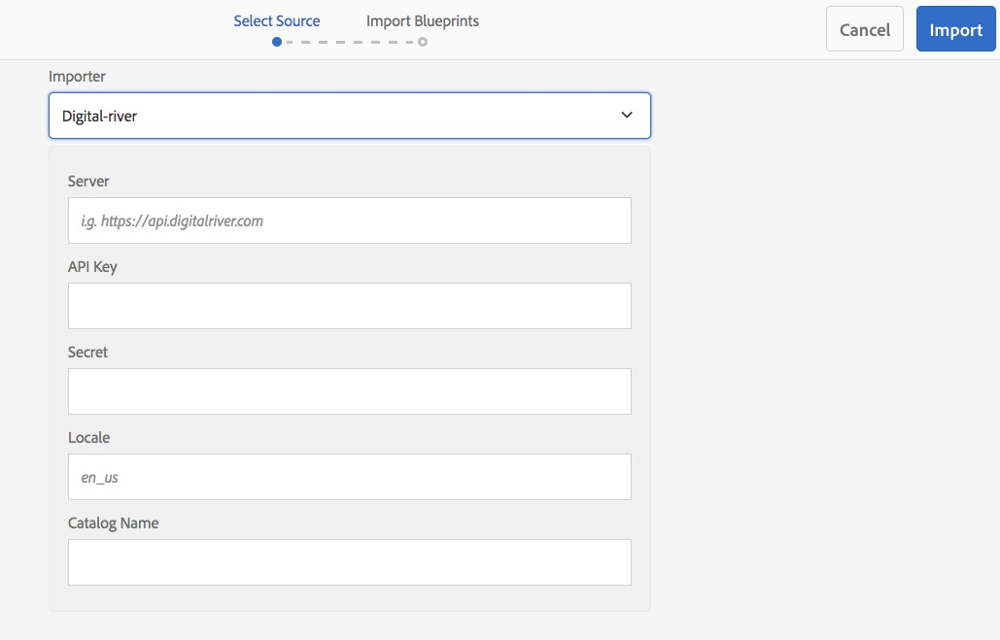

1. Click **Import**. A pop-up opens during the import stating that it is importing. You have to wait.
1. After the import is done, the screen will display information about what was done. You can then click **Done** and it will take you back to the folder, now populated with a Catalog Blueprint.

## Creating a Catalog {#creating-a-catalog}

>[!NOTE]
>
>This section must be performed by someone with write access to `/content/we-retail/us/en`.

To create a Catalog based on your blueprint:

1. In the AEM Home Page, click **Sites**.

   

1. Navigate to `/sites.html/content/we-retail/us/en and select Products.`

   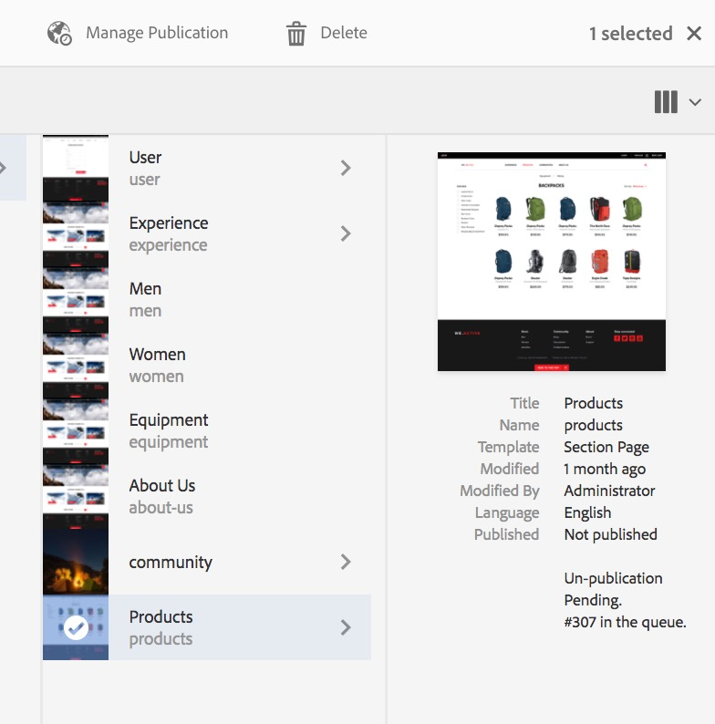

1. Click **Delete** and then **Force Delete**.

   

1. Click **Create** and **Catalog**.

   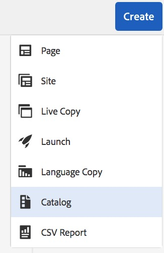

1. Navigate and select the appropriate Catalog Blueprint.

   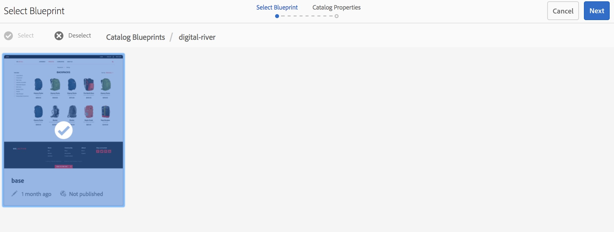

1. Click **Next**.

   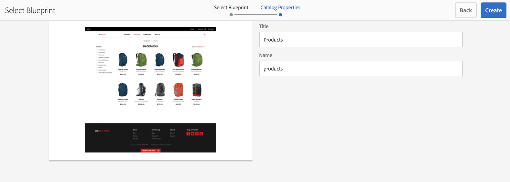

1. Fill in the fields and click **Create**.
1. Once it's created, you have two options:

    1. Clicking **Done** brings you back to Sites.
    1. Clicking **Open Catalog** opens the new catalog page.

   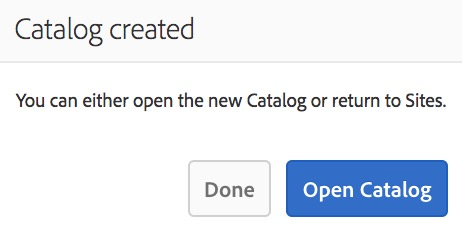

