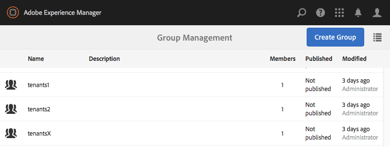
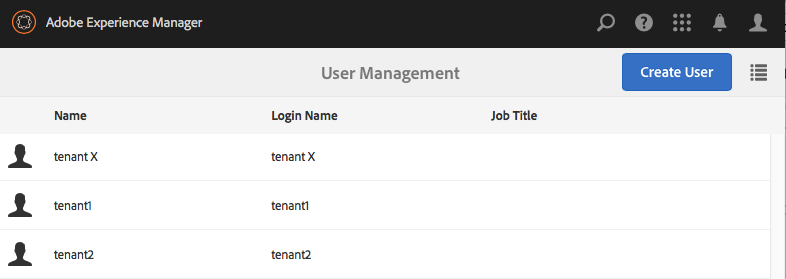
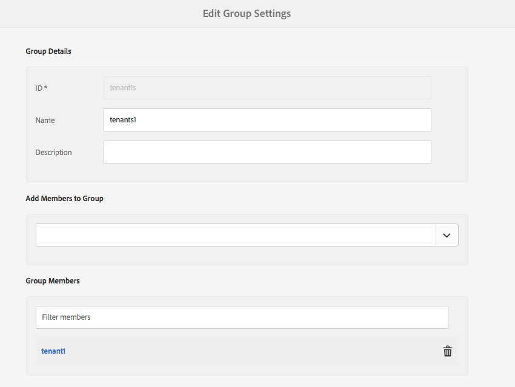
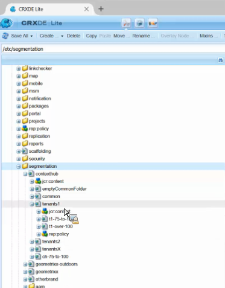
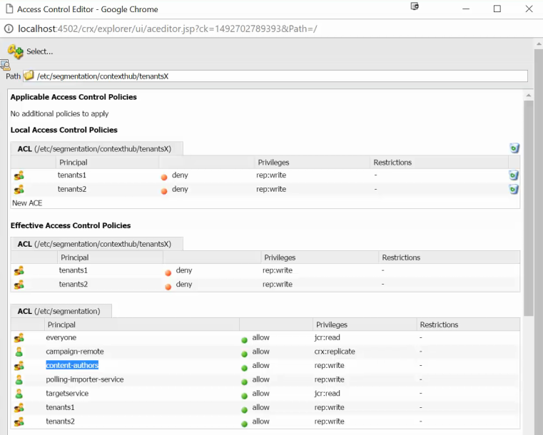
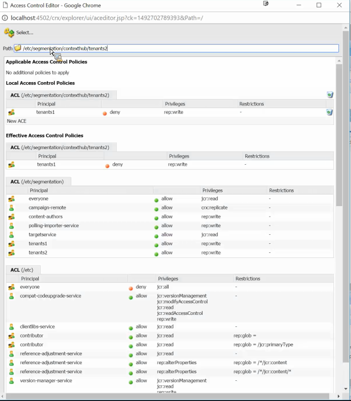
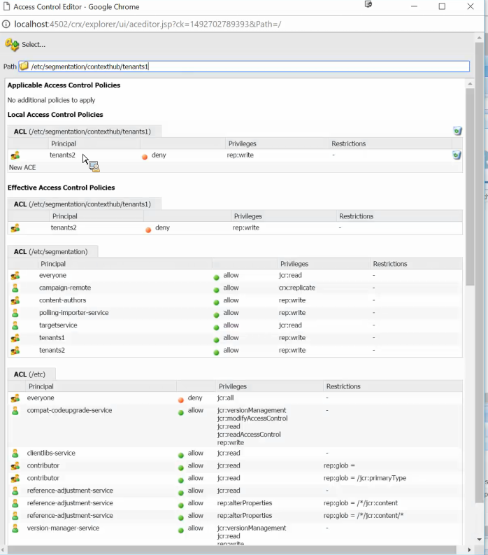

# Multi-tenancy for ContextHub Audiences{#multi-tenancy-for-contexthub-audiences}

You can create multi-tenancy for ContextHub audiences and adds the following functionality:

* You can manage access to tenant folders and tenant audiences.

  For example, you can manage access for users of a specific tenant to only have access to audience folders for that tenant (and not have access to folders of other tenants). 

* You can view audiences in a hierarchical folder structure.
* When selecting audiences, you can select audiences from tenant folders. 

  You only see audiences for tenants that you have privileges to see.

This document provides the information about how to:

* Create tenant folders
* Manage content for tenants
* Manage access to tenant folders
* Select audiences while targeting content and while creating activities in brands.

For further information about how to use ContextHub audiences, see the following documentation:

* [Configuring Segmentation with ContextHub](/help/sites-administering/segmentation.md)
* [Managing Audiences](/help/sites-authoring/managing-audiences.md)
* [Authoring Targeted Content Using Targeting Mode](/help/sites-authoring/content-targeting-touch.md)

## Creating tenant folders for ContextHub audiences {#creating-tenant-folders-for-contexthub-audiences}

You need to create tenant folders so that they can be selected by users. To create a tenant folder, you must be an administrator and you must make sure that the tenant folder fulfills the following conditions (based on the **/etc/segmentation/contexthub node**):

* It is created somewhere below **/etc/segmentation/contexthub**

    * e.g. **/etc/segmentation/contexthub/newaudiencefolder**

* Its **jcr:primaryType** is **cq:Page**

* It includes a node jcr:content with the following properties:

    * **jcr:primaryType** =&gt; String **cq:PageContent**
    * **sling:resourceType** =&gt; String **cq/contexthub/components/segments-listing-page**

These folders cannot be created through the Audiences console. These folders should only be created by administrative users that have access to tools such as CRXDE Lite (to create the nodes) and to the Access Control Editor (to set the ACLs accordingly).

In addition, there are also changes in the Resolved Segments UI, which are described in the following section. You may want to activate filtering, which is also described.

### Configuring filtering in the resolved segments UI {#configuring-filtering-in-the-resolved-segments-ui}

The Resolved Segments UI has been extended to be able to filter the displayed segments based on the accessible segments paths for the current user.

To access the Resolved Segments UI, navigate through the Cloud Settings to the following location; for example: **http://localhost:4502/etc/cloudsettings/default/contexthub/persona.html**

```
{
    "title": "Resolved Segments",
    "icon": "coral-Icon--targeted",
    "storeMapping": {
        "s": "segmentation"
    },
    "template": "<p class=\"contexthub-module-line1\">Resolved Segments</p><p class=\"contexthub-module-line2\">{{s.summary}}</p>",
    "clickable": true,
    "listReference": "/store/segmentation/segments",
    "listType": "custom",
    "listItemTemplate": "<span>{{label}}</span>",
    "itemOnClickNoop": true
}
```

A key/value pair is available to the JSON configuration of the Resolved Segments UI so you can configure whether the resolved segments are filtered by the accessible segments paths for the current user: **"isFilteredByAccessiblePaths": true/false**

The filter is turned off by default, that is **"isFilteredByAccessiblePaths": false **

You can turn on filtering by changing this value to **true**.

>[!NOTE]
>
>If you make any changes to this configuration, you should see them after reloading the Resolved Segments UI.

The detailed configuration in JSON looks like this:

```
{
    "title": "Resolved Segments",
    "icon": "coral-Icon--targeted",
    "storeMapping": {
        "s": "segmentation"
    },
    "template": "<p class=\"contexthub-module-line1\">Resolved Segments</p><p class=\"contexthub-module-line2\">{{s.summary}}</p>",
    "clickable": true,
    "listReference": "/store/segmentation/segments",
    "listType": "custom",
    "listItemTemplate": "<span>{{label}}</span>",
    "itemOnClickNoop": true,
    "isFilteredByAccessiblePaths": false
}
```

## Managing content for tenants  {#managing-content-for-tenants}

You can set up multiple tenants by creating groups for those tenant users and adding users to those groups. Then, you set the privileges for the tenant group.

In this example, there are three tenant groups: **tenants1**, **tenants2**, and **tenantsX**. You can manage groups and users by navigating to **Tools** &gt; **Security** &gt; **Users** or **Groups** respectively.



Each tenant group in this example has one user: **tenant1**, **tenant2**, and **tenantX**.



For example, if you select the group **tenants1**, you see that **tenant1** is a member of that group. The same is true of the other users: **tenant2** is a member of group **tenants2**.** tenantX **is a member of group **tenantsX**.



In addition, all groups are members of the group **content-authors**, which gives them write permissions, and **target-activity-authors**, which gives them the right to set up to target activities.

The folder structure on your AEM instance in this example looks something like this:

* **/etc/segmentation**

    * **/contexthub/**

        * **/common**-- this is a folder for common audiences 
        * **/emptyCommonFolder** -- this is an empty folder for common audiences
        * **/tenants1** -- this is a folder for audiences available to users in the group tenants1
        * **/tenants2** -- this is a folder for audiences available to users in the group tenants2
        * **/tenantsX** -- this is a folder for audiences available to users in the group tenantsX
        * **ch-75-to-100** -- this is a single audience that is not in a folder

    * **/adobe-target** -- this folder contains audiences for adobe target
    * **/brands** -- these folders contain audiences specific to brands, such as geometrixx or we.retail.



If you expand each folder, they include audiences that are specific to that folder.

After you have set up your groups and users, you need to manage the access they have.

## Managing access {#managing-access}

You manage access to content for different tenants through the ACL editor. The following example describes an example of how to set up tenants so that users that belong to each of these tenants have access as follows:

* Users in the group **tenants1** have access to audiences available only to **tenants1**.

* Users in the group **tenants2** have access to audiences available only to **tenants2**.

* Users in the group **tenantsX** have access to audiences available to both **tenants1** and **tenants2** and **tenantsX**.

In addition, all groups have access to common folders that are accessible to everyone.

>[!NOTE]
>
>See [Managing Users and Groups](/help/sites-administering/security.md#managing-users-and-groups) for general information on accessing the user administration and security console, creating users and groups, adding users to a group, and impersonating another user.

By default, all tenants have access to all tenant folders unless you deny them explicitly. Given the previous example, **tenants1**, **tenants2**, and **tenantsX** all have write permissions to **/etc/segmentation** because they are members of the** content-authors** group.

In addition, tenants cannot read tenant folders if they are denied **rep:write** privileges to that specific folder:

* When looking at the **tenantsX** group privileges, **tenants1** and **tenants2** are denied permission to the tenantsX folder. Only users in group **tenantsX** have access to this folder.

  

* When looking at the **tenants2** group privileges, **tenants1** is denied permission to the tenants2 folder. (But **tenantsX** is not denied, so users in that group can access the tenants2 folder).

  

* When looking at the **tenants1** group privileges, **tenants2** is denied permission to the tenants1 folder. (But **tenantsX** is not denied, so users in that group can access the tenants2 folder).

  

After changing the rights, if you are a user in the **tenantsX** group, you see all the folders. If you are a user in the **tenants1** group, you only see folders in tenant1. If you are a user in the **tenants2** group, you only see folders in tenants 2.

You can ensure that users in each tenant are seeing the correct folders by impersonating a user in each tenant. See [Impersonating another user](/help/sites-administering/security.md#impersonating-another-user).

## Creating ContextHub audiences for tenants {#creating-contexthub-audiences-for-tenants}

Audiences are covered in general in detail in [Managing Audiences](/help/sites-authoring/managing-audiences.md). To access audiences, navigate to **Personalization** &gt; **Audiences**.

Audiences can also be managed in structured folders:


You can create audiences directly in contexthub or in a tenant folder. Which audiences and audience folders are available to a certain user depends on the privileges.

To create an audience in a tenant folder:

1. Navigate to **Personalization** &gt; **Audiences**. 
1. Tap or click the **ContextHub** folder to open it.
1. Tap or click **Create**. Enter a title and tap or click **Create**. See [Managing Audiences](/help/sites-authoring/managing-audiences.md) for additional information on creating audiences in AEM 6.2.

## Selecting audiences when targeting {#selecting-audiences-when-targeting}

When in targeting mode, you can select audiences from different tenants based on the privileges you have. For detailed information on targeting content, see [Authoring Targeted Content Using Targeting Mode](/help/sites-authoring/content-targeting-touch.md).

1. In a page in Sites that you want to target, select **Targeting, **select an activity, and tap or click **Start Targeting**.
1. In the **Audiences** tab, select **Add Experience Targeting**. 
1. Select the audience from the drop-down menu of available audience folders. Only those audience folders that are available to that tenant and common folders are displayed in the drop-down menu.
1. Select the audience and proceed with authoring targeted content as described in [Authoring Targeted Content Using Targeting Mode](/help/sites-authoring/content-targeting-touch.md).

## Selecting audiences for activities {#selecting-audiences-for-activities}

When selecting audiences for activities in brands, you can select audiences from different tenants based on the privileges you have. For detailed information on managing activities, see [Managing Activities](/help/sites-authoring/activitylib.md).

1. Navigate to **Personalization** &gt; **Activities** and select a brand. 
1. Select an activity and tap or click **Edit**.
1. Select **Add Experience Targeting**. 
1. Select the audience from the drop-down menu of available audience folders. Only those audience folders that are available to that tenant and common folders are displayed in the drop-down menu.
1. Select the audience and proceed with managing activities as described in [Managing Activities](/help/sites-authoring/activitylib.md).

