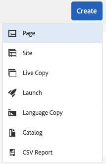
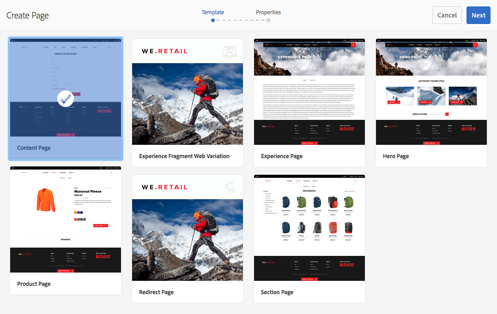
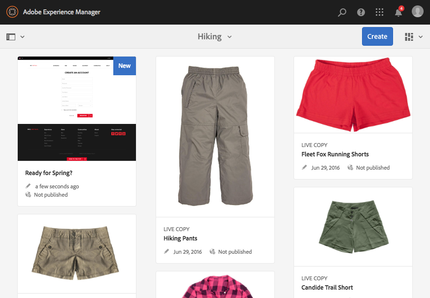
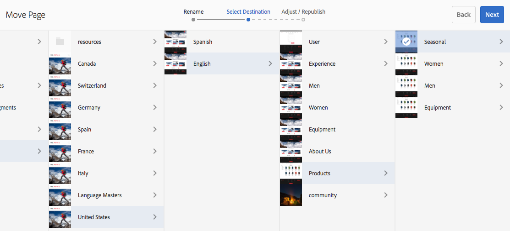
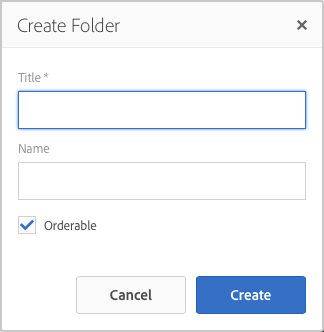

# Creating and Organizing Pages{#creating-and-organizing-pages}

This section describes how to create and manage pages with Adobe Experience Manager (AEM) so that you can then [create content](/help/sites-authoring/editing-content.md) on those pages.

>[!NOTE]
>
>Your account needs the [appropriate access rights](/help/sites-administering/security.md) and [permissions](/help/sites-administering/security.md#permissions) to take action on pages such as create, copy, move, edit, and delete.
>
>If you encounter any problems we suggest you contact your system administrator.

>[!NOTE]
>
>There are a number of [keyboard shortcuts](/help/sites-authoring/keyboard-shortcuts.md) that you can use from the websites console that make organizing your pages more efficient.

## Organizing your Website {#organizing-your-website}

As an author you will need to organize your website within AEM. This involves creating and naming your content pages so that:

* You can easily find them on the author environment  
* Visitors to your site can easily browse them on the publish environment

You can also use [folders](#creating-a-new-folder) to help organize your content.

The structure of a website can be thought of as a tree structure that holds your content pages. The names of these content pages are used to form the URLs, whereas the title is shown when the page content is viewed.

The following shows an example from the We.Retail site, where a hiking shorts page ( `desert-sky-shorts`) is accessed:

* Author environment  
  `http://localhost:4502/editor.html/content/we-retail/us/en/products/equipment/hiking/desert-sky-shorts.html`

* Publish environment  
  `http://localhost:4503/content/we-retail/us/en/products/equipment/hiking/desert-sky-shorts.html`

Depending on the configuration of your instance, use of `/content` might be optional on the publish environment.

```xml
 /content
 /we-retail
  /us
   /en
    /products
     /equipment
      /hiking
       /desert-sky-shorts
       /hiking-poles
       /... 
      /running...
      /surfing...
      /...
     /seasonal...
     /...
    /about-us
    /experience
    /...
   /es...
  /de...
  /fr...
  /...
 /...
```

This structure can be viewed From the **Sites** console, where you can [navigate through the pages of your website](/help/sites-authoring/basic-handling.md#product-navigation) and perform actions on the pages. You can also create new sites and [new pages](#creating-a-new-page).

From any point, you can see the upward branch from breadcrumbs in the header bar:

 

### Page Naming Conventions {#page-naming-conventions}

When creating a new page there are two keys fields:

* **[Title](#title)**:

    * This is displayed to the user in the console and shown at the top of the page content when editing.  
    * This field is mandatory.

* **[Name](#name)**:

    * This is used to generate the URI.  
    * User input for this field is optional. If not specified, the name is derived from the title. See the following section [Page Name Restrictions and Best Practices](/help/sites-authoring/managing-pages.md#page-name-restrictions-and-best-practices) for details.

#### Page Name Restrictions and Best Practices {#page-name-restrictions-and-best-practices}

The page **Title** and **Name** can be created separately but are related:

* When creating a page, only the **Title** field is required. If no **Name** is provided at page creation, AEM will generate a name from the first 64 characters of the title (observing the validation set out below). Only the first 64 characters are used in order to support the best practice of short page names.  

* If a page name is manually specified by the author, the 64 character limit does not apply, however other technical limitations on the page name length may.

>[!NOTE]
>
>When defining a page name, a good rule-of-thumb is to keep the page name as brief but as expressive and memorable as possible to make it easy to understand for the reader. See the [W3C style guide](https://www.w3.org/Provider/Style/TITLE.html) for the `title` element for more information.  

>
>Also keep in mind that some browsers (e.g. older versions of IE) can only accept URLs up to a certain length, so there is also technical reason to keep page names short.

When creating a new page, AEM will [validate the page name according to the conventions](/help/sites-developing/naming-conventions.md) imposed by AEM and the JCR.

The minimum allowed characters are:

* 'a' through to 'z'
* 'A' through to 'Z'
* '0' through to '9'
* _ (underscore)
* `-` (hyphen/minus)

Full details of all characters allowed can be found in [the naming conventions](/help/sites-developing/naming-conventions.md).

>[!NOTE]
>
>If AEM is running on a [MongoMK persistence manager deployment](/help/sites-deploying/recommended-deploys.md), page names are limited to 150 characters.

#### Title {#title}

If you supply only a page **Title** when creating a new page, AEM will derive the page **Name** from this string and [validate the name according to the conventions](/help/sites-developing/naming-conventions.md) imposed by AEM and JCR. A **Title** field containing invalid characters will be accepted, but the name derived will have the invalid characters substituted. For example:

| Title |Derived Name |
|---|---|
| Schön |schoen.html |
| SC%&&ast;ç+ |sc---c-.html |

#### Name {#name}

When you supply a page **Name** when creating a new page, AEM will [validate the name according to the conventions](/help/sites-developing/naming-conventions.md) imposed by AEM and JCR. You cannot submit invalid characters in the **Name** field. When AEM detects invalid characters the field will be highlighted with an explanatory message.


>[!NOTE]
>
>You should avoid using a two-letter code as defined by ISO-639-1 as a page name, unless it is a language root.
>
>See [Preparing Content for Translation](/help/sites-administering/tc-prep.md) for more information.

### Templates {#templates}

In AEM, a template specifies a specialized type of page. A template will be used as the basis for any new page being created.

The template defines the structure of a page including a thumbnail image and other properties. For example, you may have separate templates for product pages, sitemaps, and contact information. Templates are comprised of [components](#components).

AEM comes with several templates provided out-of-the-box. The templates available depend on the individual website. The key fields are:

* **Title** 
  The title displayed on the resulting web-page.  

* **Name** 
  Used when naming the page.  

* **Template** 
  A list of templates available for use when generating the new page.

>[!NOTE]
>
>If configured on your instance, [template authors can create templates with the Template Editor](/help/sites-authoring/templates.md).

### Components {#components}

Components are the elements provided by AEM so that you can add specific types of content. AEM comes with a range of [out-of-the-box components](/help/sites-authoring/default-components-console.md) that provide comprehensive functionality. These include:

* Text
* Image
* Slideshow
* Video
* And many more

Once you have created and opened a page you can [add content using the components](/help/sites-authoring/editing-content.md#inserting-a-component), which are available from the [component browser](/help/sites-authoring/author-environment-tools.md#components-browser).

>[!NOTE]
>
>The [Components Console](/help/sites-authoring/default-components-console.md) give an overview of the components on your instance.

## Managing Pages {#managing-pages}

### Creating a New Page {#creating-a-new-page}

Unless all pages have been created for you in advance, before you can start creating content, you must create a page:

1. Open the Sites console (for example, [http://localhost:4502/sites.html/content](http://localhost:4502/sites.html/content)).
1. Navigate to the location where you want to create the new page. 
1. Open the drop down selector using **Create** in the toolbar, then select **Page** from the list:

   

1. From the first stage of the wizard you can either:

    * Select the template you want used to create the new page, then click/tap **Next** to proceed.  
    
    * **Cancel** to abort the process.

   

1. From the final stage of the wizard you can either:

    * Use the three tabs to enter the [page properties](/help/sites-authoring/editing-page-properties.md) you want assigned to the new page, then click/tap **Create** to actually create the page.  
    
    * Use **Back** to return to template selection.

   Key fields are:

    * **Title**:

        * This is displayed to the user and is mandatory.

    * **Name**:

        * This is used to generate the URI. If not specified, the name is derived from the title.
        * If you supply a page **Name** when creating a new page, AEM will [validate the name according to the conventions](/help/sites-developing/naming-conventions.md) imposesd by AEM and JCR.  
        
        * You **cannot submit invalid characters** in the **Name** field. When AEM detects invalid characters the field will be highlighted and an explanatory message shown to indicate the characters that need removing/replacing.

   >[!NOTE]
   >
   >See [Page Naming Conventions](#page-naming-conventions).

   The minimum information required to create a new page is the **Title**.

   

1. Use **Create** to complete the process and create your new page. The confirmation dialog will ask whether you want to **Open** the page immediately or return to the console (**Done**):

   

   >[!NOTE]
   >
   >If you create a page using a name that already exists at that location, the system will automatically generate a variation of the name by appending a number. For example if `winter` already exists a new page will become `winter0`.

1. If you return to the console you will see your new page:

   

>[!CAUTION]
>
>Once a page has been created its template cannot be changed - unless you [create a launch with a new template](/help/sites-authoring/launches-creating.md#create-launch-with-new-template), though this will lose any content already existing.

### Opening a Page For Editing {#opening-a-page-for-editing}

After creating a page, or navigating to an existing page (in the console), you can open it for edit:

1. Open the **Sites** console.
1. Navigate until you find the page that you want to edit.
1. Select your page by using either:

    * [Quick actions](/help/sites-authoring/basic-handling.md#quick-actions)
    * [Selection mode](/help/sites-authoring/basic-handling.md#product-navigation) and the toolbar

   And then select the **Edit** icon:

   

1. The page will be opened and you can [edit the page](/help/sites-authoring/editing-content.md) as required.

>[!NOTE]
>
>Navigating to other pages from the page editor is only possible in Preview mode since links are not active in the Edit mode..

### Copying and Pasting a Page {#copying-and-pasting-a-page}

You can copy a page and all of its subpages to a new location:

1. In the **Sites** console, navigate until you find the page that you want to copy.
1. Select your page using either:

    * [Quick actions](/help/sites-authoring/basic-handling.md#quick-actions)
    * [Selection mode](/help/sites-authoring/basic-handling.md#product-navigation) and the toolbar

   And then the **Copy** page icon:

   

   >[!NOTE]
   >
   >If you are in selection mode this is exited automatically as soon as the page is copied.

1. Navigate to the location for the new copy of the page.
1. Use the **Paste** page icon:

   

   A copy of the original page and any subpages will be created at this location.

   >[!NOTE]
   >
   >If you copy the page to a location where a page with the same name as the original already exists, the system will automatically generate a variation of the name by appending a number. For example if `winter` already exists `winter` will become `winter1`.

### Moving or Renaming a Page {#moving-or-renaming-a-page}

>[!NOTE]
>
>Renaming a page is also subject to the [Page Naming Conventions](#page-naming-conventions) when specifying the new page name.

>[!NOTE]
>
>A page can only be moved to a location where the template upon which the page is based is allowed. See [Template Availability](/help/sites-developing/templates.md#template-availability) for more information.

The procedure to move or rename a page is basically the same and is handled by the same wizard. With this wizard you can:

* Rename a page without moving it.
* Move the page without renaming it.
* Move and rename at the same time.

AEM offers you the functionality to update any internal links that refer to the page being renamed/moved. This can be done on a page-by-page basis to provide full flexibility.

1. Navigate until you find the page that you want to move.
1. Select your page using either:

    * [Quick actions](/help/sites-authoring/basic-handling.md#quick-actions)
    * [Selection mode](/help/sites-authoring/basic-handling.md#product-navigation) and the toolbar

   And then select the **Move** page icon:

   

   This will open the move page wizard.

1. From the **Rename** stage of the wizard you can either:

    * Specify the name you want the page to have after it is moved, then click/tap **Next** to proceed.  
    
    * **Cancel** to abort the process.

   

   The page name can remain the same if you are only moving the page.

   >[!NOTE]
   >
   >If you move a page to a location where a page with the same name already exists, the system will automatically generate a variation of the name by appending a number. For example if `winter` already exists `winter` will become `winter1`.

1. From the **Select Destination** stage of the wizard you can either:

    * Use the [column view](/help/sites-authoring/basic-handling.md#column-view) to navigate to the new location for the page:

        * Select the destination it by clicking the destination's thumbnail.  
        * Click **Next** to continue.

    * Use **Back** to return to page name specification.

   

   >[!NOTE]
   >
   >If you move a page to a location where a page with the same name already exists, the system will automatically generate a variation of the name by appending a number. For example if `winter` already exists `winter` will become `winter1`.

1. If the page is linked to or referenced, then these references will be listed in the **Adjust/Republish** step. You can indicate which should be adjusted and republished as appropriate.

   

1. Selecting **Move** will complete the process and move/rename your page as appropriate.

>[!NOTE]
>
>If the page was already published, moving the page will automatically unpublish it. By default, it will be republished when the move is complete, but this can changed by unchecking the **Republish** field in the **Adjust/Republish** step.

>[!NOTE]
>
>If the page is not referenced in any way, then the **Adjust/Republish** step will be skipped.

### Deleting a Page {#deleting-a-page}

1. Navigate until you can see the page you want to delete.
1. Use [selection mode](/help/sites-authoring/basic-handling.md#viewing-and-selecting-resources) to select the required page, then use **Delete** from the toolbar:

   

   >[!NOTE]
   >
   >As a security precaution, **the Delete** page icon is not available as a quick action.

1. A dialog will ask for confirmation, use:

    * **Cancel** to abort the action
    * **Delete** to confirm the action:

        * If the page has no references, the page will be deleted.
        * If the page has references, a message box will inform you that **One or more pages are referenced.** You can select **Force Delete** or **Cancel**.

>[!NOTE]
>
>If a page is already published, it will automatically be unpublished before deletion.

### Locking a Page {#locking-a-page}

You can [lock/unlock a page](/help/sites-authoring/editing-content.md#locking-a-page) from either a console or when editing an individual page. Information about whether a page is locked is also shown in both locations.

  

### Creating a New Folder {#creating-a-new-folder}

You can create folders to help organize your files and pages.

>[!NOTE]
>
>Folders are also subject to the [Page Naming Conventions](#page-naming-conventions) when specifying the new folder name.

>[!CAUTION]
>
>* Folders can only be created directly under **Sites** or under other folders. They cannot be created under a page.
>* The standard actions move, copy, paste, delete, publish, unpublish, and view/edit properties can be performed on a folder.
>* Folders are not available for selection within a live copy.
>

1. Open the **Sites** console and navigate to the required location.
1. To open the option list, select **Create** from the toolbar
1. Select **Folder** to open the dialog. Here you can enter the **Name** and **Title**:

   

1. Select **Create** to create the folder.

