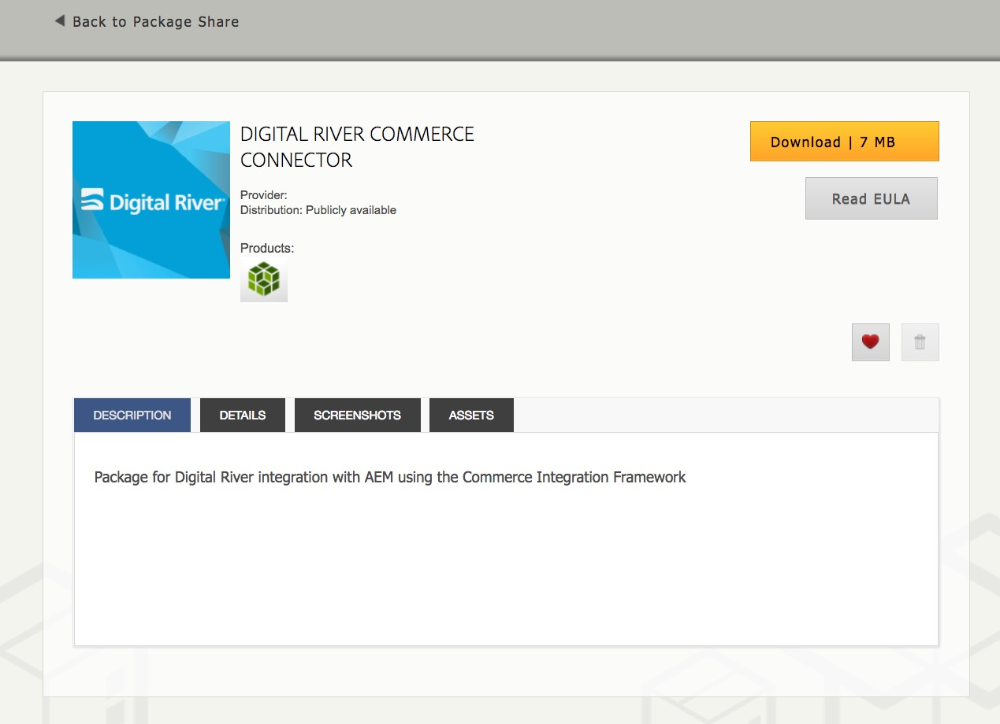
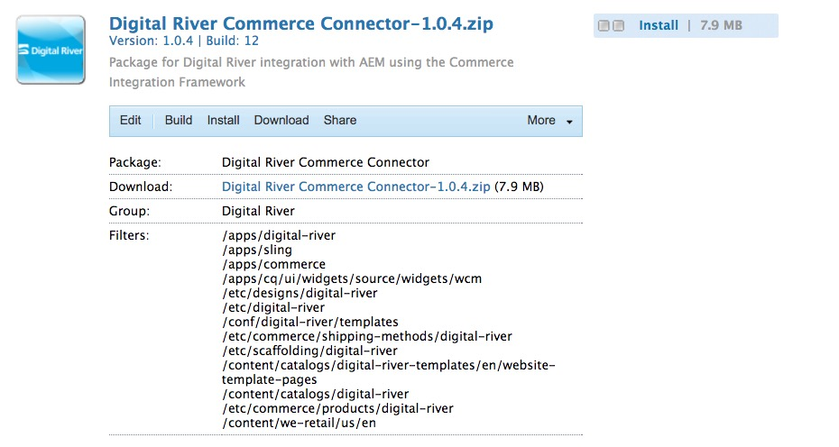
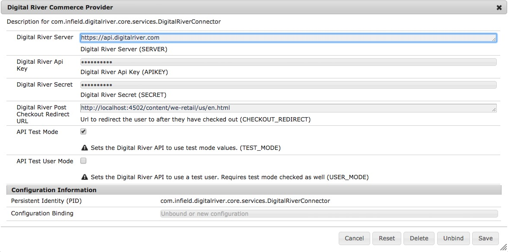

# Digital River{#digital-river}

Deploying the necessary eCommerce packages will provide the full functionality of the eCommerce framework, together with a reference implementation of eCommerce functionality as provided with a Digital River implementation (including a demonstration catalog based on We.Retail).

This catalog is available under the Language Masters English branch ( `/content/we-retal/language-masters/en`) of the We.Retail site.

## Prerequisites {#prerequisites}

You will need to reach out to your Digital River Account Manager to get an API key, Secret, and Endpoint. The connector won’t work without these.

## Installation of eCommerce with Digital River {#installation-of-ecommerce-with-digital-river}

>[!NOTE]
>
>This section must be performed by a user with package installation permissions.

Once you have your API key, you can install the package from package share on all of your instances:

1. Navigate to package share on your AEM instance: [http://localhost:4502/crx/packageshare/login.html](http://localhost:4502/crx/packageshare/login.html).
1. Enter your Adobe ID credentials or create an account if you do not already have one.
1. Search for Digital River and select the **Digital River Commerce Connector **package.

   

1. Click **Download**, then accept the End User License Agreement.
1. Once it's downloaded, click **Downloaded **and it will bring you to the package manager.
1. Click the **Install** button next to the newly downloaded package.

   

## Configuration {#configuration}

>[!NOTE]
>
>This section must be performed by an administrator.

To Configure Digital River in your AEM instance:

1. Navigate to [http://localhost:4502/system/console/configMgr](http://localhost:4502/system/console/configMgr).
1. Click **Digital River Commerce Provider**.

   

1. Enter the following information:

    * **Digital River Server**: Use the API endpoint provided by your Account or Project Manager.
    * **Digital River API Key**: Use the API Key provided by your Account or Project Manager.
    * **Digital River Secret**: Use the Secret provided by your Account or Project Manager.
    * **Digital River Post Checkout Redirect URL**: Use the URL pointing to the post checkout page for this instance. If this is a publish instance, use the Dispatcher URL.
    * **API Test Mode**: Check this box if this is not a Production Environment.

1. Click **Save**.

