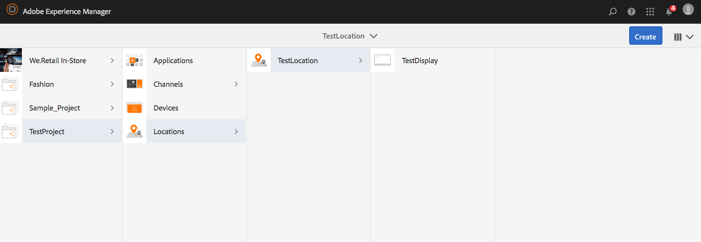
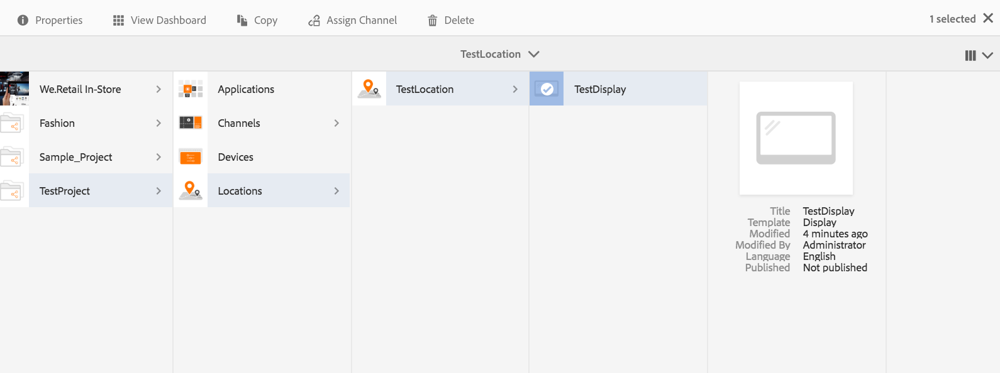
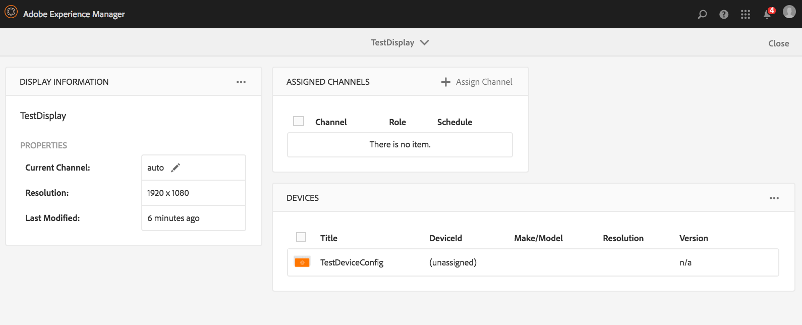
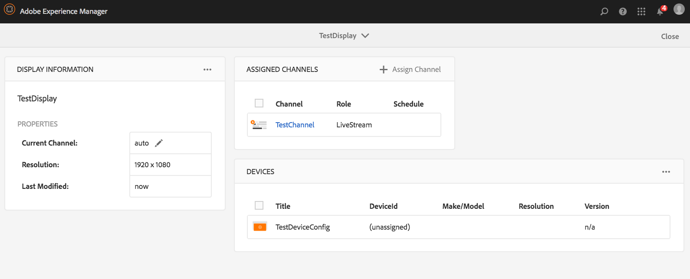
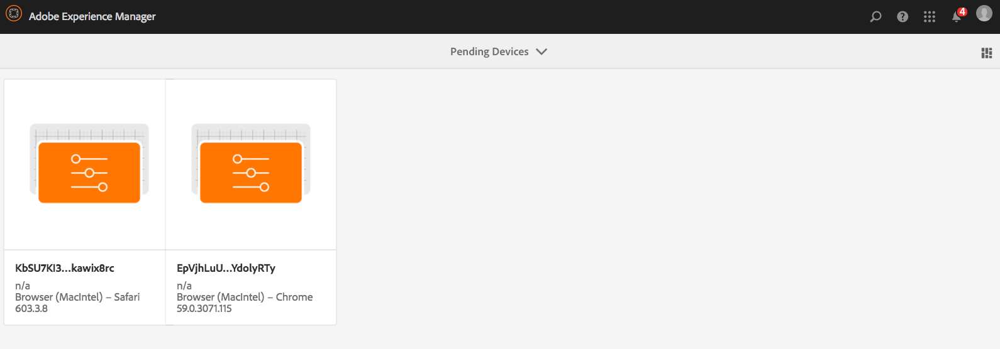
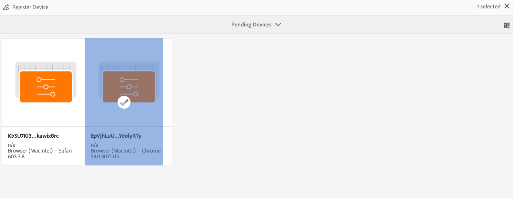
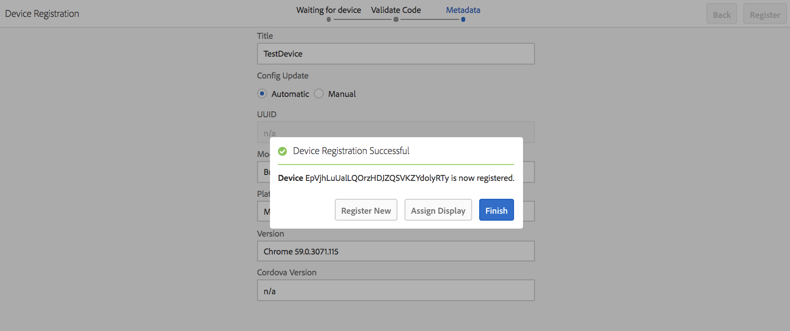
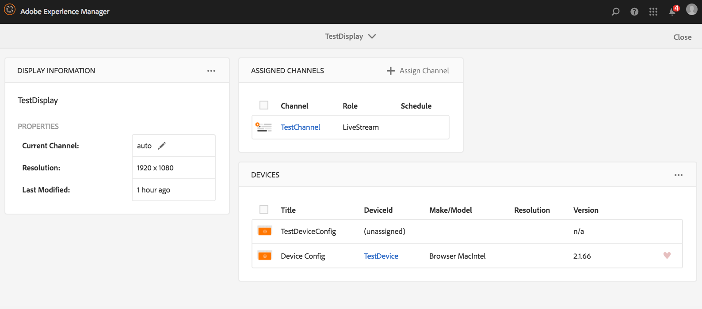
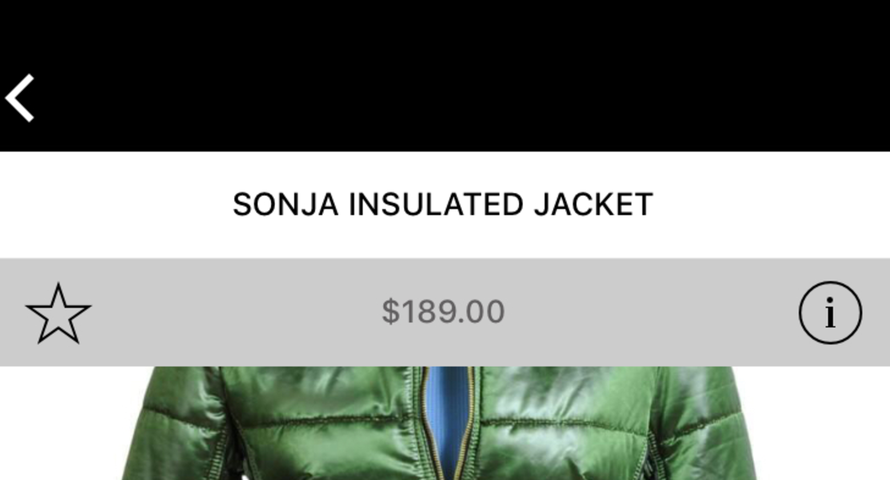

# Quickstart for AEM Screens{#quickstart-for-aem-screens}

This section is a quickstart to AEM Screens and shows how to achieve basic actions. It walks you through setting up a basic digital signage experience with content/assets and publishing to a screens player. For in-depth understanding of all the components for Screens development, see the resources at the end of the page.

## Creating a Digital Signage Experience {#creating-a-digital-signage-experience}

The following steps allow you to create a sample project for Screens and publish content to Screens player.

1. **Installing Screens Player**

   There are three different players for iOS, OS X and Android.

   To download AEM Screens Player, click [here](https://download.macromedia.com/screens/).

   Additionally, AEM Screens is also available in [iTunes App Store](https://itunes.apple.com/us/app/aem-screens/id1169641856?mt=8) and [Google Play Store](https://play.google.com/store/apps/details?id=com.adobe.aem.screens.player&hl=en).

   See [Installing and Configuring Screens](/help/screens/configuring-screens-introduction.md) for more details.

1. **Creating a new project**

    1. Select the Adobe Experience Manager link (top left) and then Screens. Alternatively, you can go directly to: [http://localhost:4502/screens.html/content/screens](http://localhost:4502/screens.html/content/screens).
    1. Click **Create** to create a new Screens project (see the figure below).
    1. Select **Screens** from the **Create Screens Project** wizard and click **Next**.
    1. Enter the title as *Test_Project *and click **Create**.

   

   Once the project is created, it brings you back to the Screens Project console. You can now select your project. In a project, there are five kind of folders namely *Applications*, *Channels*, *Devices*, *Locations*, and *Schedules*, as shown in the figure below.

   

   See [Creating and Managing projects in Screens](/help/sites-authoring/creating-a-screens-project.md) for more details.

1. **Creating a new channel**

   Once you have your project in place, you need to create a new channel where your content is managed.

   Follow the steps below to create a new channel for your project:

    1. Navigate to the *Test_Project* you created and select the **Channels** folder.
    1. Click** Create** next to the plus icon in the action bar (see the figure below). A wizard will open.
    1. Choose the **Sequence Channel **and click **Next**.
    1. Enter the **Name** and **Title** as *TestChannel* and click **Create**.

   

   The *TestChannel* is created and added to your channels folder, as shown in the figure below.

   

   See [Channel Management](/help/screens/managing-channels.md) for more details on creating and managing channels.

1. **Creating a new location**

   Once you have your channel in place, you need to create your location. The locations help you compartmentalise your various digital signage experiences and will contain the configurations of the displays according to where the various screens are.

   Follow the steps below to create a new location for your project:

    1. Navigate to the *Tes*t*_Project* you created and select the **Locations **folder.
    1. Click **Create** from the action bar (see the figure below). A wizard will open. 
    1. Select **Locations** from the wizard and click **Next**.
    1. Enter the **Name** and **Title** for your location (enter the title as *TestLocation*) and click **Create**.

   

   The *TestLocation* is created and added to your **Locations** folder.

   

   Once you have created a location, you need to create a new display for your location.

   The display represents the digital experience that you want to run on one or multiple screens.

   **Creating a new display for *TestLocation***

    1. Navigate to the location where you want to create your display. Navigate to *Test_Project *--&gt; **Locations** --&gt; *TestLocation*, as shown in the figure above, and 
    1. Select *TestLocation* and click** Create **from the action bar. 
    1. Select **Display **from the **Create** wizard opens and click **Next**.
    1. Enter **Name** and **Title** for your display location (enter the title as *TestDisplay*).
    1. Under the Display tab, choose the details of the Layout.

        1. Choose the **Resolution** as **Full HD**.
        1. Choose the **Number of Devices Horizontally** as 1.
        1. Choose the **Number of Devices Vertically** as 1.

    1. Click **Create**.

   A new display (*TestDisplay*) is added to your location named *TestLocation*, as shown in the figure below:

   

1. **Creating a new device config**

    1. Navigate to Locations folder --&gt;*TestLocation* --&gt;*TestDisplay* that you created in the preceding step.
    1. Click **View Dashboard** in the action bar (see the figure below).
    1. Click the **...** button on the top right of the **Devices **panel and choose **Add Device Config**.
    1. Select the **Device config **from the wizard and click **Next**.
    1. Enter the **Name** and **Title** for the device (name it as *TestDeviceConfig*) and click **Create**.

   

   The device config (*TestDeviceConfig*) is created and added to the current display.

   

1. **Assigning a channel**

    1. Navigate to the display from **Locations** folder --&gt; *TestLocation* --&gt; *TestDisplay*.
    1. Select *TestDisplay* and tap/click **Assign Channel **in the action bar, Or,
    1. Click **View Dashboard** and select **+assign channel** at the top right from **ASSIGNED CHANNELS** panel. **Channel Assignment** dialog box opens.
    1. Enter the **Channel Role** as *LiveStream*.
    1. Select the path (*TestProject* --&gt; *Channels* --&gt; *TestChannel* ) in the **Channel**.
    1. Choose the **Supported Events** as **Initial Load **and **Idle Screen**.
    1. Click **Save**.

   The channel should be created and added to the panel, as shown in the figure below:

   

1. **Registering a device**

   Before you register a device, the Screens player is displayed as a pending device.

   To view the pending device:

    1. Launch a separate browser window.
    1. Go to http://localhost:4502/content/mobileapps/cq-screens-player/firmware.html
    1. From the dashboard, navigate to *TestProject* --&gt; **Devices**
    1. Click **Device Manager** from the action bar.
    1. Click **Device Registration** and you will see the pending devices, as shown in the figure below:

   

   Select the device you want to register and click **Register Device**.

   

   You will need to validate the code by verifying the code from the web browser.

    1. Click Validate to navigate to **Device Registration** screen.
    1. Enter **Title** and click **Register** and the device will be registered as shown in the figure below:

   

1. **Assigning the display**

   Once you have registered the device,

    1. Click **Assign Display** as shown in the figure above.
    1. Select the display path for your channel as */content/screens/TestProject/locations/TestLocation/TestDisplay.*
    1. Click **Assign**.
    1. Click **Finish** to complete the process, and now the device is assigned as shown in the figure below:

   

### Viewing the content in Screens Player {#viewing-the-content-in-screens-player}

Once you have added the above configurations, the player should automatically show the default channel for the display on your device, for example an image (in this scenario, a sequence channel).

 

### Additional Resources {#additional-resources}

For in-depth understanding for all the modules for Screens, see the resources below:

1. [Installing and Configuring Screens](/help/screens/configuring-screens-introduction.md)
1. [Screens Project Creation](/help/sites-authoring/creating-a-screens-project.md)
1. [Device Assignment](/help/screens/managing-devices.md)
1. Application Management
1. Channel Management
1. Device Management
1. Location Management

