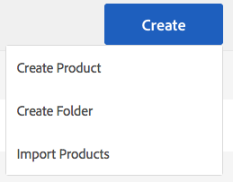
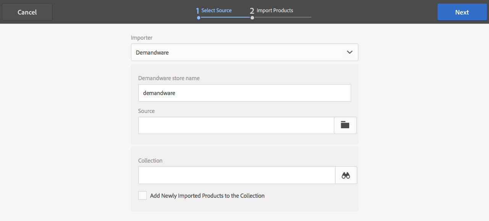

# Demandware{#demandware}

## Product Data Import {#product-data-import}

Demandware products can be imported into AEM to be used by product pickers, components, creating product teasers, and so on.

1. Export the catalog and the product data using the Demandware Business Manager or via a scheduled job.
1. In AEM, navigate to Products: [http://localhost:4502/aem/products.html/etc/commerce/products](http://localhost:4502/aem/products.html/etc/commerce/products)
1. Click **Create** button and **Import Products**.

   

1. Select **Demandware** as **Importer**.

   

1. Select the exported xml as **Source** and enter a store name.

   >[!NOTE]
   >
   >It is recommended to use `demandware` for the **Demandware store name**. Other names can be used as well, but product properties scaffolding is linked to **demandware**. This can be customised within the project.

1. Click **Next**.

   >[!NOTE]
   >
   >Depending on the size of the catalog, the amount of products and associated images, this can take a few minutes. As a reference, the import of the SiteGenesis apparel catalog including product assets takes around 5 minutes.

