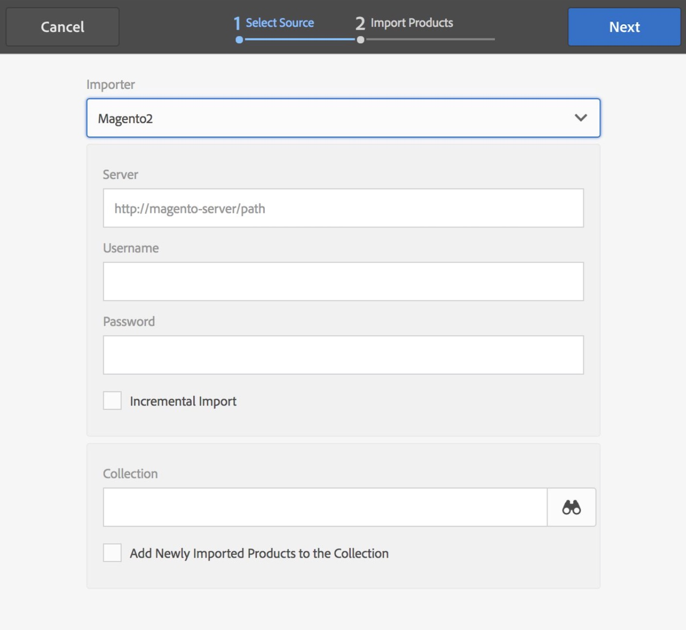

# Magento{#magento}

## Registration {#registration}

You can create a registration form using the [foundation form component](../../../sites/authoring/using/default-components-foundation.md#form) and add the necessary fields.  
Make sure you select **Magento Registration** as the action type. 

## Product/Catalog Import {#product-catalog-import}

You can re-import catalog blueprint and products from your Magento server by using the [standard blueprint import procedure](../../../sites/administering/using/generic.md#importing-products).  
You just need to select the **Magento2** importer.

 

## Order-Service {#order-service}

You can add a new mapping to the Apache Sling Service User Mapper Service Amendment. To do that:

1. Navigate to [http://localhost:4502/system/console/configMgr](http://localhost:4502/system/console/configMgr).
1. Click **Apache Sling Service User Mapper Service Amendment**.

   

1. Enter the following information:

    * **Ranking**: 0
    * **Service Mapping**: com.infield.aem.magento2.core:orders=commerce-orders-service

1. Click **Save**.

