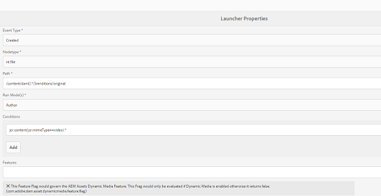

# Assets Workflow Offloader{#assets-workflow-offloader}

Assets workflow offloader lets you enable multiple instances of Adobe Experience Manager (AEM) Assets to reduce the processing load on the primary (leader) instance. The processing load is distributed among the leader instance and the various offloader (worker) instances that you add to it. Distributing the processing load of assets increases the efficiency and speed with which AEM Assets processes assets. In addition, it helps allocate dedicated resources to process assets of a particular MIME type. For example, you can allocate a specific node in your topology to process InDesign assets only.

## Configure offloader topology {#configure-offloader-topology}

Use Configuration Manager to add the URL for the leader instance and the host names of offloader instances for connection requests on the leader instance.

1. Tap/click the AEM logo, and choose **Tools** &gt; **Operations** &gt; **Web Console** to open Configuration Manager.
1. From the Web Console, select **Sling **&gt; **Topology Management**.

   

1. In the Topology Management page, tap/click the **Configure Discovery.Oak Service** link.

   

1. In the Discovery Service Configuration page, specify the connector URL for the leader instance in the **Topology Connector URLs** field.

   

1. In the **Topology Connector Whitelist** field, specify IP address or host names of offloader instances that are allowed to connect with the leader instance. Tap/click **Save**.

   

1. To see the offloader instances connected to the leader instance, go to **Tools** &gt; **Deployment** &gt; **Topology** and tap/click the Cluster view.

## Disable offloading {#disable-offloading}

1. Tap/click the AEM logo, and choose **Tools** &gt; **Deployment** &gt; **Offloading**. The **Offloading Browser** page displays topics and the server instances that can consume the topics.

   

1. Disable the *com/adobe/granite/workflow/offloading* topic on the leader instances with which users interact to upload or change AEM assets.

   

## Configure workflow launchers on the leader instance {#configure-workflow-launchers-on-the-leader-instance}

Configure workflow launchers to use the **DAM Update Asset Offloading** workflow on the leader instance instead of the **Dam Update Asset** workflow.

1. Tap/click the AEM logo, and choose, **Tools** &gt; **Workflow** &gt; **Launchers** to open the **Workflow Launchers** console.

   

1. Locate the two Launcher configurations with event type **Node Created** and **Node Modified** respectively, which run the **DAM Update Asset** workflow.
1. For each configuration, select the checkbox before it and tap/click the **View Properties** icon from the toolbar to display the **Launcher Properties** dialog.

   

1. From the **Workflow** list, choose **DAM Update Asset Offloading** and tap/click **Save**.

   

1. Tap/click the AEM logo, and choose, **Tools** &gt; **Workflow** &gt; **Models** to open the **Workflow Models** page.
1. Select the **DAM Update Asset Offloading** workflow, and tap/click **Edit** from the toolbar to display its details.

   

1. Display the context menu for the **DAM Workflow Offloading** step, and choose **Edit**. Verify the entry in the **Job Topic** field of the **Generic Arguments** tab of the configuration dialog.

   

## Disable the workflow launchers on the offloader instances {#disable-the-workflow-launchers-on-the-offloader-instances}

Disable the workflow launchers that run the **DAM Update Asset** workflow on the leader instance.

1. Tap/click the AEM logo, and choose, **Tools** &gt; **Workflow** &gt; **Launchers** to open the **Workflow Launchers** console.

   

1. Locate the two Launcher configurations with event type **Node Created** and **Node Modified** respectively, which run the **DAM Update Asset** workflow.
1. For each configuration, select the checkbox before it and tap/click the **View Properties** icon from the toolbar to display the **Launcher Properties** dialog.

   

1. In the **Activate **section, drag the slider to disable the workflow launcher and tap/click **Save** to disable it.

   

1. Upload any asset of type image at the leader instance. Verify the thumbnails generated and ported back for the asset by the offloaded instance.

