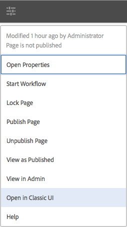

# Selecting your UI{#selecting-your-ui}

Although the touch-enabled UI is now the standard UI and feature parity has been nearly reached with the administration and editing of sites, there may be times when the user wishes to switch to the [classic UI](../../../sites/classic-ui-authoring/using/classicui.md). There are several options for doing this.

>[!NOTE]
>
>For details on the status of feature parity with the classic UI, see the [Touch UI Feature Parity](../../../release-notes/touch-ui-features-status.md) document.

There are various locations where you can define which UI is to be used:

* [Configuring the default UI for your instance](#configuring-the-default-ui-for-your-instance)  
  This will set the default UI to be shown at user login, although the user may be able to override this and select a different UI for their account or current session.  

* [Setting Classic UI Authoring for your account](../../../sites/authoring/using/select-ui.md#setting-classic-ui-authoring-for-your-account)  
  This will set the UI to be used as default when editing pages, although the user can override this and select a different UI for their account or current session.  

* [Switching to classic UI for the current session](#switching-to-classic-ui-for-the-current-session)  
  This switches to the classic UI for the current session.

* For the case of [page authoring the system makes certain overrides in the relation to the UI](#ui-overrides-for-the-editor).

>[!CAUTION]
>
>Various options for switching to the classic UI are not immediately available out-of-the-box, they must be specifically configured for your instance.
>
>See [Enabling Access to Classic UI](../../../sites/administering/using/enable-classic-ui.md) for more information.

>[!NOTE]
>
>Instances upgraded from a previous version will retain the classic UI for page authoring.
>
>After upgrade, page authoring will not be automatically switched to the touch-enabled UI, but you can configure this using the the [OSGi configuration](../../../sites/deploying/using/configuring-osgi.md) of the **WCM Authoring UI Mode Service** ( `AuthoringUIMode` service). See [UI Overrides for the Editor](#ui-overrides-for-the-editor).

## Configuring the Default UI for Your Instance {#configuring-the-default-ui-for-your-instance}

A system administrator can configure the UI that is seen at startup and login by using [Root Mapping](../../../sites/deploying/using/osgi-configuration-settings.md#daycqrootmapping).

This can be overridden by user defaults or session settings.

## Setting Classic UI Authoring for Your Account {#setting-classic-ui-authoring-for-your-account}

Each user can access his/her [user preferences](../../../sites/authoring/using/user-properties.md#userpreferences) to define if he/she wishes to use the classic UI for page authoring (instead of the default UI).

This can be overridden by session settings.

## Switching to Classic UI for the Current Session {#switching-to-classic-ui-for-the-current-session}

When using the touch-enabled UI desktop users might want to revert to the classic (desktop only) UI. There are several methods to switch to the classic UI for the current session:

* **Navigation Links**

  >[!CAUTION]
  >
  >This option for switching to the classic UI is not immediately available out-of-the-box, it must be specifically configured for your instance.
  >
  >
  >See [Enabling Access to Classic UI](../../../sites/administering/using/enable-classic-ui.md) for more information.

  If this is enabled, whenever you mouseover an applicable console, an icon appears (symbol of a monitor), tapping/clicking this will open the appropriate location in the classic UI.

  For examples, the links from **Sites** to **siteadmin**:

  

* **URL**

  The classic UI can be accessed using the URL for the welcome screen at `welcome.html`. For example:

  `http://localhost:4502/welcome.html`

  >[!NOTE]
  >
  >The touch-enabled UI can be accessed via `sites.html`. For example:
  >
  >
  >`http://localhost:4502/sites.html`

### Switching to Classic UI when Editing a Page {#switching-to-classic-ui-when-editing-a-page}

>[!CAUTION]
>
>This option for switching to the classic UI is not immediately available out-of-the-box, it must be specifically configured for your instance.
>
>See [Enabling Access to Classic UI](../../../sites/administering/using/enable-classic-ui.md) for more information.

If enabled, **Open the Classic UI** is available from the **Page Information** dialog:

### UI Overrides for the Editor {#ui-overrides-for-the-editor}

The settings defined by a user or system administrator can be overriden by the system in the case of page authoring.

* When authoring pages:

    * Use of the classic editor is forced when accessing the page using `cf#` in the URL. For example:  
      `http://localhost:4502/cf#/content/geometrixx/en/products/triangle.html`
    
    * Use of the touch-enabled editor is forced when using `/editor.html` in the URL or when using a touch device. For example:  
      `http://localhost:4502/editor.html/content/geometrixx/en/products/triangle.html`

* Any forcing is temporary and only valid for the browser session

    * A cookie set will be set dependent on whether touch-enabled ( `editor.html`) or classic ( `cf#`) is used.

* When opening pages through `siteadmin`, checks will be made for the existence of:

    * The cookie
    * A user preference  
    * If neither exist, it will default to the definitions set in the [OSGi configuration](../../../sites/deploying/using/configuring-osgi.md) of the **WCM Authoring UI Mode Service** ( `AuthoringUIMode` service).

>[!NOTE]
>
>If [a user has already defined a preference for page authoring](#settingthedefaultauthoringuiforyouraccount), that will not be overridden by changing the OSGi property.

>[!CAUTION]
>
>Due to the use of cookies, as already described, it is not recommended to either:
>
>* Manually edit the URL - A non-standard URL could result in an unknown situation and lack of functionality.
>* Have both editors open at the same time - For example, in separate windows.  
>

