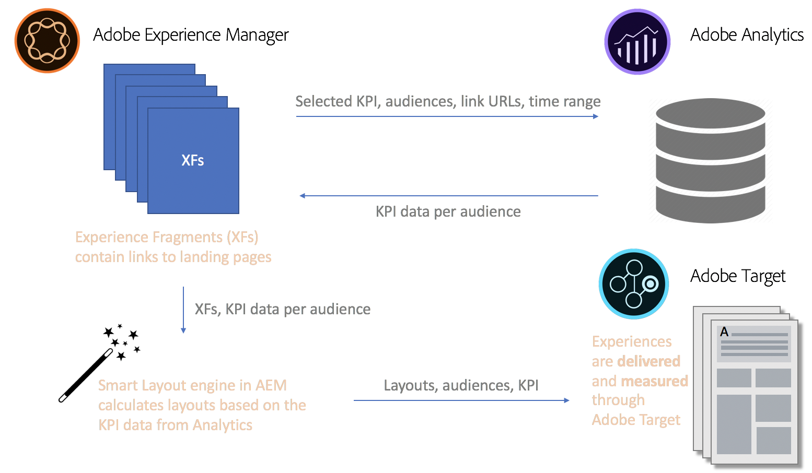
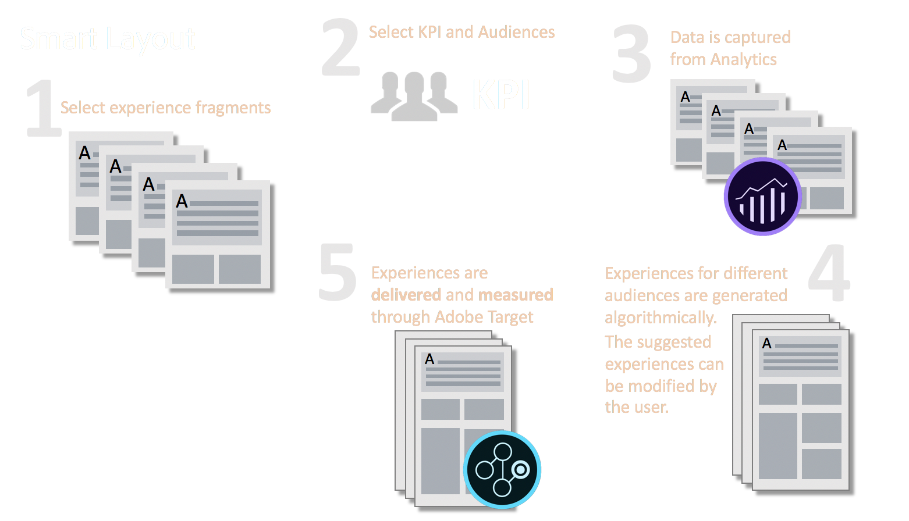

# DO NOT PUBLISH Smart Layout{#do-not-publish-smart-layout}

## What is Smart Layout? {#what-is-smart-layout}

Creating page variations for targeting personalized content is time-consuming. A lot of decisions have to be made: including the order and placement of content to determine how prominent it will be. Furthermore, to use a KPI-driven approach you need to obtain data from Adobe Analytics, then analyze it to determine the best order and placement of the Experience Fragments.

Smart Layout automates this process to allow you (as a marketer) to create page variations according to categories, based on analytical data from Adobe Analytics. This automation unlocks the power of personalization and KPI-driven experience generation.

## What does Smart Layout do? {#what-does-smart-layout-do}

Smart Layout automates the retrieval of KPI data from Adobe Analytics filtered by segment; then uses Artificial Intelligence (AI) to optimize the order and placement of the content within a category page.

Smart Layout uses Experience Fragments placed within a container. A fragment needs to contain a link to a destination page on the site. Smart Layout uses the attribution participation data from the link to retrieve the data from Adobe Analytics.

Smart Layout allows you to create variations of your experience that are tailored to the typical audiences visiting the page.

* The variations are automatically generated by [Adobe Sensei](https://www.adobe.com/sensei.html) based on data and segments from [Adobe Analytics](https://www.adobe.com/analytics/adobe-analytics.html).

* The variations are delivered using [Adobe Target](https://www.adobe.com/marketing/target.html).
* You can review and make changes to the proposed variations before publishing.

>[!NOTE]
>
>To get the information critical to determing the audience, some sites will require the visitor to be logged in with a detailed profile; for example, an online store with preferences and past purchases. Whereas others can use information such as geolocation; for example, an airline website displaying local offers or checkin details.

>[!NOTE]
>
>Variations of the Experience Fragments are created for the various audiences.

 

## Prerequisites and Configuration {#prerequisites-and-configuration}

To use Smart Layout you need:

* Adobe Analytics account:

    * With the web services permissions necessary to configure AEM access to Analytics data
    * With the segmentation configuration in Adobe Analytics aligned to the common audiences

* Adobe Target Classic API account:

    * Configured to have access to shared segments from the Experience Cloud  
    * For the integration API account, the permissions for the type of activity that can be created should not be `xt_only`

* Adobe Experience Manager (AEM):

    * Integrated with Adobe Analytics
    * Integrated with Adobe Target
    * An AEM template:

        * based on the Layout Container component (that uses the AEM Grid)
        * with the components Smart Layout Container and Targeted Layout Container enabled in the template policy

    * Experience Fragments:

        * Each fragment must contain a link to the destination page on the site; if there is more than one link, they must all point to the same destination
        * Optionally, the Experience Fragments can have the width property per variation defined

## Creating Smart Layout Variations {#creating-smart-layout-variations}

Using Smart Layout follows the work flow:

To use Smart Layouting to create variations targeted at the appropriate audience there are several stages:

* [Create a new page with the targeting and smart layout containers, the latter holding experience fragments](/sites/authoring/using/smart-layout.html?cq_ck=1542091597887#CreateaPagewithContainers).
* [Create an activity](/sites/authoring/using/smart-layout.html?cq_ck=1542091597887#CreateanActivity).
* [Configure targeting](/sites/authoring/using/smart-layout.html?cq_ck=1542091597887#ConfigureTargeting).

### Create a Page with Containers {#create-a-page-with-containers}

1. Create a new page based on the appropriate template. Open for editing (**Edit** mode).
1. Add an instance of the **Targeted Layout Container** to the page.  

1. Configure the **Targeted Layout Container** according to your requirements:

    * **Location**
    * **Engine**: Adobe Target

1. Add an instance of the **Smart Layout Container** to the page, below the **Targeted Layout Container**.
1. Configure the **Smart Layout Container**:

    * **KPI**: select from the drop down list
    * **Date range for data aggregation**: specify the from and to dates

1. From the Assets browser, add a selection of **Experience Fragments **to the **Smart Layout Container**.

### Create an Activity {#create-an-activity}

1. Change to **Targeting** mode.

   >[!NOTE]
   >
   >You can still add Experience Fragments to the **Smart Layout Container** at this stage.

1. Create a new Activity and configure:

    * **Name** 
    
    * **Targeting engine**: Adobe Target
    * **Target configuration**: *your Target configuration.*
    
    * **Activity type**: Smart Layout Delivery

### Configure Targeting {#configure-targeting}

1. Select **Start Targeting**. You will be in the **Create** step.  

1. From the **Audiences** panel (right hand side), select **Add Experience Targeting**. The **Choose Audience** dialog will open.  

1. Select the audiences for which you want to create variations. Confirm the selection, they will now be shown in the **Audiences** panel.
1. Select a specific audience in the **Audience** panel, then select the **Smart Layout Container** to show the toolbar.

   From the toolbar, select the Optimize (magic wand) icon.

   The system will access data from Adobe Analytics to determine the appropriate fragments and layout to use; only the appropriate fragments will be shown.

   You can adjust the layout as required.

   >[!NOTE]
   >
   >Accessing the Adobe Analytics data might take a short while.

1. Select **Next** to move to the **Target** step, the connections between **Audience** and **Experiences** will be shown.

   Entries:

    * On the left can be edited.
    * On the right can be renamed.

1. Select **Next** to move to the **Goals & Settings** step.

   Here you can define:

    * **Duration**
    * **Priority**
    * **Goal Metric**
    * **Additional Metrics**

1. **Save**. Your activity is saved and synchronized to Adobe Target to start targeting.

## Publishing Smart Layout Variations {#publishing-smart-layout-variations}

