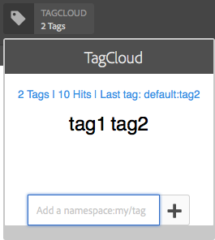

# AEM Developer Tools for Eclipse{#aem-developer-tools-for-eclipse}

  

## Overview {#overview}

The AEM Developer Tools for Eclipse is a Eclipse plugin based on the [Eclipse plugin for Apache Sling](https://sling.apache.org/documentation/development/ide-tooling.html) released under the Apache License 2.

It offers several features that make AEM development easier:

* Seamless integration with AEM instances through Eclipse Server Connector.  
* Synchronization for both content and OSGI bundles.
* Debugging support with code hot-swaping capabiliby.  
* Simple bootstrap of AEM projects via a specific Project Creation Wizard.
* Easy JCR properties edition.

## Requirements {#requirements}

Before using the AEM Developper Tools, you need to:

* Download and install [Eclipse IDE for Java EE Developers](http://eclipse.org/downloads/packages/eclipse-ide-java-ee-developers/lunar). We currently support Eclipse Kepler or newer  

* We support AEM version 5.6.1 or newer  
* Configure your eclipse installation to ensure that you have at least 1 Giga bytes of Heap memory by editing your `eclipse.ini` configuration file as described in the [Eclipse FAQ](http://wiki.eclipse.org/FAQ_How_do_I_increase_the_heap_size_available_to_Eclipse%3F).

>[!NOTE]
>
>On Mac OS X, you need to right click on **Eclipse.app** and then select **Show Package Contents** in order to find your `eclipse.ini`**.**

### How to install the AEM Developer Tools for Eclipse {#how-to-install-the-aem-developer-tools-for-eclipse}

Once you have fulfilled the [requirements](#requirements) above, you can install the plugin as follows:

1. Browse the [**AEM** Developer Tools Web Site](http://eclipse.adobe.com/aem/dev-tools/).  

1. Copy the **Installation Link**.

   Note that alternatively you can download an archive instead of using the installation link. This allows offline installation but you will miss automatic update notifications this way.

1. In Eclipse, open the **Help** menu.
1. Click **Install New Software**.
1. Click **Add...**.
1. In **Name** type AEM Developer Tools.
1. In **Location** copy the installation URL.
1. Click **Ok**.
1. Check both **AEM** and **Sling** plugins.
1. Click **Next**.
1. Click **Next**.
1. Accept the lincese agreements and click **Finish**.
1. Click **Yes** in order to restart Eclipse.

### How To Import Existing Projects {#how-to-import-existing-projects}

>[!NOTE]
>
>See [How to work with a bundle in eclipse when it was downloaded from AEM](https://stackoverflow.com/questions/29699726/how-to-work-with-a-bundle-in-eclipse-when-it-was-downloaded-from-aem/29705407#29705407).

### The AEM Perspective {#the-aem-perspective}

The AEM Development Tools for Eclipse ships with a Perspective that offers you full control over your AEM projects and instances.

 

### Sample Multi-Module Project {#sample-multi-module-project}

The AEM Developer Tools for Eclipse comes with a sample, multi-module project that helps you quickly get up to speed with a project setup in Eclipse, as well as serving as a best-practice guide to several AEM features. [Learn more about the Project Archetype](https://github.com/Adobe-Marketing-Cloud/aem-project-archetype).

Follow these steps to create the sample project:

1. In the **File** &gt; **New** &gt; **Project** menu, browse to the **AEM** section and select **AEM Sample Multi-Module Project**.

   

1. Click **Next**.

   >[!NOTE]
   >
   >This step might take a while since m2eclipse needs to scan the archetype catalogs.

   

1. Choose **com.adobe.granite.archetypes : sample-project-archetype : (highest number)** from the menu, then click **Next**.

   

1. Fill in a **Name**, **Group id** and an **Artifact id** for the sample project. You can also opt to set some advanced properties.

   

1. You should then configure an AEM server to which Eclipse will connect.

   In order to use the debugger featue, you need to have started AEM in debug mode - which can be achieved eg by adding the following to the command line: ``

   

1. Click **Finish**. The project structure is created.

   >[!NOTE]
   >
   >On a fresh installation (more specifically: when maven dependencies have never been downloaded) you might get the project created with errors. In this case please follow the procedure describe in [Resolving Invalid Project Definition](#resolvinginvalidprojectdefinition).

### Troubleshooting {#troubleshooting}

#### Resolving Invalid Project Definition {#resolving-invalid-project-definition}

To resolve invalid dependencies and project definition proceed as follows:

1. Select all created projects.
1. Right-click. In menu **Maven** select **Update Projects**.
1. Check **Force Updates of Snapshot/Releases**.
1. Click **OK**. Eclipse tries to download the required dependencies.

#### Enabling tag library autocompletion in JSP files {#enabling-tag-library-autocompletion-in-jsp-files}

Tag library autocompletion works out of the box, given that the proper dependencies are added to the project. There is one known issue when using the AEM Uber Jar, which does not include the needed tld and TagExtraInfo files.

To work around it, ensure that the org.apache.sling.scripting.jsp.taglib artifact is located in the classpath before the AEM Uber Jar. For Maven projects, place the following dependency in the pom.xml before the Uber Jar.

```xml
<dependency>
  <groupId>org.apache.sling</groupId>
  <artifactId>org.apache.sling.scripting.jsp.taglib</artifactId>
  <scope>provided</scope>
</dependency>

```

Make sure to add the proper version for your deployment of AEM.

### More information {#more-information}

The official Apache Sling IDE tooling for Eclipse website provides you with useful information:

* The [**Apache Sling IDE tooling for Eclipse** User Guide](https://sling.apache.org/documentation/development/ide-tooling.html), this documentation will guide you through the overall concepts, server integration and deployement capabilities supported by the AEM Development Tools.
* The [Troubleshooting section](https://sling.apache.org/documentation/development/ide-tooling.html#troubleshooting).
* The [Known issues list](https://sling.apache.org/documentation/development/ide-tooling.html#known-issues).

The following official [Eclipse](http://eclipse.org/) documentation can help to set up your environment:

* [Getting Started with Eclipse](http://eclipse.org/users/)
* [Eclipse Luna Help System](http://help.eclipse.org/luna/index.jsp)
* [Maven Integration (m2eclipse)](http://www.eclipse.org/m2e/)

