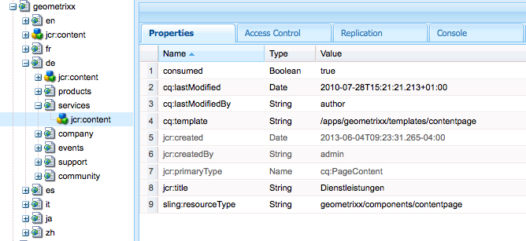

# Creating and Consuming Jobs for Offloading{#creating-and-consuming-jobs-for-offloading}

The Apache Sling Discovery feature provides a Java API that enables you to create JobManager jobs and JobConsumer services that consume them.

For information about creating offloading topologies and configuring topic consumption, see [Offloading Jobs](../../../sites/deploying/using/offloading.md).

### Handling Job Payloads {#handling-job-payloads}

The offloading framework defines two job properties that you use to identify the job payload. The offloading replication agents use these properties to identify the resources to replicate to the instances in the topology:

* `offloading.job.input.payload`: A comma-separated list of content paths. The content is replicated to the instance that executes the job.
* `offloading.job.output.payload`: A comma-separated list of content paths. When job execution is complete, the job payload is replicated to these paths on the instance that created the job.

Use the `OffloadingJobProperties` enum to refer to the property names:

* `OffloadingJobProperties.INPUT_PAYLOAD.propertyName()`
* `OffloadingJobProperties.OUTPUT_PAYLOAD.propetyName()`

Jobs do not require payloads. However, the payload is necessary if the job requires the manipulation of a resource and the job is offloaded to a computer that did not create the job.

### Creating Jobs for Offloading {#creating-jobs-for-offloading}

Create a client that calls the JobManager.addJob method to create a job that an automatically-selected JobConsumer executes. Provide the following information to create the job:

* Topic: The job topic. 
* Name: (Optional)
* Properties Map: A `Map<String, Object>` object that contains any number of properties, such as the input payload paths and output Payload paths. This Map object is available to the JobConsumer object that executes the job.

The following example service creates a job for a given topic and input payload path.

```java
package com.adobe.example.offloading;

import org.apache.felix.scr.annotations.Component;
import org.apache.felix.scr.annotations.Service;
import org.apache.felix.scr.annotations.Reference;

import java.util.HashMap;

import org.apache.sling.event.jobs.Job;
import org.apache.sling.event.jobs.JobManager;

import org.apache.sling.api.resource.ResourceResolverFactory;
import org.apache.sling.api.resource.ResourceResolver;

import com.adobe.granite.offloading.api.OffloadingJobProperties;

@Component
@Service
public class JobGeneratorImpl implements JobGenerator  {

 @Reference
 private JobManager jobManager;
 @Reference ResourceResolverFactory resolverFactory;

 public String createJob(String topic, String payload) throws Exception {
  Job offloadingJob;

  ResourceResolver resolver = resolverFactory.getResourceResolver(null);
  if(resolver.getResource(payload)!=null){

   HashMap<String, Object> jobprops = new HashMap<String, Object>();
   jobprops.put(OffloadingJobProperties.INPUT_PAYLOAD.propertyName(), payload);

   offloadingJob = jobManager.addJob(topic, null, jobprops);
  } else {
   throw new Exception("Payload for job cannot be found");
  }
  if (offloadingJob == null){
   throw new Exception ("Offloading job could not be created");
  }
  return offloadingJob.getId();
 }
}

```

The log contains the following message when JobGeneratorImpl.createJob is called for the `com/adobe/example/offloading` topic and the `/content/geometrixx/de/services` payload:

```shell
10.06.2013 15:43:33.868 *INFO* [JobHandler: /etc/workflow/instances/2013-06-10/model_1554418768647484:/content/geometrixx/en/company] com.adobe.example.offloading.JobGeneratorImpl Received request to make job for topic com/adobe/example/offloading and payload /content/geometrixx/de/services

```

### Developing a Job Consumer {#developing-a-job-consumer}

To consume jobs, develop an OSGi service that implements the `org.apache.sling.event.jobs.consumer.JobConsumer` interface. Identify with the topic to consume using the `JobConsumer.PROPERTY_TOPICS` property.

The following example JobConsumer implementation registers with the `com/adobe/example/offloading` topic. The consumer simply sets the Consumed property of the payload content node to true.

```java
package com.adobe.example.offloading;

import org.apache.felix.scr.annotations.Component;
import org.apache.felix.scr.annotations.Property;
import org.apache.felix.scr.annotations.Reference;
import org.apache.felix.scr.annotations.Service;
import org.apache.sling.api.resource.ResourceResolver;
import org.apache.sling.api.resource.ResourceResolverFactory;
import org.apache.sling.event.jobs.Job;
import org.apache.sling.event.jobs.JobManager;
import org.apache.sling.event.jobs.consumer.JobConsumer;
import org.slf4j.Logger;
import org.slf4j.LoggerFactory;

import javax.jcr.Session;
import javax.jcr.Node;

import com.adobe.granite.offloading.api.OffloadingJobProperties;

@Component
@Service
public class MyJobConsumer implements JobConsumer {

 public static final String TOPIC = "com/adobe/example/offloading";

 @Property(value = TOPIC)
 static final String myTopic = JobConsumer.PROPERTY_TOPICS; 

 @Reference
 private ResourceResolverFactory resolverFactory;

 @Reference
 private JobManager jobManager;

 private final Logger log = LoggerFactory.getLogger(getClass());

 public JobResult process(Job job) {
  JobResult result = JobResult.FAILED;
  String topic = job.getTopic();
  log.info("Consuming job of topic: {}", topic);
  String payloadIn =  (String) job.getProperty(OffloadingJobProperties.INPUT_PAYLOAD.propertyName());
  String payloadOut =  (String) job.getProperty(OffloadingJobProperties.OUTPUT_PAYLOAD.propertyName());

  log.info("Job has Input Payload {} and Output Payload {}",payloadIn, payloadOut);

  ResourceResolver resolver = null;
  try {
   resolver = resolverFactory.getAdministrativeResourceResolver(null);
   Session session = resolver.adaptTo(Session.class);
   Node inNode = session.getNode(payloadIn);
   inNode.getNode(Node.JCR_CONTENT).setProperty("consumed",true);
   result = JobResult.OK;
  }catch (Exception e){
   log.info("ERROR -- JOB RESULT IS FAILURE " + e.getMessage());
   result = JobResult.FAILED;
  }
  log.info("Job OK for payload {}",payloadIn);
  return result;
 }
}
```

The MyJobConsumer class generates the following log messages for an input payload of /content/geometrixx/de/services:

```shell
10.06.2013 16:02:40.803 *INFO* [pool-7-thread-17-<main queue>(com/adobe/example/offloading)] com.adobe.example.offloading.MyJobConsumer Consuming job of topic: com/adobe/example/offloading
10.06.2013 16:02:40.803 *INFO* [pool-7-thread-17-<main queue>(com/adobe/example/offloading)] com.adobe.example.offloading.MyJobConsumer Job has Input Payload /content/geometrixx/de/services and Output Payload /content/geometrixx/de/services
10.06.2013 16:02:40.884 *INFO* [pool-7-thread-17-<main queue>(com/adobe/example/offloading)] com.adobe.example.offloading.MyJobConsumer Job OK for payload /content/geometrixx/de/services
```

The Consumed property can be observed using CRXDE Lite:

 

### Maven Dependencies {#maven-dependencies}

Add the following dependency defenitions to your pom.xml file so that Maven can resolve the Offloading-related classes.

```xml
<dependency>
   <groupId>org.apache.sling</groupId>
   <artifactId>org.apache.sling.event</artifactId>
   <version>3.1.5-R1485539</version>
   <scope>provided</scope> 
</dependency>
<dependency>
   <groupId>com.adobe.granite</groupId>
   <artifactId>com.adobe.granite.offloading.core</artifactId>
   <version>1.0.4</version>
   <scope>provided</scope>
</dependency>
```

The previous examples also required the following dependency definitions:

```xml
<dependency>
   <groupId>org.apache.sling</groupId>
   <artifactId>org.apache.sling.api</artifactId>
   <version>2.4.3-R1488084</version>
   <scope>provided</scope>
</dependency>

<dependency>
   <groupId>org.apache.sling</groupId>
   <artifactId>org.apache.sling.jcr.jcr-wrapper</artifactId>
   <version>2.0.0</version>
   <scope>provided</scope>
</dependency>

```

